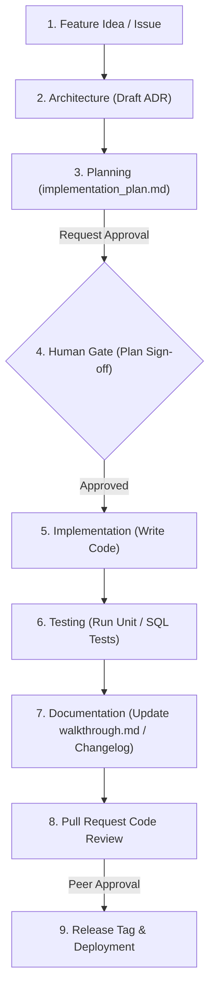

# 04 — Agent Workflows

## Purpose
This document visualizes the end-to-end development workflows executed by AI agents, from initial feature concept to production release.

## Scope
Includes all code contribution steps, validation checks, and approval gates.

---

## Detailed Guidelines

AI agents must progress through the following developmental gates:

### 1. Idea & Architecture (ADR)
- The agent reads issues, explores workspace paths, and creates a draft ADR if new schemas, tables, or integrations are introduced.

### 2. Implementation Planning
- The agent creates `implementation_plan.md` in the active workspace. This plan outlines proposed modifications, file links, and security impacts. No code is changed.
- The agent waits for explicit human approval.

### 3. Implementation & Testing
- The agent writes modifications, verifies style guidelines (`AGENTS.md`), format code, and executes test suites.

### 4. Review & Release
- The agent updates validation logs, prepares a PR, requests code review, and assists in release deployment.

---

## References
- [Change Management](../../governance/change-management.md)
- [Git Workflow](../../engineering/git-workflow.md)
