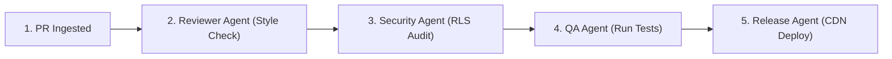

# 09 — AI Roadmap

## Purpose
This document communicates the long-term vision, planned capabilities, and ecosystem evolutions for AI collaborations on the Moneyball platform.

## Scope
Tracks future multi-agent architectures, automated review pipelines, and metadata graph structures.

---

## Detailed Guidelines

### 1. Future Orchestrations & Multi-Agent Architecture
Our long-term target is to transition from single-agent task executions to a fully automated pipeline of specialized agents:

### 2. Planned AI Capabilities
- **Automated PR Auditing**: Running style checks automatically during commit pushes.
- **Verification OCR Spike**: Integrating OCR models into Edge Functions to scan uploaded statements and match names/PANs automatically.

### 3. Repository Metadata Knowledge Graph
Constructing a machine-readable directory map of the codebase to allow new agents to index domains, entities, and RLS policies instantly.

---

## References
- [ROADMAP.md](../../ROADMAP.md)
- [07 — AI Engineering & Agent Architecture](../architecture/07-ai-architecture.md)
