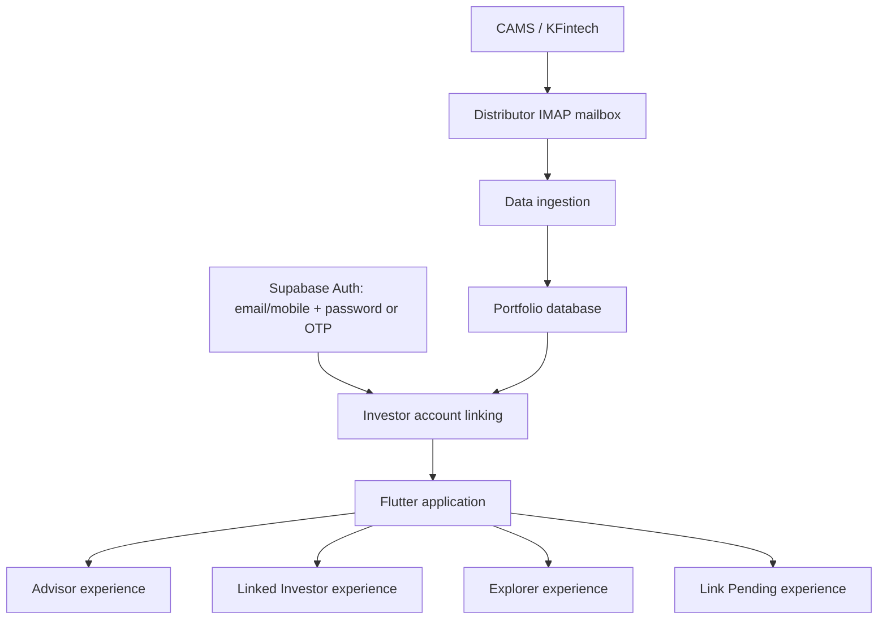
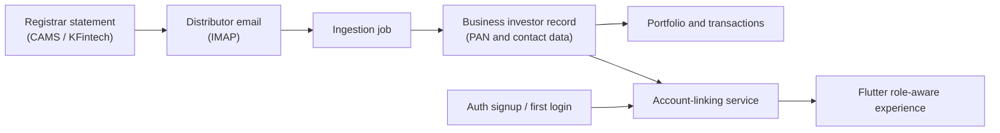
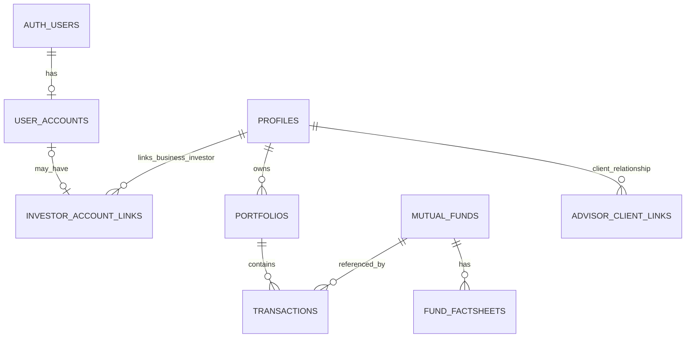

# Mutual Fund Portfolio Management Platform — Target Architecture

## 1. System vision

Sharan Fincorp is one Flutter application serving four account states:

- **Advisor**: the distributor's business administrator, with access to all
  clients and business operations.
- **Linked Investor**: an investor whose Auth account is linked to an existing
  business investor record and portfolio.
- **Link Pending**: a signed-in user who says that they already invest but for
  whom automatic contact matching did not find a business investor record.
- **Explorer**: a signed-in user without linked investments who is browsing
  public investor-facing resources.

The application has one login experience. Authentication establishes who can
sign in; portfolio linkage establishes which investor record, if any, that
account represents. Supabase Row Level Security (RLS) and Edge Functions are
the authority for access control. Flutter role checks improve navigation and
usability, but never grant access on their own.



### Architectural principles

1. **Authentication identity and business identity are distinct.**
2. **PAN is a business identity and verification attribute, never a login
   credential.**
3. Registrar data ingested through the distributor's IMAP workflow is the
   source of truth for client and portfolio records; signup never creates a
   portfolio.
4. An investor may have a portfolio before creating an application account.
5. Feature-first organization and repositories isolate UI from infrastructure.
6. Invoice Signer retains its completed Sprint 2 architecture unchanged.

## 2. Identity, onboarding, and account states

### 2.1 Two identities

| Identity | Purpose | Fields | Rules |
|---|---|---|---|
| Authentication identity | Supabase Auth sign-in and session recovery | verified email, verified mobile, password and/or OTP | Never use PAN; one Auth user can exist before portfolio linkage. |
| Business identity | Distributor's investor record created from registrar data | PAN, legal name, registrar/folio data, verified contact details | PAN identifies the investor in the business domain and is only requested for verification after failed automatic linking. |

PAN must not be stored in authentication metadata, used in a sign-in form, or
treated as a password substitute.

### 2.2 Portfolio data source



The data ingestion process may create or update a business investor before
that person has an Auth account. It must not create a Supabase Auth user,
assign a login password, or require the investor to sign up.

### 2.3 Signup and first-login flow

Signup requests only:

- verified email **or** verified mobile;
- password or OTP.

Immediately after signup, and again after first login if no link exists, the
platform attempts automatic linking in priority order:

1. match a verified email to an existing investor business record; or
2. match a verified mobile to an existing investor business record.

When either match succeeds, the platform creates the account-to-investor link
and the user becomes a **Linked Investor** without further questions.

When neither match succeeds, the same question is always displayed:

> Do you already invest through Sharan Fincorp?
>
> ○ Yes, I already invest.
>
> ○ No, I'm just exploring.

The platform must not try to distinguish changed contact details from a new
visitor before this decision. It has insufficient information to do so.

#### Explorer path

Selecting **“No, I’m just exploring.”** creates or retains an **Explorer**
account. Do not request PAN and do not force portfolio linkage. Explorers may
access:

- educational content;
- factsheets;
- calculators;
- marketing pages;
- contact-advisor information;
- language, theme, notification preferences, and personal profile.

They do not receive portfolio, transaction, client, ingestion, Invoice Signer,
or Advisor administration access.

#### Link Pending path

Selecting **“Yes, I already invest.”** transitions the account to **Link
Pending** and begins portfolio linking. The UI explains:

> We couldn't automatically locate your investments. This can happen if your
> registered email address or mobile number has changed.

Only at this point may the platform ask for a verification method. PAN is the
recommended initial method. Folio-number verification and advisor-assisted
verification are future alternatives.

Successful verification creates a link to the existing business investor
record and transitions the account to **Linked Investor**. Failed verification
must not expose whether a PAN, folio, or investor record exists.

### 2.4 State transitions

| From | Event | To |
|---|---|---|
| Unauthenticated | Successful Advisor sign-in | Advisor |
| Unauthenticated | Sign-up / sign-in and automatic contact match | Linked Investor |
| Unauthenticated | No automatic match + “exploring” | Explorer |
| Unauthenticated | No automatic match + “already invest” | Link Pending |
| Link Pending | Successful permitted verification | Linked Investor |
| Linked Investor | Account link removed by authorized administrator | Explorer or Link Pending, based on a new user decision |

Advisor is a business-controlled role; it must never be assigned from public
signup metadata.

## 3. Application layers

| Layer | Responsibility | Examples |
|---|---|---|
| Presentation | Screens, responsive layouts, page state, navigation, user feedback | Advisor dashboard, Investor dashboard, onboarding |
| Application / business | Use cases, orchestration, validation, account-linking flow | Link investor account, process invoice job |
| Domain | Business entities and contracts | Investor, Portfolio, Transaction, ProcessingReport |
| Data | Repositories, DTO mapping, query and cache policies | PortfolioRepository, InvestorLinkRepository |
| Infrastructure | Supabase, storage, Edge Functions, IMAP and platform APIs | Supabase service, file picker, downloads |
| Security | Session, account state, permission policy, protected routes | AuthSession, AccountState, Permission |

Supabase Auth owns sign-in, token refresh, OTP/password flows, and session
persistence. Postgres owns business data and RLS. Storage owns private document
objects. Edge Functions own privileged and compute-heavy operations.

## 4. Domain-driven module organization

| Domain | Current / future modules | Responsibility |
|---|---|---|
| Authentication | Login, sign-up, password/OTP recovery | Authentication identity and sessions |
| Investor Identity | Account linking, verification, invitations | Auth-to-investor link and account states |
| Client Management | Client directory, client detail | Advisor management of business investor records |
| Portfolio | Portfolio summary, holdings, XIRR, charts | Investor and Advisor portfolio read models |
| Transactions | Transaction history and reconciliation | Immutable investment ledger |
| Documents | Factsheets, holdings links, statements | Investor documents and downloads |
| Operations | Data Ingestion, Invoice Signer | Registrar and business operations |
| Reports | Analytics, exports, future statements | Advisor-wide and investor-specific reports |
| Administration | Company profile, branding, email settings | Distributor-wide configuration |
| Settings | Theme, language, personal preferences | Role-scoped account settings |

### Invoice Signer boundary

Invoice Signer belongs to **Operations** and remains Advisor-only. Its stable
architecture is preserved:

- `RegistrarDetectionService`
- `ProcessingReport`
- `ArchiveManifest`
- `RegistrarProcessor`
- `CamsProcessor`
- `KfintechProcessor`
- shared PDF discovery

Future work may add retained job history and audit events around this boundary,
but must not merge its registrar, archive, or tracker rules into dashboard code.

## 5. Role-based access control

| Module | Advisor | Linked Investor | Link Pending | Explorer |
|---|---:|---:|---:|---:|
| Own profile, theme, language, notifications | Yes | Yes | Yes | Yes |
| Client management | Full | No | No | No |
| Portfolio, holdings, transactions | All clients | Own linked records, read-only | No | No |
| Factsheets | Manage and read | Read | Read | Read |
| Calculators and educational content | Yes | Yes | Yes | Yes |
| Data ingestion | Full | No | No | No |
| Invoice Signer | Full | No | No | No |
| Advisor reports and administration | Full | No | No | No |
| Contact advisor | Yes | Yes | Yes | Yes |

UI visibility follows this matrix, but the backend must enforce it. An
Investor must receive zero rows when querying another investor’s data.

## 6. Navigation architecture

### Advisor navigation

- Clients Management
- Data Ingestion
- Factsheets Manager
- Invoice Signer
- Analytics and Reports
- Business Settings

### Linked Investor navigation

- My Portfolio
- Holdings
- Transactions
- Analytics
- Factsheets
- Personal Settings

### Explorer navigation

- Learn / educational content
- Factsheets
- Calculators
- Contact Advisor
- Personal Settings

### Link Pending navigation

- Portfolio Linking
- Factsheets
- Calculators / education
- Contact Advisor
- Personal Settings

All routes are declarative and guarded by session, account state, and data
ownership. Direct links must run the same guards as in-app navigation.

## 7. Authentication and authorization strategy

### Authentication flow

1. Authenticate with email/mobile and password or OTP.
2. Restore the session before displaying a role-specific shell.
3. Resolve whether the Auth account is an Advisor, a linked investor, pending,
   or explorer.
4. If not an Advisor and no investor link exists, run automatic verified-contact
   matching and then the required investor/explorer decision flow.
5. Route to the matching protected shell.

### Frontend

Flutter uses a central permission/account-state policy for routes and UI. No
screen directly decides that a user is an Advisor or can access a client.

### Backend and Edge Functions

- Every Edge Function validates the caller JWT.
- Advisor-only functions independently verify Advisor permission.
- Privileged service-role access stays only inside secured server-side code.
- Private documents use RLS-protected storage and short-lived signed URLs where
  direct download access is needed.

### RLS rules

- Resolve the current profile through `profiles.user_id = auth.uid()`.
- Resolve an investor’s portfolio ownership through the investor-link record,
  not from a user-supplied client ID.
- Investors receive `SELECT` access to linked portfolio data only.
- Investors have no portfolio or transaction write permission unless a future
  approved workflow requires it.
- Users cannot change account state, role, PAN, investor link, ownership,
  advisor relationship, or verified contacts from a direct client update.

## 8. Supabase architecture and schema recommendations

### Core relationships



### Recommended schema direction

| Entity | Purpose |
|---|---|
| `profiles` | Business investor and Advisor records. Includes PAN and registrar/ingestion identity attributes; not login credentials. |
| `user_accounts` or extended `profiles` linkage | Auth-facing account state keyed by `auth.users.id`; stores account state and verified-contact snapshots. |
| `investor_account_links` | Explicit link from Auth account to business investor profile; supports a pre-existing investor record and controlled linking lifecycle. |
| `advisor_client_links` | Explicit Advisor-to-investor relationship for future transfers or multiple advisors. |
| `portfolios`, `transactions`, `mutual_funds` | Existing investment domain data. |
| `fund_factsheets` | Existing factsheet metadata. |
| `user_preferences` | Theme, language, and notification preferences for all signed-in states. |
| `advisor_settings` | Company, email, branding, signature, and stamp settings. |
| `account_link_attempts` | Privacy-safe linking attempts and verification state; no raw PAN should be logged. |
| `ingestion_jobs`, `invoice_signer_jobs`, `audit_events` | Operational history and traceability. |

### Required schema and policy improvements before Sprint 3 implementation

1. Use `profiles.user_id` consistently for Auth linkage; the legacy
   `profiles.id = auth.uid()` assumption is incompatible with pre-existing
   investor records.
2. Add an explicit account-state model: `explorer`, `link_pending`,
   `linked_investor`, and `advisor`.
3. Keep Advisor role assignment server-controlled. Never trust a public
   `raw_user_meta_data.role` value during signup.
4. Add a controlled `investor_account_links` table with uniqueness rules so one
   Auth account cannot link to an arbitrary investor and one investor cannot be
   silently linked to multiple accounts without an approved policy.
5. Store verified email and mobile separately from unverified input. Automatic
   matching uses verified values only.
6. Make PAN access minimal: encrypt or otherwise protect it according to the
   organisation’s compliance requirements, never expose it broadly in selects,
   and compare through a secured verification workflow.
7. Tighten RLS so direct client updates cannot alter role, account state,
   business identity, investor links, or ownership relations.
8. Make portfolio and transaction records read-only for Investors by default.

## 9. Recommended Flutter folder structure

```text
lib/
  app/
    app.dart
    bootstrap.dart
    navigation/
    security/
  core/
    config/
    errors/
    result/
    utils/
  shared/
    models/
    widgets/
    theme/
    localization/
  features/
    authentication/
    investor_identity/
    client_management/
    portfolio/
    transactions/
    documents/
    operations/
      invoice_signer/
      ingestion/
    reports/
    administration/
    settings/
  repositories/
  services/
    supabase/
    storage/
    downloads/
```

Feature code belongs under its domain. Repositories own Supabase access and
data mapping. Presentation code must not call `Supabase.instance.client`
directly. `shared/` contains role-neutral components only. Existing Invoice
Signer stays isolated under `features/operations/invoice_signer/`.

## 10. UI architecture

### Advisor dashboard

Business overview, client directory, ingestion, Invoice Signer, factsheet
management, analytics, reporting, and business settings.

### Linked Investor dashboard

Portfolio value, invested value, gains/losses, XIRR, holdings, transactions,
factsheets, personal profile, and preferences.

### Explorer and Link Pending experiences

Both provide non-portfolio resources and personal settings. Link Pending adds
a clear, resumable portfolio-linking workflow and contact-advisor route.

### Shared components

Application shell, responsive navigation, top bar, loading/error/empty states,
money/date/percentage formatting, document cards, and preference controls.

## 11. Future roadmap

### Phase 0 — Security and identity foundation

- Normalize Auth-to-business investor linkage.
- Add account states and protected routing.
- Lock down role assignment and profile field updates.
- Audit RLS with Advisor, own-investor, other-investor, Explorer, Link Pending,
  and unauthenticated test cases.

### Phase 1 — Investor experience

- Linked Investor portfolio, holdings, transactions, XIRR, and charts.
- Explorer and Link Pending shells.
- Factsheets, calculators, contact-advisor, and personal settings.

### Phase 2 — Linking and invitation maturity

- Advisor invitation links.
- Email invitations after IMAP imports.
- SMS invitations.
- Folio-based verification.
- Advisor-assisted account linking.

### Phase 3 — Advisor operations and reporting

- Processing history and audit logs.
- Client communication.
- Portfolio reports and investor statements.
- Revenue dashboard and commission analytics.

### Phase 4 — Scale and engagement

- Notifications and scheduled reports.
- Goal planning and expanded analytics.
- Responsive Android/mobile refinement and resilient offline reads.

## 12. Technical debt and risk assessment

### Address now

| Risk | Impact | Required action |
|---|---|---|
| Auth/profile linkage uses inconsistent IDs | High | Use `user_id` and an explicit investor link before Investor features expand. |
| Public signup metadata can influence roles | Critical | Make Advisor assignment server-controlled. |
| Mutable client fields can create privilege escalation | Critical | Restrict direct updates and enforce RLS. |
| Client portfolio/transaction writes conflict with product model | High | Make Investor access read-only by default. |
| UI directly accesses Supabase | Medium | Add repositories incrementally with Sprint 3 work. |
| Broad PAN exposure or logging | Critical | Limit access, avoid logs, and use secured verification. |

### Can safely wait

- Replacing Provider with another state-management package.
- Full generated database models.
- Offline caching.
- Multi-advisor ownership, if the immediate model remains one distributor.
- Analytics warehouse and advanced reporting.

## 13. Architecture decision before Sprint 3 production work

Complete a narrow identity-and-security foundation milestone first:

1. Separate Auth account state from the business investor identity.
2. Add verified-contact automatic linking and the Explorer / Link Pending
   decision flow.
3. Implement secure PAN verification only after a user selects “I already
   invest.”
4. Correct RLS and test cross-investor denial paths.
5. Introduce protected routes and role/account-state shells.

This allows the platform to grow the Investor experience without assuming that
signup creates investment data, or that an Auth account already has a portfolio.
