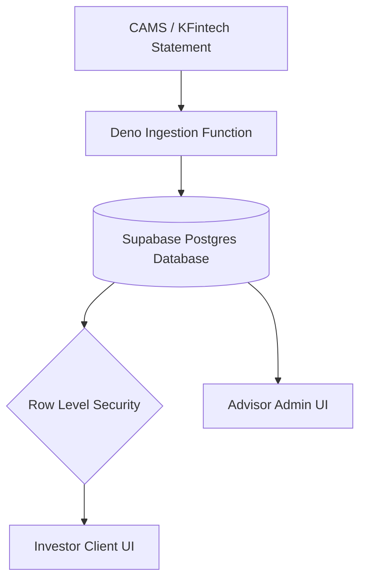

# Sharan Fincorp — Executive Architecture Document

Welcome to the primary architectural entry point for the **Sharan Fincorp** (Moneyball) platform. This document serves as the high-level executive overview of the system components, identity models, and security principles. It links directly to the detailed technical libraries, architecture designs, and decisions records.

---

## 1. System Vision & Component Relationships

Sharan Fincorp coordinates secure distributor operations (statement ingestion, client directory, and invoice signature overlays) with private client access.

```mermaid
flowchart TB
  Registrar["CAMS / KFintech Statement"] --> Ingestion["Deno Ingestion Function"]
  Ingestion --> db[(Supabase Postgres Database)]
  db --> RLS{Row Level Security}
  RLS --> client["Investor Client UI"]
  db --> advisor["Advisor Admin UI"]
```

For a comprehensive breakdown of the system components, data flow pathways, and schemas, read the **[Target Architecture Contract](architecture/ARCHITECTURE.md)**.

---

## 2. Core Architectural Pillars

### 2.1 Identity Isolation (ADR-001)
We enforce a strict separation between authentication identity (managed via Supabase Auth) and business identity (distributor's records). This allows imported investor portfolios to exist in the database before the investor registers an application login account.
- **Detailed Design**: See [Target Architecture Contract: Section 2](architecture/ARCHITECTURE.md#2-identity-onboarding-and-account-states)
- **Decision Record**: See [ADR-001 — Separate Authentication Identity from Business Identity](decisions/ADR-001-Identity-Architecture.md)

### 2.2 Vault-Backed Cryptography & PAN Protection (ADR-003)
PAN is treated strictly as business verification evidence. The database protects PAN at rest using Supabase Vault-backed AES-256 keys, and indexes lookups using separate SHA-256 HMAC lookup tokens to prevent data leakage.
- **Vault Setup Reference**: See [PAN Vault Setup Guide](development/pan_verification_vault_setup.md) and [Candidate Token Vault Setup Guide](development/verification_vault_setup.md)
- **Decision Record**: See [ADR-003 — Protect PAN as Encrypted Business Evidence](decisions/ADR-003-PAN-Verification.md)

### 2.3 Folio-Scoped Access Control (ADR-006)
Portfolio holdings, transactions, and valuations are secured at the folio boundary. An authenticated investor can only view records for canonical folios that have active, approved grants linked to their account.
- **Verification Design**: See [Verification Workflow Design Spec](verification_workflow_design.md)
- **Decision Record**: See [ADR-006 — Folio-Scoped Portfolio Access Authorization](decisions/ADR-006-Folio-Access-Authorization.md)

### 2.4 Advisor Assignment Layer (ADR-007)
Advisor review operations (such as list, detail, and decision mutations) require an active verification request assignment. Stale decisions, deadlocks, and cross-advisor queues are mitigated via lock ordering (`FOR UPDATE`) on database tables.
- **Sprint Overview**: See [Sprint 5.6A Layer Specs](sprints/Sprint-5.6A.md)
- **Decision Record**: See [ADR-007 — Advisor Assignment for Folio Review](decisions/ADR-007-Advisor-Folio-Review-Assignment.md)

### 2.5 In-Memory ZIP Processing (ADR-008)
To prevent server I/O overhead and comply with security bounds, the PDF Invoice Signer decompresses, stamps, and re-compresses PDF invoices fully in-memory inside a Deno Edge Function.
- **Feature Specification**: See [Invoice PDF/ZIP Signer Spec](features/invoice_signer.md)
- **Decision Record**: See [0002_in_memory_zip_processing.md](decisions/0002_in_memory_zip_processing.md)

---

## 3. Architecture Library Index

- 📑 **[Target Architecture Contract](architecture/ARCHITECTURE.md)**: Main component relationships, database ERD schemas, account state machines, and RLS guidelines.
- 🚀 **[05 — Deployment Architecture](architecture/05-deployment-architecture.md)**: Physical environments (local, staging, production) and runtime hosting details.
- ⚙️ **[06 — Infrastructure Architecture](architecture/06-infrastructure-architecture.md)**: Serverless compute, object storage, and pg_vault secrets management.
- 🤖 **[07 — AI Engineering & Agent Architecture](architecture/07-ai-architecture.md)**: Multi-agent coordination pipelines, repository handovers, and prompt structures.
- 👁️ **[08 — Observability Architecture](architecture/08-observability.md)**: Logging levels, structured diagnostic tracking, and P0/P1 alerts.
- 📊 **[09 — Monitoring Architecture](architecture/09-monitoring.md)**: Connection pool, deadlock diagnostics, brute force detections, and runbooks.
- 🛡️ **[10 — Backup & Disaster Recovery](architecture/10-backup-disaster-recovery.md)**: Logical dumps, offline Vault KMS archives, and RPO/RTO goals.
- ⛓️ **[11 — CI/CD Pipeline Architecture](architecture/11-cicd-architecture.md)**: Pull request build check gates, branch strategy, and rollback procedures.
- 🔐 **[12 — Security Architecture](architecture/12-security-architecture.md)**: Token signature validations, active link/grant checks, and encryption details.
- 🔑 **[Architecture Decision Records Index](decisions/README.md)**: Architectural rationales (ADR-001 through ADR-008).
- 🛠️ **[Verification Design Spec](verification_workflow_design.md)**: Detailed onboarding verification paths and state transitions.
- 📋 **[Invoice Signer Spec](features/invoice_signer.md)**: PDF layout overlays, Coordinate anchoring, and SheetJS parsing boundary.
