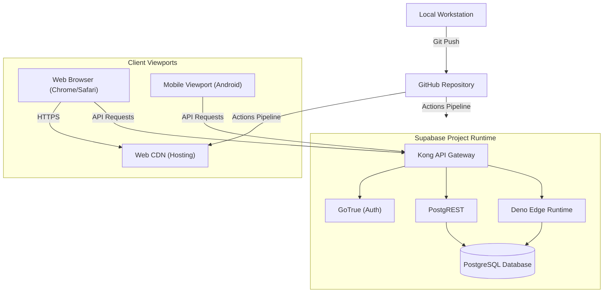

# 05 — Deployment Architecture

## Purpose
This document defines the physical and logical deployment topology, environment mappings, runtime hosting, and distribution flows for the Sharan Fincorp (Moneyball) platform.

## Scope
Includes all target hosting platforms (Supabase Cloud, static web hosting, mobile distribution), Deno runtime configurations, environment classifications (local, staging, production), and deployment automation boundaries.

## Responsibilities
- **DevOps/Infrastructure Lead**: Owns release pipelines, SSL/DNS records, and production environment provisioning.
- **Backend Developer**: Owns Deno Edge Function deployments and database migrations.
- **Frontend Developer**: Owns Flutter Web bundles and Android package (APK/AAB) generation.

## Architecture Overview

Sharan Fincorp uses a hybrid cloud model where the database, authentication, storage, and edge functions reside on Supabase Cloud, while the Flutter Web application is hosted on a high-availability CDN. The mobile client is compiled as a native Android binary.



---

## Detailed Design

### Environments Matrix

| Environment | Database Target | Auth Provider | Functions Engine | Client URL |
| :--- | :--- | :--- | :--- | :--- |
| **Local Dev** | Docker (localhost:54322) | Local GoTrue | Local Deno | `http://localhost:5000` |
| **Staging** | Supabase Project (`auxbbotbcvrgzvynyrgg`) | Staging Auth | Hosted Deno | Staging domain |
| **Production** | Production Instance | Production Auth | Production Deno | Production domain |

### Local Development Runtime
Local environments run inside Docker containers orchestrated by the Supabase CLI:
1. **Kong API Gateway**: Proxies requests to database Rest APIs and Auth.
2. **PostgreSQL**: Contains the database schemas and mock seed data.
3. **GoTrue**: Simulates email/mobile OTP logins.
4. **Local Deno Server**: Hot-reloads Edge Functions.

### Client-Side Deployments
- **Flutter Web**: Compiled to static HTML/JS via `flutter build web --release`. Deployed to CDN (Netlify/Vercel) with cache-busting Service Worker headers configured in `index.html`.
- **Android App**: Compiled via `flutter build apk --release` and distributed through internal testing groups (Firebase App Distribution) or Google Play Store.

### Supabase Edge Functions Deployment
Edge Functions (`cams-kfintech-ingestion` and `sign-stamp-invoice`) are written in TypeScript and executed in the Deno runtime. Deployed using:
```bash
supabase functions deploy cams-kfintech-ingestion --project-ref auxbbotbcvrgzvynyrgg
supabase functions deploy sign-stamp-invoice --project-ref auxbbotbcvrgzvynyrgg
```

---

## Dependencies
- **Docker**: For local orchestration.
- **Supabase CLI**: For migration executions and local sandbox setups.
- **Flutter SDK**: For compiling client targets.

## Design Decisions
- **Decoupled Web Hosting**: The Flutter Web build is kept separate from Supabase storage buckets to allow high-availability static CDN caching and zero-downtime routing swaps.
- **In-Memory function design**: Edge Functions do not persist files locally. Zipped PDF processing runs fully in RAM to stay within Deno container disk limits.

## Future Evolution
- **Multi-region Supabase replication**: For low latency read access across different geographic nodes.
- **App Store/Google Play automation**: Fastlane integrations to compile and push staging builds to alpha tracks automatically.

## References
- [Target Architecture Contract](README.md)
- [ADR-005 — Require Evidence-Driven Release Workflow](../decisions/ADR-005-Release-Workflow.md)
