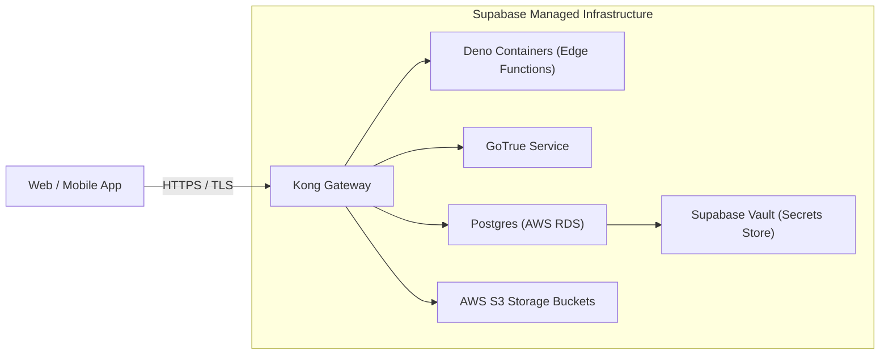

# 06 — Infrastructure Architecture

## Purpose
This document defines the underlying infrastructure resources, storage engines, networking layers, compute allocations, and third-party integrations supporting the Sharan Fincorp platform.

## Scope
Includes Postgres databases, Deno Edge Function compute bounds, CDN storage, network gateways, secret stores, and scalability assumptions.

## Responsibilities
- **Infrastructure Lead**: Configures memory limits, storage bucket access control lists, network proxies, and database resource provisioning.
- **Database Administrator**: Monitors SQL table growth, query indexes, and Postgres memory limits.

## Architecture Overview

Sharan Fincorp's infrastructure is built on a serverless, database-centric model. The client communicates with Postgres and compute services via an API gateway.

---

## Detailed Design

### Compute Resources
- **Client Side**: Executed in-browser (V8/JavaScript engine) or on-device (Dart VM / Android runtime). Local browser engines execute SheetJS calculations to reduce server CPU loads.
- **Server Side**: Deno containers run Edge Functions with a 50ms active CPU execution limit and a 150MB memory ceiling.

### Storage Resources
- **Relational Data**: PostgreSQL database (managed via AWS RDS on Supabase). Holds users, transaction ledgers, registrar statements, and system logs.
- **Object Data**: Supabase Storage Buckets (S3-compatible). Stores signatures, company stamp graphics, and encrypted RTA statements.

### Networking & Gateways
- **Kong Gateway**: Serves as the single API router. Resolves routes for Auth, Database Rest APIs, and functions over TLS 1.3.
- **Static CDNs**: Static HTML, CSS, and compiled Dart JS assets are cached at network edges.

### Secret Management & Cryptography
- **Supabase Vault**: System-level secret storage. Encrypts sensitive keys (`pan_encryption_key`, `pan_lookup_hmac_key`, `verification_candidate_token_encryption_key`) at rest.
- **Application Env**: Transient environment variables passed via compile-time `--dart-define` parameters.

### Third-Party Systems
- **Registrar (RTA) Feeds**: Automated statements arriving from CAMS and KFintech via IMAP mailbox sync.

---

## Dependencies
- **Postgres (v15+)**: Core database engine.
- **AWS S3 / Supabase Storage**: File repository.
- **Supabase Vault extension (`pg_vault`)**: Secret engine.

## Design Decisions
- **Offloaded Browser Processing**: Using SheetJS on the client side for spreadsheet calculations preserves Edge Function CPU cycles, preventing timeouts on bulk invoice tasks.
- **Service-Role Boundary**: Private tables (e.g. `profile_pan_records`) reject all public select statements. Decryption or lookup queries delegate mutations strictly to `SECURITY DEFINER` procedures.

## Future Evolution
- **Managed SMTP/IMAP Ingestion Service**: Transitioning registrar extraction from standard serverless functions to a dedicated queuing service (e.g. AWS SQS) for resilience against large files.

## References
- [Target Architecture Contract](README.md)
- [ADR-003 — Protect PAN as Encrypted Business Evidence](../decisions/ADR-003-PAN-Verification.md)
