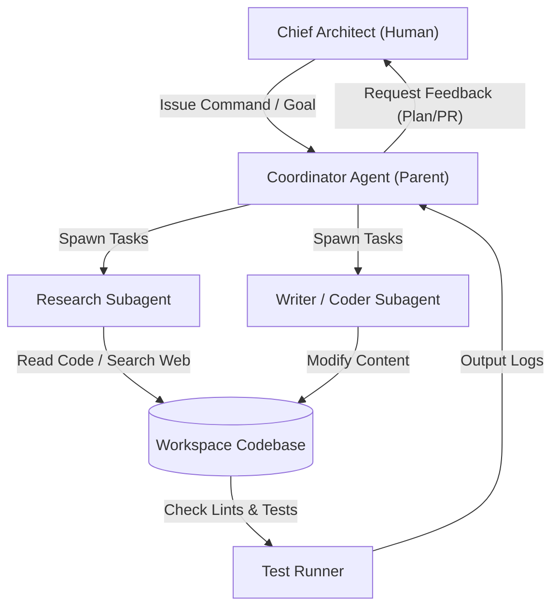

# 07 — AI Engineering & Agent Architecture

## Purpose
This document defines the roles, protocols, repository integrations, prompt structures, and review workflows for AI agents (and human operators) developing the Sharan Fincorp platform.

## Scope
Applies to all generative AI workflows, automated review scripts, context configuration sets (e.g. `AGENTS.md`), and developer-to-agent handover rules.

## Responsibilities
- **Chief Architect (Human)**: Establishes repository direction, reviews code changes, approves implementation plans, and oversees security boundaries.
- **AI Coding Assistant (Agent)**: Researches the workspace, drafts plans, writes code modifications, and validates results against unit tests.

## Architecture Overview

AI engineering on the Moneyball platform utilizes a collaborative multi-agent pattern with strict human approval gates. Agents act as engineers under the guidance of the Chief Architect.

---

## Detailed Design

### AI Ecosystem Mappings
- **Chief Architect (Human)**: The final approval authority for all code commits, database migrations, and structural adjustments.
- **AI Coding Agents (Antigravity/ChatGPT/Codex/BAI)**: Perform context gathering, draft implementation plans, perform file adjustments, and run regression verifications.

### Repository Workflow
1. **Planning Phase**: The agent researches code and writes an `implementation_plan.md` detailing the proposed changes and open questions. No code is modified.
2. **Review & Approval Gate**: The human Chief Architect reviews the plan and grants approval.
3. **Execution Phase**: The agent updates `task.md` checklists, applies line edits in-place, and executes validation tests.
4. **Verification Phase**: The agent documents results in `walkthrough.md` and commits the code.

### Context Management & Knowledge Flow
- **`AGENTS.md`**: Loaded at session startup. Serves as the central rule book (enforces design system colors, file path rules, relative imports, and commenting requirements).
- **`docs/AI_HANDOFF.md`**: Tracks active sprint progress, current database migration heads, and checklist verifications.
- **`walkthrough.md`**: Serves as the audit log of actual execution (deno tests, local builds, deployment status).

### Future Agent Extensibility
As AI models evolve, new agents are onboarded by declaring roles and context rules in the `agents/` directories of custom plugins. The workflow ensures that any agent (regardless of framework) compiles code under standard validation tests.

---

## Dependencies
- **Antigravity SDK / Agent Engine**: Orchestrates concurrent subagents.
- **`AGENTS.md` Context Rules**: Binds the engine to coding standards.

## Design Decisions
- **Immutable Historical Logs**: Test outputs and runs are appended to `walkthrough.md` instead of being rewritten. This ensures humans can trace the rationale behind code edits.
- **Sandboxed Execution**: Shell tools run within a security sandbox to prevent unauthorized network access during local testing.

## Future Evolution
- **Automated AI Linting in CI**: Integrating validation checks directly into GitHub Actions to reject PRs that do not link files correctly or deviate from `AGENTS.md` rules.

## References
- [AI Developer Manual (AGENTS.md)](../../AGENTS.md)
- [AI Engineering Handoff Specs](../AI_HANDOFF.md)
