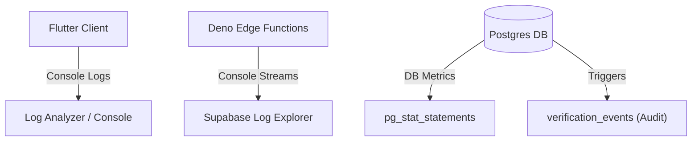

# 08 — Observability Architecture

## Purpose
This document defines the metrics collection, tracing paths, logging standards, system audit trails, health monitoring, and alerting configurations for the Sharan Fincorp platform.

## Scope
Covers application logs (Flutter client), Edge Function diagnostics (Deno runtime), PostgreSQL database metrics, and security audit trails.

## Responsibilities
- **Operations Lead**: Configures log aggregation pipelines, monitors performance alert thresholds, and manages diagnostic dashboards.
- **Security Auditor**: Conducts weekly audits of the immutable database event tables.

## Architecture Overview

Observability is divided into operational metrics (error rates, request latency) and security/compliance audits (immutable verification logs).



---

## Detailed Design

### Logging Standards
- **Flutter Client**: Debug-only logging. No sensitive fields (PAN, contact numbers) may be printed. Production errors are sent to a crash reporting dashboard (e.g. Sentry).
- **Edge Functions**: JSON structured logging to standard output. Console messages are captured by the Supabase logs processor.
- **Database Engine**: Logs query execution times exceeding 100ms (`log_min_duration_statement = 100`).

### Metrics & Performance Tracking
- **CPU & Memory**: Deno Edge Functions track peak CPU utilization (limit 50ms) and memory footprint (limit 150MB).
- **Database Performance**: Query plans and transaction rates are monitored via PostgreSQL standard extensions:
  - `pg_stat_statements`
  - `pg_stat_user_tables`

### Audit Logging (Immutable Trails)
Audit trails are enforced transactionally inside Postgres. Every critical lifecycle action (e.g. folio claim approvals, PAN updates) appends a record to the append-only `verification_events` table:
```sql
-- Audit record structure
CREATE TABLE verification_events (
  id uuid PRIMARY KEY,
  request_id uuid REFERENCES verification_requests,
  event_type varchar,
  actor_id uuid,
  payload jsonb, -- Masked business data only
  created_at timestamp
);
```

### Alert Strategy
Alerting rules are categorized by severity levels:
1. **P0 Critical (Immediate Paging)**: Database connection failures, consecutive Edge Function timeouts, or RLS violations.
2. **P1 Operational (Slack/Email Alert)**: Database table locks persisting > 5 seconds, query durations > 500ms, or failed user login spikes.

---

## Dependencies
- **pg_stat_statements extension**: For tracking Postgres query efficiency.
- **Supabase Logs API**: For extracting runtime container logs.

## Design Decisions
- **Zero Raw Data in Logs**: To comply with data privacy policies, raw PAN records, unmasked folio IDs, and encryption keys must never be output to log streams.
- **Append-Only Auditing**: Audit records (`verification_events`) are write-once. Edit/Delete privileges are revoked for all database roles.

## Future Evolution
- **OpenTelemetry Integration**: Incorporating tracing libraries in the Flutter app and Edge Functions to map transaction lifecycles from the user click to database commits.

## References
- [Target Architecture Contract](README.md)
- [ADR-005 — Require Evidence-Driven Release Workflow](../decisions/ADR-005-Release-Workflow.md)
