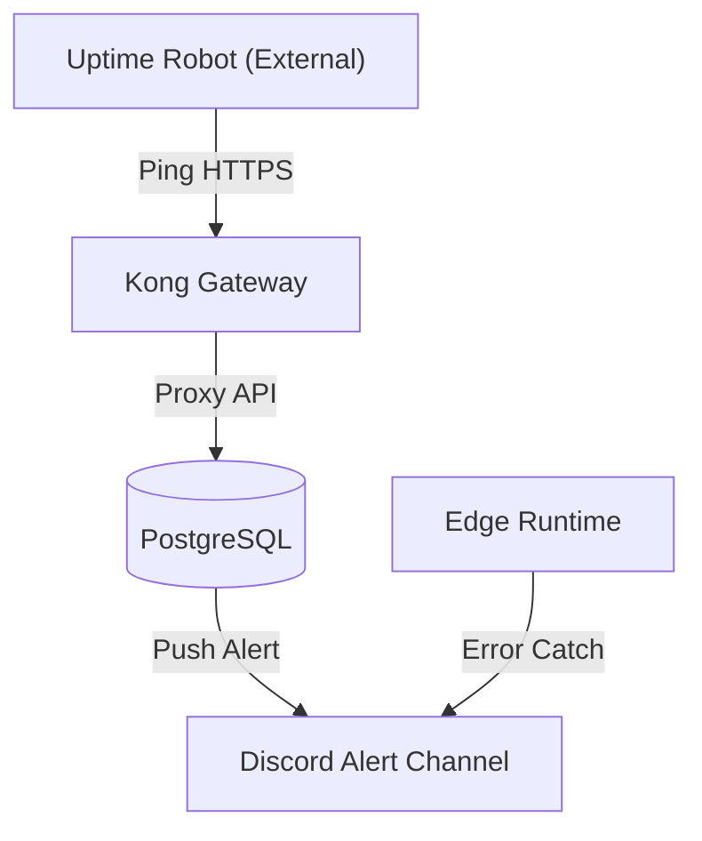

# 09 — Monitoring Architecture

## Purpose
This document defines the real-time systems monitoring, database health metrics, API endpoints probing, security threat detections, disk capacity bounds, and incident response procedures for Sharan Fincorp.

## Scope
Covers database disk, connection pool sizing, Edge Function invocation stats, API latency thresholds, and support runbooks for the operations team.

## Responsibilities
- **Operations Lead**: Owns system performance monitoring, server capacity allocations, and paging configurations.
- **Incident Response Team**: Resolves P0/P1 production outages and manages user communication.

## Architecture Overview

Sharan Fincorp uses an active-passive monitoring pattern. Scheduled external probes ping system gateways, while internal sensors push metrics to notifications channels.



---

## Detailed Design

### Database Performance Monitoring
- **Disk & Disk I/O**: Alarms trigger when database storage reaches 80% capacity.
- **Connection Pools**: Alerts notify administrators if database connection usage exceeds 90% of the maximum pool size (typically 100 connections on standard tiers).
- **Deadlock Detections**: Scans Postgres locks table (`pg_locks`) to verify locking orders.

### API & Network Gateway Monitoring
- **Gateway Availability**: External health check probes ping `/rest/v1/` REST endpoints every 60 seconds.
- **Latency Thresholds**: Warns operators if average REST call response times exceed 300ms over a 5-minute rolling window.

### Security Monitoring
- **Authorization Failures**: Alerts when client RLS violations occur more than 10 times in 5 minutes from a single IP address.
- **Brute Force Detection**: GoTrue Auth logs track failed login spikes.

### Incident Response Playbook (P0 Outage)
When a critical database lock or Edge Function timeout occurs:
1. **Paging**: PagerDuty alerts the on-call engineer.
2. **Analysis**: Inspect database Locks and current processes:
   ```sql
   -- Find blocked queries
   SELECT pid, query, state, age(clock_timestamp(), query_start) 
   FROM pg_stat_activity 
   WHERE wait_event_type = 'Lock';
   ```
3. **Remediation**: Terminate offending database processes safely using:
   ```sql
   SELECT pg_cancel_backend(pid);
   ```

---

## Dependencies
- **pg_stat_activity view**: For inspecting live active connection states.
- **Webhook API integration**: For publishing messages to chat networks.

## Design Decisions
- **Strict Separation of Concerns**: We use external probers to track availability rather than depending on internal database scripts. This guarantees alerts fire even if the database is unresponsive.
- **Lock ordering guidelines**: All transactional mutations lock requests first and then assignments to prevent application-level deadlocks.

## Future Evolution
- **Self-Healing Automation**: Auto-restart Edge Function containers or adjust database connection limits dynamically when query rates surge.

## References
- [Target Architecture Contract](README.md)
- [08 — Observability Architecture](08-observability.md)
