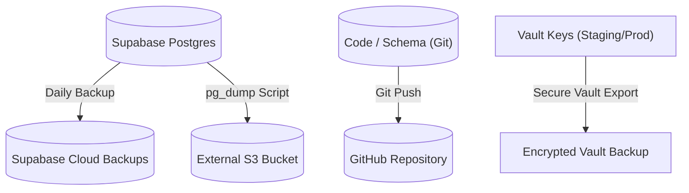

# 10 — Backup & Disaster Recovery Architecture

## Purpose
This document defines database backup schedules, data recovery procedures, configuration backups, target recovery metrics (RPO/RTO), and secret store recovery pipelines for the Sharan Fincorp platform.

## Scope
Applies to Postgres schema and transactional records, static web artifacts, Supabase Vault credentials, and IMAP statement ingestion configurations.

## Responsibilities
- **DevOps Lead**: Manages backup routines, executes test restores, and updates disaster recovery policies.
- **Project Owner (Distributor)**: Authorizes recovery activations during database disruptions.

## Architecture Overview

Sharan Fincorp enforces redundant backups across multiple cloud systems. If the primary hosting provider fails, backup assets can rebuild the system elsewhere.



---

## Detailed Design

### Recovery Objectives
- **Recovery Point Objective (RPO)**: Maximum allowed data loss is **24 hours** (matching daily backup sweeps).
- **Recovery Time Objective (RTO)**: Maximum allowed restoration window is **4 hours** for P0 outages.

### Database Backups
1. **Automated Daily Backups**: Managed by Supabase. Daily physical backups are retained for 7 to 30 days depending on project tier.
2. **Logical Backups (`pg_dump`)**: Scripted nightly dumps export table schemas and row contents (excluding Vault keys) to a secure, external AWS S3 bucket.
   ```bash
   pg_dump -h db.auxbbotbcvrgzvynyrgg.supabase.co -U postgres -d postgres > backup.sql
   ```

### Storage Bucket Backups
Files uploaded to private S3 storage buckets (signature files, stamp images) use bucket replication to copy content to a fallback region automatically.

### Code & Database Configuration
- All database tables, RLS policies, trigger code, and Edge Functions are managed as files in the repository.
- GitHub hosts the codebase. If the database engine needs to be rebuilt, applying standard migrations recovers the schema instantly.
  ```bash
  supabase db deploy --project-ref new-project-id
  ```

### Secret Store & Key Recovery
- Vault keys (`pan_encryption_key`) are sensitive.
- These keys are securely archived in offline, encrypted keyvaults (e.g. AWS KMS). They are never stored in source code repositories or logical dumps.

---

## Dependencies
- **pg_dump tool**: For database exporting.
- **AWS KMS / KMS Keyring**: For encrypting backup files.

## Design Decisions
- **Off-Site Backups**: Logical database dumps must run to an external server outside the primary Supabase hosting infrastructure. This safeguards operations if the cloud account is compromised.
- **Schema-First Reconstruction**: Code is the authority for database structures. Re-deploying migrations recovers database layouts without restoring full physical disk images.

## Future Evolution
- **Continuous Point-in-Time Recovery (PITR)**: Enabling write-ahead logging (WAL) archiving to reduce the RPO to minutes instead of 24 hours.

## References
- [Target Architecture Contract](README.md)
- [05 — Deployment Architecture](05-deployment-architecture.md)
