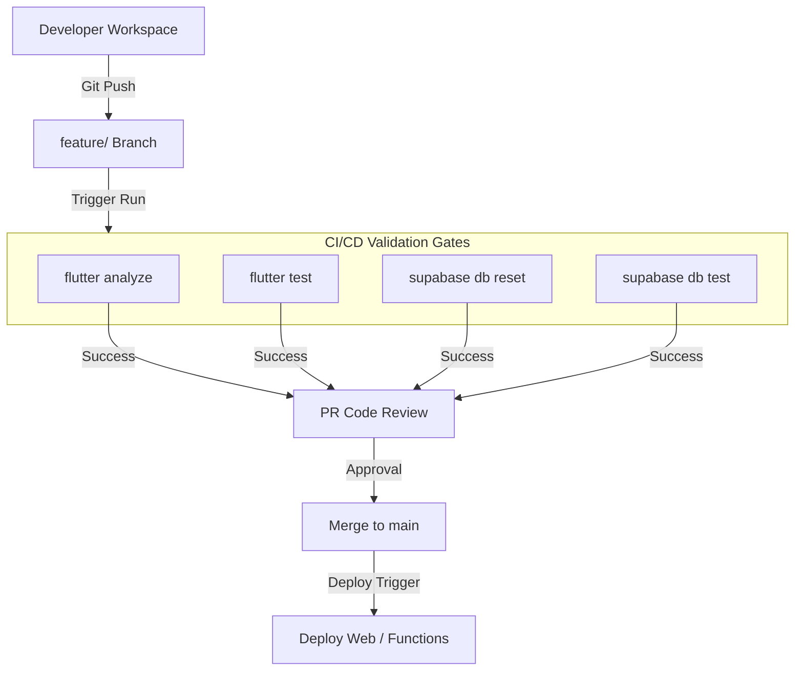

# 11 — CI/CD Pipeline Architecture

## Purpose
This document defines build verification pipelines, testing routines, code review workflows, deployment flows, release tagging, and rollback strategies for the Sharan Fincorp repository.

## Scope
Includes GitHub Actions workflows, Flutter static analysis gates, Dart unit/widget test executors, database migration testers, and deployment triggers.

## Responsibilities
- **DevOps Lead**: Manages deployment scripts, configures repository secrets, and maintains CI workflows.
- **QA Engineer**: Validates that all test runs compile and pass before PR approval.

## Architecture Overview

Sharan Fincorp utilizes GitHub Actions to trigger continuous integration builds. No branch modifications merge directly to the production tracking branch without verification.



---

## Detailed Design

### Branch Strategy
- **`main`**: Reflects the current production deployment. Direct commits are forbidden.
- **`feature/*`**: Standalone branches for specific tasks (e.g. `feature/analytics`).
- **`release/*`**: Stabilization tracks for staging verifications prior to production updates.

### Build Verification Workflow (Pull Requests)
Every PR targeting `main` triggers a GitHub Action worker to execute:
1. **Lint Check**: Enforces style rules:
   ```bash
   flutter format --set-exit-if-changed .
   flutter analyze
   ```
2. **Flutter Tests**: Runs the unit/widget test suite:
   ```bash
   flutter test
   ```
3. **Database Test**: Starts a local Supabase instance, applies all migrations, and runs pgTAP database tests:
   ```bash
   supabase db reset
   sh supabase/tests/run_all.sh
   ```

### Release & Deployment Flow
When a release branch merges to `main`:
1. **Web Build**: GitHub compiles web assets and uploads them to the CDN.
2. **Edge Functions**: Deploy using the Supabase CLI:
   ```bash
   supabase functions deploy --project-ref auxbbotbcvrgzvynyrgg
   ```
3. **Database Migrations**: Applied to the hosted production database.

### Rollback Strategy
- **Web Client**: CDN settings allow reverting routing to the previous static release tag instantly.
- **Database Schema**: Database rollback is handled via forward-only hotfix migrations rather than backup restorations, ensuring database records are not lost.

---

## Dependencies
- **GitHub Actions**: Pipeline executor.
- **Supabase CLI**: For database testing inside pipeline runtimes.
- **Flutter SDK**: For compiling client code in runner VM containers.

## Design Decisions
- **Unified Validation Gates**: PR builds execute Flutter tests and database tests concurrently. A failure in either gate rejects the build.
- **Pre-Release Evidence**: A walkthrough log must be updated at release time detailing verification outputs.

## Future Evolution
- **Automated Android Compiles**: Configuring automated builds to generate Android App Bundles (AAB) and deploy them to Google Play beta tracks.

## References
- [Target Architecture Contract](README.md)
- [ADR-005 — Require Evidence-Driven Release Workflow](../decisions/ADR-005-Release-Workflow.md)
