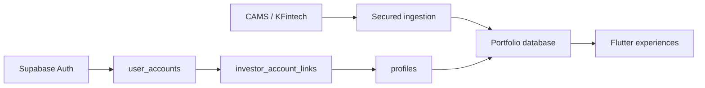
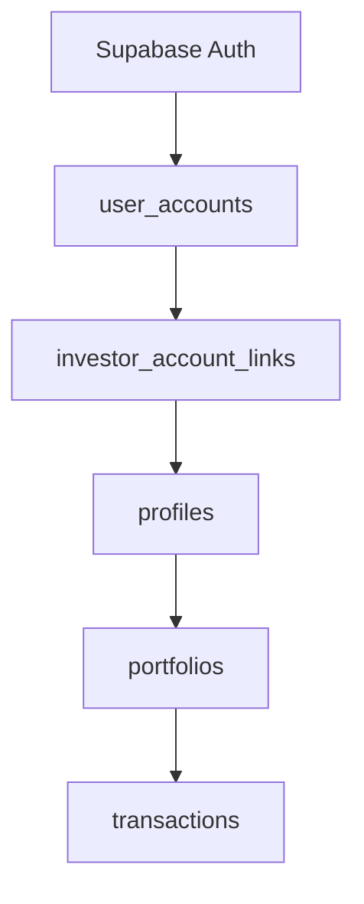

# Sharan Fincorp Architecture Contract

**Mandatory reading before every sprint.** Current release: `v0.7.0-alpha`.

This is the high-level architecture guide for the Mutual Fund Portfolio
Management Platform. Detailed, durable decisions are recorded in the
[Architecture Decision Records](../decisions/README.md).

## System Purpose

Sharan Fincorp is a secure, Advisor-managed mutual fund portfolio platform.
Advisors operate client, ingestion, factsheet, invoice, and review workflows.
Investors receive only their own verified portfolio and permitted resources.
Registrar-originated data can exist before an investor creates an account.

## Architectural Principles

- Security, least privilege, and server-side authorization take precedence over
  UI convenience.
- Authentication identity is separate from business investor identity.
- Investor ownership changes require safe automatic matching or explicit,
  auditable verification.
- RLS and secured RPCs are the authorization authority; Flutter only improves
  navigation and usability.
- Evidence and verification events are immutable historical records.
- Migrations are forward-only and historical migrations are never edited.
- Widgets render state; repositories and application services own data access
  and business orchestration.
- New domains require approved architecture before implementation.

## Identity and Ownership

`profiles` represents the distributor's business identity and may exist without
an Auth account. `investor_account_links` is the sole ownership relationship.
Account states are Advisor, Linked Investor, Link Pending, and Explorer.

PAN is business evidence only. It is never login, authentication, ownership, or
automatic-linking input.

## Verification and PAN Protection

Verification requests provide the versioned lifecycle; verification events
provide append-only history. Secured RPCs perform approval, rejection,
request-more-information, cancellation, and revocation transactionally.

Advisor candidate search uses short-lived opaque tokens rather than profile
UUIDs. Tokens are bound to the Advisor, request, candidate, and expiry.

PAN architecture separates durable encrypted business records from immutable
request evidence. PAN encryption and lookup HMAC use separate Vault secrets.
Browser clients receive only masked PAN projections. Raw PAN must not persist
in active statement storage or operational logs.

## Application and Data Boundaries

Flutter features organize models, repositories, services, and presentation.
Widgets do not call Supabase directly or make ownership, authorization, or
lifecycle decisions. Repositories invoke safe projections; Supabase owns RLS,
transaction boundaries, and privileged mutation.

## Release Discipline

Every sprint follows: Architecture → Implementation → Local validation →
Security review → Fixes → Validation → Merge → GitHub pre-release. Release
evidence includes database reset, SQL lifecycle tests, Flutter tests, analysis,
web build, and diff integrity checks.

## Non-Negotiable Rules

1. Never expose internal UUIDs as business identifiers.
2. Never expose, persist, or log raw PAN outside an approved protected boundary.
3. Never bypass repositories or call Supabase directly from widgets.
4. Never weaken RLS, grants, or server-side authorization.
5. Never automatically change investor ownership outside an approved flow.
6. Never edit historical migrations or remove immutable audit history.
7. Always approve architecture and validate locally before merge.

## Related Documentation

- [Architecture Decision Records](../decisions/README.md)
- [Product roadmap](../../ROADMAP.md)
- [Release changelog](../../CHANGELOG.md)
