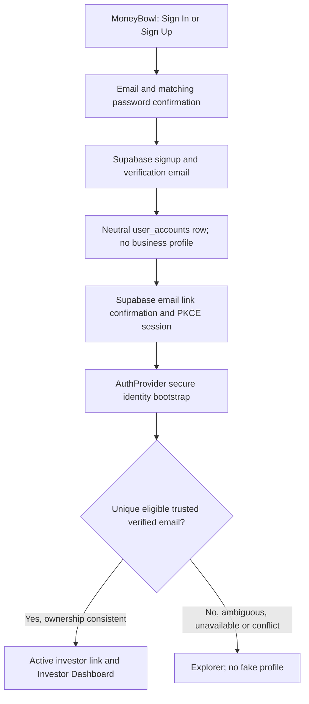

# Email Signup + Verification V1

Local candidate based on fetched `origin/develop` at
`62062f188fc48d9415b38be7212489776947b23a`. No hosted changes or email delivery.

**MoneyBowl public signup does not permit users to self-declare investor, MFD, advisor or admin status.**

## Lifecycle and first screen



The first screen has a MoneyBowl heading and always-visible **Sign In | Sign Up**
segmented control. Sign In retains email or mobile number plus password,
including international `+` numbers. Sign Up has email, password, confirmation,
12–128-character passphrase guidance and Create Account. There are no role,
workspace, mobile signup or referral-metadata fields. Existing theme colors,
card radius, shadows and Outfit branding are reused in a centered, scrollable
440px maximum-width layout.

After signup, the same card shows **Check your email**, a masked destination,
verification/spam-folder instructions, resend countdown, Change email and Return
to Sign In. Password fields are cleared on successful submission or mode change.
Attempts, including failed sends, start a 60-second cooldown. Double submission
is blocked. Switching email does not reset that cooldown. There are no automatic
signup/resend retries. Cooldown/pending email are transient UX state, not an
abuse boundary; refreshing cannot bypass Supabase's server limits.

No existing Terms/Privacy documents, URLs, acknowledgement record or required
consent contract were found. This candidate does not invent legal terms or
record misleading consent. Product/legal should supply approved documents and
any consent-record requirements before a public launch if acknowledgements are
required. This is not a role-selection mechanism.

## Before and after

Previously, `handle_new_user()` accepted user-editable `role` and
`membership_role`, attached profiles using unconfirmed contact values, and
created business profiles and personal workspaces. Bootstrap recognized only
legacy `client` matches and routed no-match accounts to linking. RouteGuard
required a profile even for Explorer. AuthProvider only listened for future
session events and did not dispose its listener.

The forward migration `20261002221544_email_signup_verified_identity.sql`:

- Creates only an Explorer `user_accounts` row on auth insertion, idempotently.
  No contact claiming, business profile, workspace or membership is created by
  public signup. All role metadata is ignored.
- Serializes bootstrap per account; matches confirmed `auth.users.email` against
  trimmed, case-insensitive trusted `profiles.verified_email`, for active
  `investor` and legacy `client` records. It counts matches before ownership
  filtering, locks the candidate and rechecks ownership and eligibility. Unique
  active-link indexes protect both account and profile during races.
- Requires consistent direct-profile ownership and active link ownership.
  Another user's profile is never reassigned. Revoked relationships are not
  automatically revived. Conflicting existing active links fail closed.
- Adds the link and, only where `profiles.user_id` is null, sets that ownership
  pointer in the same transaction. This preserves existing server helpers and
  business dashboard consumers; names, contact data, portfolios, workspace
  memberships and other business values are not overwritten.
- Reuses valid active links; repeated/concurrent bootstrap is idempotent. A new
  verified unmatched account becomes completed Explorer, with no profile. Zero,
  multiple, occupied, suspended and revoked candidates all yield the same
  neutral public resolution. Existing explicit `link_pending` remains supported.
- Resolves staff routing only from an active trusted business profile. Existing
  advisor/admin/operations/platform-admin profiles continue to route to the
  existing dashboard. A cached account-state marker is not enough. Existing
  valid investor links, including historical phone-authenticated accounts, are
  retained without introducing a new mobile matching or signup flow.
- Allows Explorer to enter the existing portfolio-linking flow via
  `complete_onboarding_choice`; that RPC accepts only Explorer/link-pending,
  requires verified email and cannot replace an active investor relationship.
  Explorer now exposes Link existing investments; linking progress derives from
  persisted account state so an auth refresh does not reset its screen.
- Restricts identity writes to controlled server functions. Browser roles cannot
  INSERT/UPDATE/DELETE profiles, accounts or links. RLS remains enabled; a narrow
  own-profile SELECT policy lets trusted staff load their profile without a
  workspace. Trigger execution is revoked from public/API roles. RPCs use an
  empty search path, qualified tables, `auth.uid()` and explicit grants.

No existing business data is rewritten by applying the migration. Trusted
backend provisioning must explicitly create its business profile/workspace;
creating an Auth user with role metadata is intentionally no longer provisioning.

## Invitations and referrals

`accept_workspace_invitation` now requires the authenticated user's confirmed
email to match the invitation recipient. It locks the pending, unexpired
invitation, checks the workspace is active and the inviter still holds active
admin authority (or is an active platform admin), then uses the **stored
invitation role**. It never uses caller role metadata, claims another profile by
contact, promotes an existing profile, or silently reactivates a membership.
Creation of a profile here represents an explicit trusted business invitation.
An investor invitation alone does not establish an investor-account link.

The old `invited_token` auth metadata transport is still understood during
bootstrap, after verification; a token has no effect without a valid matching
server invitation. Invalid/replayed tokens do not disclose invitation details
through public bootstrap. Successful acceptance retains the audit event. The
explicit acceptance RPC gives the same generic rejection for invalid, expired,
revoked and wrong-recipient tokens.

The existing `/join?ref=...` pre-auth claim, authenticated binding and trusted
investor conversion are retained. Explorer does not earn a business-investor
conversion merely by signing up. The existing referral controller is transient:
its in-memory pre-auth claim is not carried across a new tab/app restart; returning
to the original open tab and signing in preserves that path. Cross-restart
referral attribution needs a separate persisted claim/resume design; no unsafe
referral or role metadata was added to signup.

## Session, callback and recovery

Supabase Flutter explicitly uses PKCE. The SDK generates/stores the verifier,
exchanges callback codes, persists/restores sessions and refreshes tokens. No
MoneyBowl code stores access or refresh tokens or handles verification tokens.
The app recognizes `/auth/callback` and uses its normal AuthWrapper and bootstrap.
AuthProvider consumes both a session already restored during SDK initialization
and later auth events. Duplicate loads share one in-flight operation. A session
generation prevents an old request from restoring identity after logout/account
change; the listener is cancelled on disposal.

Web defaults to `<current-origin>/auth/callback`; use the build-time
`AUTH_EMAIL_REDIRECT_URL` to set an explicit callback for a subpath deployment or
controlled environment. Android has release network permission, registers `app.moneybowl://auth/callback` and
uses the SDK's existing app-links handling. Existing `/join` intent handling is
retained. This repository has no iOS runner; native iOS registration/device testing
is not claimed.

PKCE completion needs the browser/app storage that initiated signup. On another
device, private window, cleared storage, or a reused/expired link, the auth screen
provides a generic recovery message: sign in if already confirmed, otherwise
request another email through Sign Up. Confirmation at Supabase may already have
succeeded even when code exchange cannot finish. Manual sign-in then follows the
same bootstrap. A valid current session is not discarded because of a link replay.
Cold web callbacks without a session also show recovery even if the SDK emitted
its error before AuthProvider was created. Raw errors, email-existence claims,
customer match details, passwords and codes are never rendered or logged by the
new application code. Account-load failures have Try Again and Sign Out actions.

## Manual Supabase DEV setup before live email testing

These are operator instructions, **not changes performed by this task**.
Repository `supabase/config.toml` controls local development only. It now enables
email confirmation, sets a 12-character password minimum and 60-second email
frequency, disables new SMS signup, and includes local/Android callback URLs.

1. Apply the forward migration through the normal reviewed deployment process
   before exposing signup. Do not enable public signup on the old trigger.
2. Authentication → URL Configuration: set Site URL to the exact DEV app origin.
   Add `<DEV-origin>/auth/callback` to Redirect URLs. For a local Flutter web test
   on port 3000, allow `http://localhost:3000/auth/callback` and/or
   `http://127.0.0.1:3000/auth/callback`, matching the origin actually used.
   For Android, allow `app.moneybowl://auth/callback`. Do not use broad production
   wildcards. The DEV origin is operator-supplied; no hosted URL is assumed here.
   The web host must rewrite `/auth/callback` to Flutter's `index.html`.
3. Authentication → Providers → Email: enable email/password signup and **Confirm
   email**; retain secure email-change confirmation. Set password minimum to 12.
   Keep anonymous signup off. No new phone, social, MFD or advisor provider is
   needed. Preserve established phone-password login configuration for existing
   accounts. Supabase's existing-user obfuscation also depends on Confirm phone;
   review that setting without disabling verification for existing phone users.
4. Authentication → Email Templates → Confirm signup: use the supported
   `{{ .ConfirmationURL }}` link, not an OTP-code-only template or custom token
   endpoint. Use the configured redirect allowlist. Set email link expiry to
   3600 seconds. Disable mail-provider click tracking/link rewriting that consumes
   or damages one-use links. Do not log callback query strings in web analytics.
5. Authentication → Rate Limits: retain server IP limits no more permissive than
   30 signup/email requests per 5 minutes and 30 verification requests per
   5 minutes; set email resend frequency to at least 60 seconds. Start custom-SMTP
   DEV email quota at 10/hour and adjust deliberately for authorized testing.
   The built-in sender has a much smaller quota (2/hour) and restricted delivery;
   use authorized team addresses or configure custom SMTP to test other addresses.
   These limits, not the client timer, protect the public API. See
   [Supabase rate limits](https://supabase.com/docs/guides/auth/rate-limits).
6. Authentication → SMTP: if needed, configure a DEV sender, SMTP host/port,
   credentials and verified sending domain in the Dashboard only. No SMTP secret
   belongs in Flutter or Git. See
   [Supabase password/email setup](https://supabase.com/docs/guides/auth/passwords).
7. CAPTCHA is **not implemented in this V1**. Supabase supports Turnstile/hCaptcha,
   but requires a rendered challenge and fresh `captchaToken` on affected requests,
   including existing Sign In. Enabling only the Dashboard switch would break the
   forms. Leave it off for controlled DEV testing; a bot-protected public rollout
   requires the corresponding frontend integration and Dashboard provider secret.
   No secret/sitekey or fake CAPTCHA bypass was introduced. See
   [Supabase CAPTCHA integration](https://supabase.com/docs/guides/auth/auth-captcha).

Hosted confirmations disabled would bypass the required human email-verification
step: the database cannot distinguish Supabase auto-confirmation from a completed
link. Therefore confirmation configuration is a release prerequisite, not an
optional UI preference. A product decision on approved legal acknowledgements
and on requiring CAPTCHA precedes unrestricted public launch.

## Validation

Run from the feature worktree:

```sh
bash scripts/test_email_signup_sql.sh
flutter test test/authentication test/investor_identity_models_test.dart test/user_management_workspace_models_test.dart test/referral_attribution_test.dart
flutter build web --release
python3 .github/scripts/validate_docs.py
python3 .github/scripts/validate_migration_history.py
```

The SQL runner creates a **new disposable network-disabled** Supabase Postgres
container, applies the platform Auth/Storage fixture and every repository
migration, then runs eight focused identity/auth/workspace/browser/referral SQL
suites, PL/pgSQL checks on all four changed functions, four overlapping bootstrap
requests across two competing accounts, and the existing referral-conversion
concurrency test. It removes its own container. It never selects a running shared
or hosted database. This is a full clean-schema replay, not a partial mocked
business schema. The fixture supplies GoTrue's current JWT-setting helpers
missing from the bare Postgres image, using the
[published Auth migration](https://raw.githubusercontent.com/supabase/auth/master/migrations/20220224000811_update_auth_functions.up.sql).

Flutter tests use fake gateways and the actual Supabase Dart SDK with mocked HTTP
responses. They cover signup payload/redirect, SDK PKCE exchange/replay, restored
sessions, logout/login and in-flight logout races, error redaction, current active
link/profile requirements, both auth modes, validation, busy state, verification,
cooldown, mobile/desktop layouts and both themes. No automated test sends real
email. Live SMTP delivery, hosted redirect configuration and native device link
launch still require authorized DEV testing; they have not been represented as
verified by mocks.

### Candidate validation results

- 80 focused Flutter tests passed, including the existing verification-status
  widget regression, staff routing, profile-free linking and 1.5× text at 320px.
- Eight focused SQL suites passed after a full clean migration replay, plus
  concurrent bootstrap and referral conversion. Four changed PL/pgSQL functions
  passed `plpgsql_check` with no findings.
- Release web builds passed. The initial default build reports pre-existing
  `dart:js` WebAssembly incompatibilities in admin/excel code and a missing
  Cupertino font family. The final JS release build with `--no-wasm-dry-run`
  passes with the same unrelated font warning.
- Focused static analysis has no errors/warnings and five baseline informational
  findings: existing `anonKey` deprecation and four existing mutable fake-provider
  fields. Documentation, immutable migration history and diff-whitespace checks
  passed. The Flutter runner required a local loopback-socket sandbox escalation;
  no test made a hosted request.

### Implementation files

| Area | Files |
| --- | --- |
| Unified authentication UI | `lib/screens/login_screen.dart` |
| Signup gateway, transient pending state and cooldown | `lib/features/authentication/application/email_signup_controller.dart` |
| Session/identity lifecycle, service injection, mobile login normalization | `lib/providers/auth_provider.dart`, `lib/services/supabase_service.dart` |
| Profile-free routing and Explorer linking entry | `lib/features/authentication/services/route_guard.dart`, `lib/features/authentication/presentation/onboarding_screens.dart` |
| PKCE initialization, callback route and retry UI | `lib/main.dart` |
| Android callback and network permission | `android/app/src/main/AndroidManifest.xml` |
| Local Auth prerequisites | `supabase/config.toml` |
| Forward database contract | `supabase/migrations/20261002221544_email_signup_verified_identity.sql` |
| Reproducible local SQL and concurrency checks | `scripts/test_email_signup_sql.sh`, `scripts/test_email_signup_concurrency.sh`, `supabase/tests/email_signup_identity_test.sql` |
| Auth tests | `test/authentication/email_signup_test.dart`, `auth_session_test.dart`, `explorer_entry_test.dart`, `route_guard_test.dart`, `onboarding_services_test.dart` |

Existing auth/workspace/referral fixtures explicitly provision trusted business
profiles instead of relying on the removed unsafe signup side effect. Production
referral functions and financial data are unchanged.
