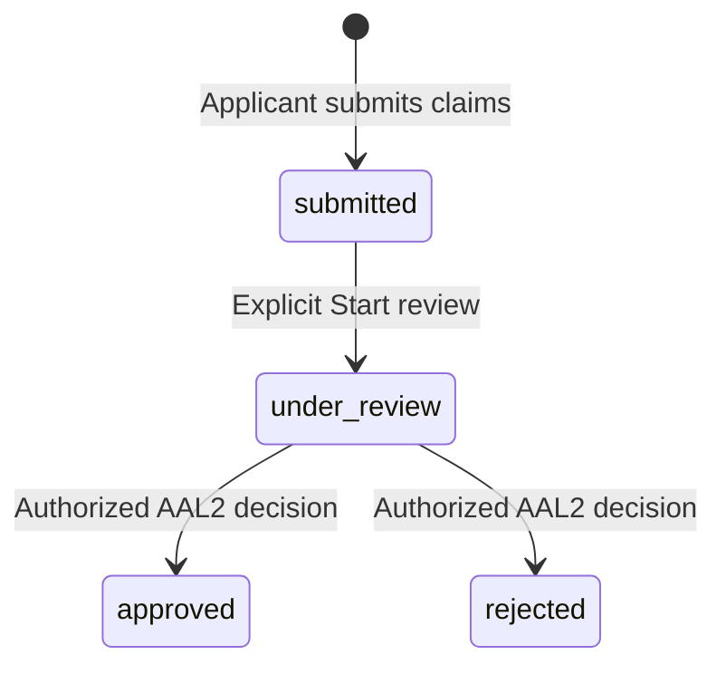

# MFD Application / Approval V1

Status: local implementation candidate; no hosted migration or deployment performed.
Base: `534cbbfb8111dcbc690e4649f8b0b479333eab69`.

## Product and authority contract

An application claim is not authority. The active workspace membership is tenant
authority. Platform Admin review authority remains independent from tenant
authority.

V1 admits only a clean Explorer: authenticated, confirmed nonempty email,
non-anonymous, non-deleted, non-banned Auth account, an Explorer `user_accounts`
row, no linked `profiles` row, no active investor account link, no unrevoked
Platform Admin grant, and no approved initial application. Because workspace
memberships and ownership reference profiles, absence of an account-linked profile
also excludes existing directly linked professional/workspace authority. Existing
investor/client, staff, Advisor, workspace-admin, inactive/suspended profile, and
platform identities are unsupported. Nothing silently converts or reactivates them.

The same eligibility check runs after applicant lifecycle locks at submission and
again at approval. An eligible submission is not a promise of later approval.
Rejection never resets or deletes a legitimate identity acquired independently.

The applicant supplies only business name, claimed ARN and an optional note.
Identity/email are loaded from `auth.uid()` and `auth.users`. Text is trimmed,
with limits of 200 characters for business name, 100 for ARN, and 2000 for notes.
Whitespace-only required fields are rejected. ARN has no invented format rule.

Approval records that a human Platform reviewer manually accepted the submitted
registration claim. It requires a nonempty evidence/reference note and preserves
both the claimed and accepted ARN snapshots. No external verifier is called and
no claim of independent database/provider ARN validation is made. Review notes
are applicant-visible: the UI asks reviewers not to include secrets or unrelated
customer information. EUIN and legacy `advisor_profiles` are not provisioned.

## State machine and storage



There is no persistent draft or in-place claim editing. Rejection permits a new
application if the applicant is still eligible. A rejected record cannot reopen.
Any currently authorized reviewer may finish a review; starting review is not an
exclusive reviewer assignment. Opening a detail page performs reads only.

Migration: [20261004144356_mfd_application_approval_v1.sql](../../supabase/migrations/20261004144356_mfd_application_approval_v1.sql).

- `public.mfd_applications`: immutable applicant/email/claim snapshot, lifecycle
  state/version (1/2/3), start/decision Auth-user attribution and timestamps,
  decision note, approved claim snapshots, unique resulting profile/workspace/
  membership references. Foreign keys restrict deletion of meaningful history.
- `public.mfd_application_events`: append-only submitted/review-started/approved/
  rejected events, applicant and actor Auth UUIDs, request UUID, state/version
  transition, timestamp and decision/provisioning details. One event per lifecycle
  step and at most one terminal event per application.
- `mfd_application_private.requests`: private immutable request receipts, globally
  unique request UUID, actor, operation, normalized input, application and original
  committed result. Separate receipts allow a no-op repeated Start review without
  creating another history event.

Partial unique indexes allow one open application and at most one approved initial
application per applicant. CHECK constraints require coherent state/version,
review/decision fields and approval-only result IDs. Triggers reject claim edits,
terminal rewrites, skipped transitions and history UPDATE/DELETE. Approval result
references are checked against actual applicant/profile/owner/admin membership.
Account-history and queue indexes support bounded list reads.

## RLS, ACL and RPCs

RLS is enabled on all three tables. The only public table policies are SELECT:
applicant owns the row, or `has_platform_capability('mfd_applications.review')`.
Application/event reads expose only this review domain, never arbitrary tenant
records. Applicant event history and reviewer notes are deliberately safe to share
with that applicant. No internal credentials are collected or stored here.

All table privileges are revoked from PUBLIC, anon, authenticated and service_role
before granting authenticated SELECT on the two public tables. No direct browser
submission, decision, event write or TRUNCATE is allowed. The private schema and
all its helpers/receipts are inaccessible to API roles. Each public RPC explicitly
revokes all execution privileges before granting only authenticated execution.
An internal `require_browser()` also requires a signed-in authenticated execution
role; a service-role caller is not a human decision shortcut.

All privileged functions use an empty search path and qualified domain objects.
No existing tenant policy, platform grant, commissioning function, or invitation
policy is changed.

| RPC | Parameters | Result / authority |
| --- | --- | --- |
| `get_my_mfd_application_context` | none | `{can_apply: boolean}` for current account |
| `submit_mfd_application` | request UUID, business name, claimed ARN, optional note | Application snapshot; eligible applicant only |
| `start_mfd_application_review` | application UUID, expected version, request UUID | Application snapshot; current review capability, no AAL2 required |
| `approve_mfd_application` | application UUID, expected version, request UUID, evidence | Application snapshot with provisioning IDs; human review capability plus AAL2 |
| `reject_mfd_application` | application UUID, expected version, request UUID, reason | Rejected application snapshot; same capability/AAL2 guard |

All mutations derive actor identity server-side. Submission has no caller-supplied
applicant/profile/workspace/role/state/verified-ARN parameters. Start review holds
current account/profile/grant locks and rechecks the review capability. Approval
and rejection call the existing private
`platform_authority.require_mutation('mfd_applications.review')` unchanged. It
requires both platform-admin and review grants, verified AAL2 JWT/session/factor
state and eligible actor lifecycle, holding relevant authority locks through the
transaction. Read-only review is allowed at AAL1.

## Approval and rejection transactions

Approval executes in one PostgreSQL transaction:

1. Require authenticated execution and the existing platform mutation guard.
2. Normalize/bound evidence and validate request parameters.
3. Acquire transaction advisory lock `mfd-request:<full request UUID>`; compare an
   existing receipt's actor, operation and normalized inputs. Exact authorized
   replay returns the original result before stale-version/eligibility checks.
4. Resolve the application's immutable applicant, lock Auth row FOR UPDATE,
   then `user_accounts` FOR UPDATE, then application FOR UPDATE.
5. Require under-review state and expected version; recheck clean-Explorer
   eligibility. New profile/link/platform grant/account lifecycle conflicts deny
   approval without overwriting the independently acquired identity.
6. Create one active `profiles` row with `user_id=applicant`, `role=advisor`.
7. Create one active workspace with the submitted business display name,
   `owner_profile_id` equal to that profile, and slug `mfd-<full application UUID>`.
8. Create exactly one active, unended `admin` membership for that profile/workspace.
9. Set applicant account state to `advisor`, onboarding completed.
10. Mark approved/version 3 and store accepted business/ARN snapshots, reviewer
    Auth UUID, evidence, timestamp and the three resulting IDs.
11. Append approval event and one `mfd.application_provisioned` workspace audit,
    with reviewer `actor_user_id`, null profile attribution and request/application
    correlation. This is not an `override.*` family-support event.
12. Persist the immutable request receipt and commit everything together.

An exception rolls back profiles, workspace, membership, account projection,
application changes, events, workspace audit and receipt. The applicant later
refreshes identity through the existing `AuthProvider`/bootstrap flow; approval
never calls the reviewer's `bootstrap_identity()` to provision an applicant.

Rejection uses the same guard/request/account/application serialization and
under-review/version checks, but only changes the application, event and receipt.
It requires a nonempty applicant-visible reason, does not require the applicant to
remain a clean Explorer, and never changes their current account/business state.
It is safe to reject an application whose applicant independently acquired a
business identity. New request IDs cannot overwrite either terminal outcome.

## Exact authority created and exclusions

`profiles.role=advisor` and `user_accounts.account_state=advisor` provide current
compatibility/routing. Effective `workspace_memberships(role=admin)` establishes
tenant administration; ownership plus that membership also satisfies existing
MFD-side operational predicates. No separate Advisor membership is created;
existing uniqueness allows only one unended membership for a profile/workspace.

Approval creates an empty tenant. It supplies no investor target, NSE connection,
credential, feature flag or provider operation. Existing future investor-admission
and operation-specific authorization checks still apply; this does not redesign
the capabilities already inherent in owner/admin membership.

Unchanged: `advisor_profiles`, `advisor_euin_assignments`, investor account links,
advisor-investor assignments, portfolios, orders, verification assignments, folio
grants, NSE integration accounts/operations/connections/credentials, outbox,
`distributor_details`, platform grants/events, billing plans/subscriptions and
reviewer memberships. The existing membership trigger only updates an already
present billing count; it does not create a billing row for this new workspace.

The reviewer needs no business profile and receives no membership or tenant access.
Future staff can join through existing trusted workspace invitations; staff do not
need a separate MFD application to work within an approved MFD workspace.

## Idempotency, concurrency and UI

Request UUIDs are global within this domain, not scoped only to an application.
An exact operation/actor/normalized-input replay returns the original committed
snapshot. Reuse with different payload, version, actor, target or operation raises
`mfd_request_conflict`. Request advisory locks serialize absent receipts; account
locks serialize same-applicant operations with different request IDs; application
locks/version and unique constraints allow only one terminal decision/provisioning.
Authorization is checked before replay, so revoked reviewers cannot replay using
stale capability/MFA context. Once a guard has locked authority, revocation either
wins before it and blocks the decision, or waits until the authorized transaction
finishes. There is no external/provider work inside these transactions.

Repeated Start review on an already under-review application returns the current
snapshot without another event, including another reviewer's stale version-1
view. It cannot reopen a terminal application. Submitted claims never change.

Flutter adds an Explorer entry, application form/status/reapplication flow, and
an actionable Platform Administration tile, paginated queue, detail/history and
explicit Start review. Approve requires manual-review acknowledgement and evidence;
Reject requires a reason. At AAL1 decision controls are disabled and explain MFA.
MFA enrollment and step-up UI are outside scope. Backend checks remain mandatory.

Each form freezes a UUID and payload on its first attempt and reuses the identical
request on Retry safely; fields are read-only after an uncertain attempt. Opening
or refreshing pages never submits or starts review. A terminal success refreshes
server state; approved applicant status refreshes existing identity routing.
Unknown and known backend errors are mapped to safe messages rather than raw SQL.
Closing a failed form does not automatically resubmit; reopening/reloading checks
current state and server uniqueness remains authoritative.

## Validation and delivery

Run only the explicitly disposable harness:

```bash
bash scripts/test_mfd_application_sql.sh
flutter test --no-pub test/mfd_application_test.dart test/authentication test/platform_administration_screen_test.dart
flutter test --no-pub
python3 .github/scripts/validate_docs.py
python3 .github/scripts/validate_migration_history.py
```

The SQL harness creates a uniquely named PostgreSQL container with `--network none`,
a tmpfs database and no host port or volume. It uses `docker exec psql` only, replays
the complete migration sequence and removes its container on exit. It does not
read Supabase linkage, hosted URLs or hosted credentials. The concurrency script
checks both the specific disposable name prefix and Docker network mode.

Coverage includes eligibility, RLS/ACL, both capability grants, missing/invalid/
expired/removed MFA state, immutable claims/events, exact provisioning, all excluded
entity counts, late-audit rollback, rejection/reapplication, stale identity, replay
conflicts and competing transactions. Existing signup/containment/platform/order/
NSE authorization regressions run in the same disposable schema. Synthetic fixtures
are never actual enrollments or hosted users. Flutter tests use fake repositories
or HTTP mocks; no provider requests are made.

Baseline before edits: 64 relevant Flutter tests passed; the existing complete
platform-authority SQL harness and its signup/containment/platform races passed.
The initial sandboxed Flutter attempt could not bind its localhost test socket;
the authorized local runner passed. No migration was applied to hosted DEV.

Future work: external/manual registration policy evolution, existing-identity
application flows, credential lifecycle/EUIN, MFA enrollment UI, MFD suspension or
revocation, ownership transfer, billing activation, provider credential setup and
multi-workspace business hierarchy. None is implicitly enabled by V1.

Final local validation:

- Full Flutter suite: 395 passed, including 25 new MFD tests and all existing
  auth/platform routing regressions.
- MFD SQL suite: 98 assertions passed; composed suite reported 294 assertions,
  with all 11 selected SQL/fixture suites passing.
- Seven MFD concurrency scenarios passed: competing approvals, approval/rejection,
  exact approval replay, overlapping submissions, shared request UUID across
  applications, capability loss and session expiry. Existing signup, containment
  and platform concurrency regressions also passed.
- Changed-code Dart analysis: no issues. Dart formatting, shell syntax,
  documentation validation and frozen migration-history checks passed.
- A new-function SQL variable qualification and two Flutter test-fixture errors
  found during development were corrected; final reruns passed.
- No hosted tests, linked-project reset/lint, browser deployment, MFA enrollment
  or NSE/provider calls were run. Local full-schema replay and real API-role tests
  use the proven isolated harness instead of commands that might follow linkage.

## Pre-commit security review

The implementation and deterministic tests were reviewed against these boundaries:

| Question | Result and enforcement |
| --- | --- |
| Can an Explorer approve themselves? | No; private platform capability/AAL2 guard and no direct decision DML. |
| Can a claimed ARN grant authority? | No; submission creates application/event/receipt only. |
| Can service_role bypass the human decision contract? | No; table/RPC/private-schema ACLs deny it; authenticated execution and human guard are required internally. |
| Can a tenant Workspace Admin approve? | No; tenant roles do not supply platform grants. |
| Can review capability leak tenant access? | No; new policies concern only application/event rows; existing tenant predicates are unchanged. |
| Does the reviewer join the workspace? | No; membership targets only the applicant profile; audit uses reviewer Auth UUID. |
| Can AAL1 approve or reject? | No; both endpoints call the existing mutation guard. |
| Can retries create duplicate provisioning? | No; immutable receipts, global request lock, applicant/application locks and unique constraints. |
| Can approval and rejection both commit? | No; same application lock, terminal-state checks and one-terminal-event index. |
| Can approval create investor/provider records? | No; excluded entity counts stay unchanged; new tenant has no investor/NSE target or configuration. |
| Can a stale application overwrite a new identity? | No; approval repeats eligibility under lifecycle locks and never transforms an existing profile. |
| Are decision events mutable? | No; UPDATE/DELETE triggers reject; API DML/TRUNCATE is revoked. |
| Are submitted claims mutable? | No; immutable provenance trigger and no browser write grants. |
| Can browser clients directly write decisions? | No; only authenticated controlled RPC execution is granted. |

The review does not change the trust placed in the database owner/operator. It
adds no service-key or database-operator commissioning route for this feature.
