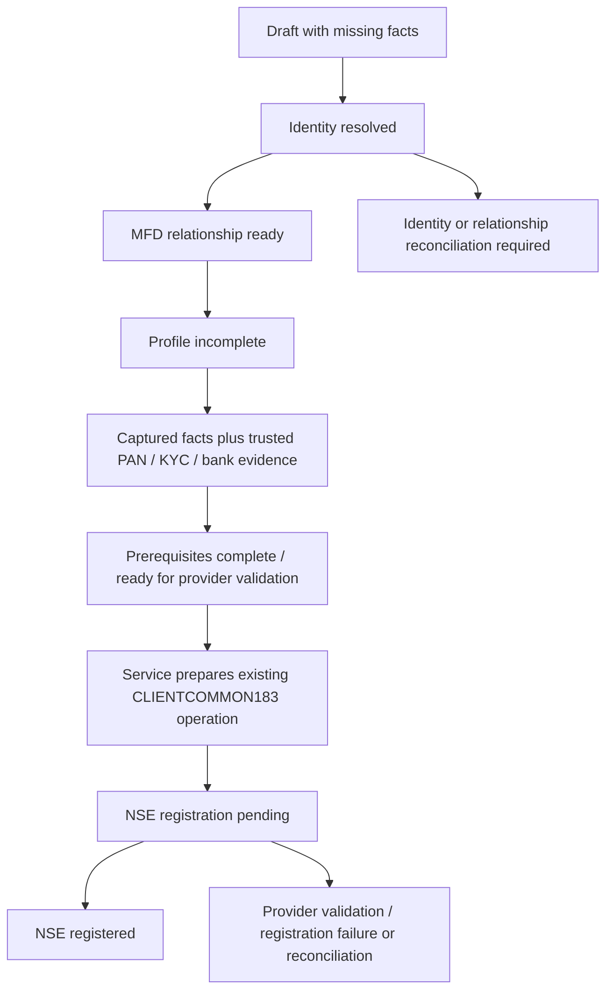

# MFD-led Investor Onboarding V1

Local DEV candidate; no hosted migration, real investor mutation, provider request, deployment or publication was performed.

## Provenance

- Canonical repository: `/home/ubuntu/moneybowl`, clean `develop` before editing.
- `git fetch origin develop` confirmed both local and remote develop at `a7d7bf0eba02220e7b05034f8e32e77cb47d406a`.
- Isolated branch: `feature/mfd-led-investor-onboarding-v1`.
- Worktree: `/home/ubuntu/moneybowl-worktrees/mfd-led-investor-onboarding-v1`.
- No draft onboarding worktree was copied or cherry-picked.
- Additive migration: [MFD onboarding](../../supabase/migrations/20261006191416_mfd_led_investor_onboarding_v1.sql). Historical migrations are unchanged.

## Identity and relationship model

`auth.users` is the authentication identity. `user_accounts` is its existing application routing projection. Neither is an investor business profile. The existing `profiles` row with investor/client role is the canonical investor and can have `user_id = NULL`. `investor_account_links` remains the authoritative, unique active account-to-investor relationship. No second account system or Explorer business profile is introduced.

The existing signup trigger creates a neutral account shell with `onboarding_completed = false`. This is not a completed Explorer choice, investor profile, or workspace. Bootstrap resolves investor identity **before** returning its completed routing projection. A verified matching signup goes directly to Investor; no matching investor falls back to Explorer. Existing Explorer history and the auth user are retained.

The additive private `moneybowl_onboarding.cases` table holds resumable, encrypted input and its provenance. It references canonical profiles rather than replacing them. Drafts do not claim identity. `UNIQUE(workspace_id, investor_profile_id)` permits one canonical onboarding case per workspace/investor. A restarted duplicate draft points to the existing case; its original audit history is retained and it disappears from the active draft directory.

Existing PAN records provide encryption, keyed HMAC lookup, provenance, masking and observed/verified/conflict states. The flow normalizes PAN, examines **all** matching non-superseded records, and refuses multiple matches, conflicting PAN records, inactive profiles and incompatible known name/contact/DOB evidence. Contact overlap with another investor but no compatible PAN is reconciliation, not another profile. A canonical PAN captured here is `OBSERVED`, never automatically `VERIFIED`.

New investors receive an investor membership and advisor assignment in the initiating approved MFD's workspace, in the same transaction as profile resolution. An existing investor must already have the actor's live assignment in that workspace. Knowing PAN or contact details cannot manufacture another relationship. The repository supports multiple workspace-specific relationships; existing ones are preserved. This flow does not steal, end, reactivate or create an additional relationship to an existing investor based on PII. Additional relationships require an independently authorised relationship process and review.

## Account matching and the two arrival orders

For **new MFD-asserted contact evidence**, V1 deliberately requires both a verified Auth email and verified Auth mobile to identify the same unique account. A single MFD-entered address, an unverified Auth address, PAN, Auth metadata or a reported KYC status cannot authenticate ownership. The pre-existing independently trusted `profiles.verified_email` bootstrap path is retained behind a private compatibility function; MFD onboarding never writes that field.

The private matcher is shared by MFD resolution and signup/bootstrap. It counts email/mobile candidate accounts together before linking. It refuses split email/mobile candidates, inactive/banned/deleted/anonymous accounts, other owned business profiles, active links elsewhere, historical revoked links, overlapping investor contact records, or cases already awaiting reconciliation. It never detaches or overwrites ownership. Persisted conflicts cannot be cleared by sending different frontend state or re-verifying contact details.

```mermaid
sequenceDiagram
  participant MFD
  participant RPC as Transactional onboarding RPC
  participant Investor as Canonical investor
  participant Auth as Existing or future Auth account
  MFD->>RPC: Add Investor / reviewed business details
  RPC->>RPC: Verify approved MFD owner + live workspace authority
  RPC->>Investor: Resolve PAN and compatible identity; create only if absent
  RPC->>Investor: Establish new scoped relationship or validate existing one
  RPC->>Auth: Check unique verified email + mobile and ownership compatibility
  alt Safe existing account
    RPC->>Investor: Link same Auth user; project Investor capability
  else No account or incomplete verified evidence
    RPC->>Investor: Preserve usable investor without login
    Auth->>RPC: Later verified signup / bootstrap
    RPC->>Investor: Resolve and link existing canonical investor
  else Ambiguous or conflicting identity
    RPC->>RPC: Persist reconciliation; do not relink
  end
```

Email signup remains the existing Supabase signup flow. Where an investor candidate exists but mobile verification is missing, bootstrap returns `link_pending / verified_contacts_required`, not a completed Explorer experience or manual conversion screen. The account owner can verify their mobile through Supabase's existing `updateUser` and `phone_change` OTP APIs. The repository fences those calls to the same auth user; the controller blocks double submissions, applies resend cooldown, ignores disposed responses and does not treat an intermediate secure-phone-change response as complete. Bootstrap, not Flutter, decides access after verification. Existing email verification remains required; SMS delivery must be configured in DEV to exercise this real flow. No fake confirmation path is provided.

An existing Explorer can use **Refresh account access** or sign in again to load the new capability. The login/account is unchanged. Professional and Platform Admin bootstrap projections retain the existing architecture.

## RPCs and transactional boundaries

| API | Allowed caller | Responsibility |
| --- | --- | --- |
| `list_investor_onboarding_workspaces()` | authenticated, filtered | Approved owner workspaces only |
| `list_investor_onboarding(workspace)` | approved active owner MFD | Current authorised drafts/cases only |
| `get_investor_onboarding(case)` | initiating active MFD with live relationship if resolved | Resume fields; never raw PAN/account |
| `save_investor_onboarding(workspace, case, version, fields)` | approved active owner MFD | Validate allowlisted facts, encrypt draft, materialize resolved inputs, audit atomically |
| `resolve_investor_onboarding(case, version)` | initiating active owner MFD | Resolve identity, validate/create relationship, reuse case, privately attempt account linkage |
| `bootstrap_identity()` | current authenticated account | Resolve pre-existing investor before ordinary account routing |
| `prepare_onboarded_investor_ucc(case, candidate)` | service role only | Require authoritative prerequisites and reuse existing UCC operation/outbox |

Public RPCs never accept actor/user/link/assignment IDs or verified flags from clients. They derive the actor through the repository's profile-resolution and active-account helpers. MFD approval, owner membership, workspace/profile/Auth status and relationship checks are database decisions. Operations staff, Family Guests, unrelated MFDs, Explorers and investors receive no onboarding authority. Platform authority alone is not an MFD approval.

Short V1 mutation transactions share an advisory lock across resolution and bootstrap, followed by the existing scope/row locks. This intentionally favors deterministic identity resolution over maximum onboarding throughput. Unique active account/profile links, per-workspace case uniqueness, assignment uniqueness, bank HMAC uniqueness and address uniqueness are additional database invariants. A future lock-partitioning optimization must preserve both contact/PAN ambiguity checks and revocation fencing.

Draft UUIDs are stable across retries; equivalent save retries return the current case and stale changed payloads get `onboarding_version_conflict`. Repeated resolution never duplicates identity, membership, bank, address, assignment or external attempt. Revoked assignment prevents resuming that investor's saved inputs. Resolved PAN/name/contact facts and supplied DOB cannot be silently edited. Changes to verified registration data require review; once an integration account exists, captured submission inputs are locked.

## Lifecycle and NSE readiness



Identity and relationship transitions are audited; readiness is derived, not duplicated as flags. The projection returns missing field/evidence names, relationship status, account-link status, authoritative KYC state, UCC readiness, NSE state and current operation reference.

Capture covers legal name parts, PAN, DOB, contacts, address, tax/occupation/holding information, KYC type/reported status/CKYC, bank name/type/account/IFSC/MICR, communication/paperless choices, contact ownership, nomination/holder details, declaration evidence and existing CLIENTCOMMON183 code inputs. None is defaulted to a fabricated factual value. Draft bank/PAN and other PII are encrypted using the existing Vault-backed encryption infrastructure. Bank capture uses the existing HMAC/encrypted bank setter and does not mark the record verified.

Registration/address/bank inputs materialize into existing `investor_registration_profiles`, `investor_addresses` and `investor_bank_accounts`. A reported completed KYC status is still unverified until trusted evidence sets the canonical `kyc_verified_at`. Active unverified bank fields can be completed on resume without duplicating the record. Verified, rejected or inactive bank changes require review; existing verified records are not silently downgraded or overwritten.

The existing UCC adapter supports a bounded individual/adult/resident/single-holder/nomination-opt-out slice. Joint holdings, minor/non-resident cases and nominee opt-in can retain their supplied details, but remain visibly blocked for provider support. Final code/master/semantic validation remains in the existing NSE adapter and worker. `PREREQUISITES_COMPLETE` means ready for that validation, not a promise that NSE will accept the input.

The service hook builds metadata from the captured case, calls the existing preparation RPC, records the operation reference and returns the original operation on retry. It never submits HTTP itself, retries ambiguous writes or creates replacement attempts after a failed submission. Existing Client Master verification, CLIENT_KYC_REPORT, encrypted request/response evidence and the worker lifecycle remain unchanged. B07 HIDDEN/MFD_APPROVAL/DIRECT policy and bank/mandate behavior are untouched; future APIs consume this identity/relationship foundation through their existing policy boundary.

## Security and audit invariants

- Private schema has no PUBLIC/anon/authenticated/service-role schema, table or function grants. RLS is enabled on both private tables. Only explicit public facade functions are callable; the preparation facade is service-only.
- New SECURITY DEFINER functions have an empty search path and explicit execution revocations. Existing business table policies/grants are not broadened.
- Caller account IDs, workspaces, roles, verified flags and reconciliation status cannot be injected into the allowlisted payload.
- MFD approval is checked on every read/mutation; a retained JWT cannot outlive ended membership, assignment, inactive profile/workspace or account ban.
- PAN deduplicates business identity, not auth accounts. No user metadata grants authority or proves linkage.
- Same-account linkage and actor/workspace/investor IDs, creation versus reuse, relationship provenance, verified-contact timestamps/method, conflicts, versions, lifecycle snapshots and external operation references are stored in append-only private events. Historical draft redirects preserve events. No raw PAN/account/contact payload is copied into events or application logs.
- Responses mask PAN and bank account after capture; review hides contact/CKYC/nominee/declaration evidence. Draft secrets are removed from controller memory after successful save. Account switches dispose the controller and fence late responses.
- Reconciliation is an explicit support state with an internal case reference. There is intentionally no browser override, automatic merge, ownership transfer or public privileged linking endpoint. Operators must inspect protected evidence through existing authorised maintenance/review processes.

## Validation

See [validation record](MFD_LED_INVESTOR_ONBOARDING_V1_VALIDATION.md) for exact commands, results and the pre-existing broad-runner failure. The dedicated [SQL suite](../../supabase/tests/mfd_led_investor_onboarding_test.sql) covers A–L, evidence thresholds, input injection, bank/source idempotency, source handoff, assignment revocation, masking and audit immutability. The [concurrency test](../../scripts/test_investor_onboarding_concurrency.sh) overlaps duplicate onboarding with bootstrap and fences membership revocation. Tests use only synthetic identities and local disposable databases.

## Priya/Lala DEV commissioning readiness

The feature is generic. There are no commissioning names, email/PAN comparisons or account IDs in application logic. No real PAN, bank value, auth account or investor record was read or mutated for this candidate.

After this candidate is explicitly admitted to hosted DEV, Lala can use **Clients → Add Investor**, capture known facts, review, continue and resume from **Onboarding drafts**. The UI never asks whether Priya is an Explorer. MoneyBowl can link her same account if both Auth contacts are verified and compatible. If only email is verified, Priya can complete the same-account mobile verification flow; mismatches remain reconciliation rather than a forced link.

The supplied real-world PAN/SBI information must be entered privately in DEV; values are not reproduced in code, documentation or fixtures. Do not infer DOB, legal name parts, gender, address, tax/residency/occupation/holding facts, KYC/CKYC evidence, contact ownership, nominee/guardian details or opt-out consent, paperless/communication choices, declaration evidence or provider codes. Confirm any missing SBI account-type/IFSC/MICR/holder details. PAN, KYC and bank verification must come from legitimate evidence. The external UCC candidate must be legitimately allocated by the authorised operator. Until those prerequisites exist, stop at the displayed incomplete/verification/reconciliation state. No real UI commissioning or NSE registration is claimed by local synthetic tests.
