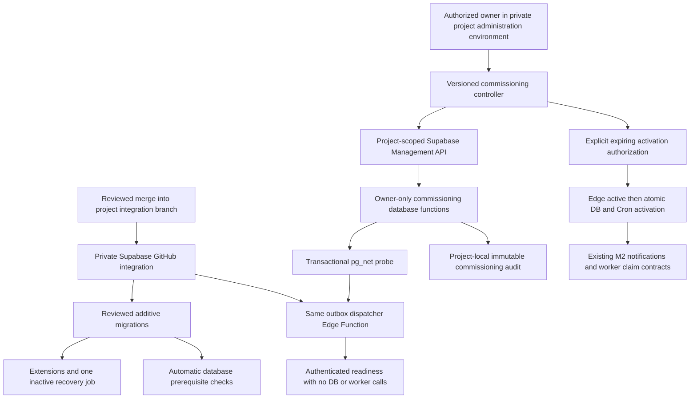

# MONEYBOWL M2A — commissioning as code

Status: local candidate for independent review; M2A has not been deployed.
Baseline: `7bc4849762b7e15e869149cd01a7fede30aa4998` (M2 PR #205).

## Architecture and authority

M2A adds administrative lifecycle automation around the existing M2 dispatcher.
It does not own claims, change worker business logic, send NSE requests, or change
any of the 17 routes. The [M2 routing and safety contract](MONEYBOWL_M2_NATIVE_OUTBOX_DISPATCHER.md)
and [M1 environment contract](MONEYBOWL_M1_RUNTIME_CONFIGURATION.md) remain authoritative.



Routine deployment authority remains the existing hosted DEV GitHub integration
recorded in Issue #107. Supabase applies new files from `supabase/migrations` and
the tracked function configuration. There is no new credential-bearing GitHub
Actions deployment job, Oracle daemon, or external dispatcher receiver. The
existing validation workflow also checks M2A before and after merges. Branch
names select the deployment integration; they never authorize financial activity.

M2A's additive migration installs missing `pg_net`, `pg_cron`, `pgcrypto`, and
Vault extensions through the existing trusted migration owner. It fails the
transaction if extension installation or verification is unavailable; it does
not skip a prerequisite. It provisions `moneybowl-outbox-recovery` at
`*/15 * * * *`, owned by the migration/database administrator, executing only
`SELECT moneybowl_dispatch.notify(NULL,0);`. A new job is **inactive**. Repeated
provisioning preserves an existing job ID and its active state, rejects conflicting
commands/ownership/duplicate visible jobs, and repairs the canonical interval.
It never changes database dispatch mode or invents a project binding.

Consequently a fresh deployment is disabled and cannot send, even when Edge
Secrets were mistakenly preconfigured active. A previously commissioned active
project stays active across routine additive updates; deployment does not create
new activation authority. Rollback preserves the job but deactivates it.

## Source and exact interface

- [Migration](../../supabase/migrations/20261009170240_m2a_dispatcher_commissioning.sql)
- [Controller](../../tools/commissioning/controller.py)
- [Synthetic project configuration](../../tools/commissioning/config.example.json)
- [Intentionally invalid approval example](../../tools/commissioning/approval.example.json)
- [CI validation](../../.github/workflows/outbox-dispatcher.yml)

Python 3.10+ standard library is sufficient. Run the controller from a clean Git
checkout at the approved full SHA. The config's revision must match HEAD. There
is no branch-derived environment selection. Config and approval files belong
outside the checkout. Example commands below contain paths only, no credentials:

```bash
python3 tools/commissioning/controller.py bootstrap --config /private/dev.json
python3 tools/commissioning/controller.py preflight --config /private/dev.json
python3 tools/commissioning/controller.py observe --config /private/dev.json
python3 tools/commissioning/controller.py schedule --config /private/dev.json
python3 tools/commissioning/controller.py eligibility --config /private/dev.json
python3 tools/commissioning/controller.py activate --config /private/dev.json --approval /private/approval.json
python3 tools/commissioning/controller.py verify --config /private/dev.json
python3 tools/commissioning/controller.py rollback --config /private/dev.json
```

| Operation | Effect and success criterion |
| --- | --- |
| `bootstrap` | Requires DB disabled; checks secret names, sets explicit Edge environment/project and disabled mode, binds private DB identity once, validates signed readiness. Existing differing bindings are rejected. |
| `preflight` | Checks DB identity, Vault name presence, extensions, Edge secret metadata, signed effective Edge configuration and exact 17-route parity. No worker calls. |
| `observe` | Refuses active DB; sets Edge observe and proves that mode before DB observe; sends the canonical M2 recovery notification, then the same nonce again; requires processed then replay responses and records the revision's evidence. |
| `schedule` | Idempotently reconciles the one canonical job; does not activate a new job or enable DB dispatch. Migration already performs this for routine deployment. |
| `eligibility` | DEV only; checks fresh observation, infrastructure, schedule and no in-flight delivery/worker state. Returns aggregate pending/ambiguous counts for owner review; it is not authorization. |
| `activate` | Requires an explicit approval file, same environment/project/revision/actor/ticket, UUID, expiration within 15 minutes, retirement and backlog authorization attestations. Disables DB/Cron first, proves Edge active through signed readiness, then atomically enables DB and Cron and records authorization. |
| `verify` | Checks signed effective Edge active mode, exact routes, matching DEV DB active mode and canonical active schedule; returns last Cron SQL status. Explicitly does not claim a real business operation completed. |
| `rollback` | Commits DB disabled and Cron inactive first; disables Edge next and verifies it; returns `oracle_restart_safe` only if native controls are off and no in-flight operations remain. Never starts Oracle. |

All operations return bounded JSON diagnostics and nonzero exit codes on failure.
Raw API/SQL errors, headers, tokens, signed bodies and response content are never
printed. HTTP redirects, arbitrary API paths, inherited proxies and oversized
management responses are rejected. Request timeouts are 30 seconds; probe polling
is bounded to 20 attempts with one-second delays (each management request also has
a timeout). A management outage can therefore make a command take several minutes.
Do not interpret a controller timeout as evidence that its last SQL did not commit.
Re-run preflight/rollback before choosing another operation.

## Private one-time bootstrap

An environment owner must privately establish the following once, before running
`bootstrap`; none of these values or credentials are requested by shared CI:

1. An independently controlled project with the intended Supabase GitHub integration,
   working directory `.`, migration deployment and the tracked `outbox-dispatcher`
   function enabled. Verify the deployed revision through that integration's records.
   Use DEV first. Do not create QA as part of M2A.
2. A project-scoped administrator token in `MONEYBOWL_COMMISSION_TOKEN`, supplied by
   the private secret manager to the controller process. Scope it to that project
   and the database-query and Edge-secret administration capabilities it needs.
   Do not give it to ChatGPT, Oracle, shared GitHub Actions, or frontend clients.
   A full-account token is neither required nor requested. A 401/403 stops execution;
   use the project's authorized administration environment instead of expanding access.
3. One independently generated, project-local HMAC key (at least 256 random bits),
   with identical copies in Vault `moneybowl_outbox_notification_key` and Edge Secret
   `OUTBOX_NOTIFICATION_KEY`. Preserve each project's independent `NSE_WORKER_TOKEN`.
   Platform service-role injection remains unchanged. The controller never retrieves,
   creates, exports or transfers signing, worker or NSE credentials.
4. Existing M1 worker secrets and correct `NSE_URL`: DEV uses NSE UAT; QA/PROD use
   their own policy-bound destinations and `NSE_ALLOWED_READ_APIS=[]`. Existing
   persisted QA/PROD workflows still fail closed. Do not change NSE login credentials
   to satisfy commissioning. The controller sets only the environment/project binding
   and dispatcher mode; readiness rejects incomplete M1 runtime configuration.
5. A private config file with explicit `environment`, `project_ref`, exact public
   project origin, reviewed checkout `revision`, named `actor`, and approval/change
   `ticket`. The Management API URL is constructed from that verified project ref;
   callers cannot supply a management or worker URL. An existing database binding
   cannot be silently changed by pointing a config at another environment.

This bootstrap is the unavoidable private identity/credential step. Routine
schema and Cron provisioning thereafter comes from source-controlled migrations,
not copied Dashboard SQL. QA later uses the exact same files and controller in
its own private administration environment, with no QA access on the DEV VM.

## Observe evidence and activation gate

The new `/readiness` path uses the same strict HMAC envelope and five-minute
freshness window as M2, with a distinct signed `kind=readiness`. After authentication
it returns only effective mode/environment/project and the generated route map.
It performs **zero** database RPCs and **zero** worker calls in every mode.
Replaying readiness is harmless and does not create execution authority. Recovery
replay remains fenced by M2's durable nonce receipts and worker claim contracts.

The private database probe uses the same Vault key without returning it. For the
first recovery probe it calls M2's existing `notify(NULL,0)`, reads only its queued
nonce/timestamp metadata, and records request IDs. For replay it recreates the
identical bounded notification using those metadata. `pg_net` sends after commit.
The result accessor projects allowlisted fields and fixed failure codes; it never
returns raw headers/errors/bodies. Probe bookkeeping older than one day is pruned
on readiness probes. Financial outbox/evidence are never cleaned up here.

A successful observe run writes a private audit row tied to the reviewed revision.
Activation requires that revision's observation within 15 minutes, fresh Edge
active proof, the canonical job, Vault presence, DEV binding and no in-flight
outbox/onboarding/admission leases. Expired processing rows still block activation:
operators must let the existing worker recovery contracts resolve them first.

Approval is an explicit owner operation, separate from deployment. The owner
creates a `0600` approval file outside Git with a new UUID, matching config fields,
expiration no more than 15 minutes ahead, and both attestations set true only after
verification. `oracle_retired=true` means every legacy delivery owner is isolated;
for a future environment without Oracle it means no legacy dispatcher exists.
`backlog_authorized=true` authorizes the displayed queued DEV operations to resume.
These are owner attestations under the private project administrator credential,
not claims inferred from GitHub branches or arbitrary public HTTP callers. A file
alone without that administrator capability cannot activate the database.

Database authorization records store UUID, revision, actor, ticket, timestamp,
database session actor, expiry, retirement/backlog attestations and probe IDs; ordinary UPDATE/DELETE is rejected. Repeating an already
committed activation with the same ID is read-only/idempotent. After rollback that
ID is consumed and cannot reactivate the dispatcher. A fresh approval is required.
No controller or migration grants API roles access to administrative functions.
All new functions are invokers with controlled search paths in the private schema.

Administrators already holding database-owner powers can bypass application
controls by direct SQL. M2A provides a reviewed, audited path; it cannot constrain
a malicious project owner. Run one commissioning operation per project at a time.
SQL mutations serialize using an advisory lock plus the existing control-row lock;
network/Edge administration is not one cross-service transaction. Any failed
activation attempts DB rollback first. If database access itself fails, do not
assume rollback succeeded and do not restart Oracle: verify through the separate
administrator channel. If Edge management fails after DB rollback, DB remains the
execution fence, but the controller reports failure rather than Oracle-safe success.

## DEV rollout and rollback

M2A Phase A on 2026-10-09 found DEV DB observe, no Cron jobs, no pending/processing
outbox events, and zero ambiguous/reconciliation/in-flight operations. Edge v4's
five source files exactly matched M2. Native DB was set disabled before restoration;
actual service-role admission returned `disabled` and worker authorization `false`.
Oracle's original controls and retained image were restored from the restricted
retirement backup and its container became healthy. The CLI returned 401, so Edge's
configured active setting could not also be disabled. The verified DB fence prevents
it from sending; this is an explicit deviation from the preferred two-switch rollback.
No M2A code was deployed, no NSE smoke operation was created, and no QA/PROD accessed.

Recorded restoration evidence remains under
`/var/backups/moneybowl/m2-oracle-retirement-20261009T160955Z` on the DEV host.
Do not copy credentials out of that host or publish private configuration.

After independent review and authorized merge, let the existing DEV integration
apply the migration and deploy the tracked Edge code. Check its deployment result.
The new job stays inactive and DB stays disabled while Oracle serves DEV. From the
private administrator environment run bootstrap, preflight, observe, schedule and
eligibility. Inspect aggregate backlog and obtain the explicit approval. Retire
Oracle through its separately authorized host procedure; verify its restart owners
are isolated. Then activate and verify. Do not manufacture investor operations.
Monitor subsequent naturally occurring worker claims and encrypted REQUEST/RESULT
evidence through approved aggregate diagnostics. Cron SQL success proves enqueue
attempt only, not Edge completion or a successful financial transaction.

For failure, run rollback first. Only after it reports native controls disabled,
Cron inactive and zero in-flight state may the independently authorized host owner
restore Oracle's known-good image/restart controls. If the database is active or
unreachable, never restart Oracle. Do not clear event states, erase encrypted evidence,
blindly retry MAYBE_SENT, or remove the additive migration to roll back.

## Validation and limits

CI runs controller tests without credentials, Deno readiness/dispatch tests with
network and environment denied, existing Python dispatcher regressions, route parity,
immutable migration-history validation and a network-disabled disposable full database
rebuild with M2/M2A/NSE/onboarding SQL and concurrency regressions. M2's network mock
requires the extension owner after pg_net installation; its synthetic notification
table remains owned by postgres so the notifier runs with real production privileges.
Explicit anon/authenticated/service-role tests retain their actual permissions.

The local suite uses synthetic pg_net responses for the controller's database gates;
no test sends real NSE requests. Hosted extension permissions, management token scopes,
GitHub integration deployment ordering and the complete PostgreSQL-to-hosted-Edge
handshake require DEV commissioning after merge. Existing local Postgres test image
is pinned to 17.6.1.155; the current platform's newer minor releases need hosted checks.
Controller readiness proves configuration and route parity, not byte-for-byte deployed
bundle identity: the approved deployment revision must also be checked in the private
Supabase integration records before issuing authorization.

Recovery retains M2's 15-minute interval and offer cooldown: missed notification
latency up to 15 minutes, retry alignment nearly 30 minutes, potentially longer during
outages/backlog. No independent business retries, claim changes, new NSE endpoints or
60-second replacement loop are introduced. Admission/evidence/ambiguity and existing
UAT-only guards remain unchanged. QA/PROD activation is rejected in both SQL and the
controller, even with a valid-looking approval file.

Current platform references checked for this implementation:
[GitHub deployment integration](https://supabase.com/docs/guides/deployment/branching/github-integration),
[pg_net post-commit semantics](https://supabase.com/docs/guides/database/extensions/pg_net),
[Cron idempotent job names](https://supabase.com/docs/guides/cron/quickstart),
[project-scoped tokens](https://supabase.com/changelog/scoped-personal-access-tokens-ga),
and [Postgres minor-release changes](https://supabase.com/changelog/postgres-15-19-17-11-breaking-changes).
M2A does not change evidence encryption algorithms or perform database version upgrades.

## Local validation record — 2026-10-09

| Command/check | Result |
| --- | --- |
| `python3 -m unittest discover -s tools/commissioning -v` | 34 passed, no network or credentials |
| `python -m pytest` in `services/outbox-dispatcher` | 63 existing tests passed |
| `deno test --deny-net --deny-env supabase/functions/outbox-dispatcher` | 88 passed |
| `deno test --deny-net --deny-env supabase/functions/_shared/nse supabase/functions/nse*-worker supabase/functions/nse-uat-smoke-test` | 981 passed |
| `bash scripts/test_m2_outbox_sql.sh` | 92 migrations rebuilt; 21 SQL regression files passed; 32 M2A assertions plus actual-role denial checks; M2/M2A PL/pgSQL lint passed |
| Included concurrency checks | Duplicate admission: one admitted, one busy; concurrent Cron provisioning: exactly one inactive job, DB disabled |
| `python3 scripts/generate_outbox_routes.py --check` | All 17 routes unchanged |
| `python3 scripts/test_outbox_compose.py` | Synthetic Compose/preflight passed |
| `python3 .github/scripts/validate_migration_history.py` | Frozen history unchanged |
| `python3 .github/scripts/validate_docs.py` | Passed |
| Deno format/type checks, Python compilation, shell syntax, `git diff --check` | Passed |

Tooling: Deno 2.9.6; disposable Supabase Postgres 17.6.1.155 with network disabled.
The complete final SQL run exited zero; its disposable container was removed.
Earlier local fixture ownership/trigger-lint failures were corrected before the
successful final run. None required a production permission or business-logic change.
The Oracle Python source, canonical routes, generated routing map, NSE workers and
shared NSE modules are byte-for-byte unchanged from the verified base.

Remaining certification is hosted DEV commissioning after review/merge, using
private scoped administration access. This local record is not a claim that M2A
is deployed, the hosted observe handshake passed, native cutover completed, or
financial processing was certified. Oracle was restored only for DEV availability.
