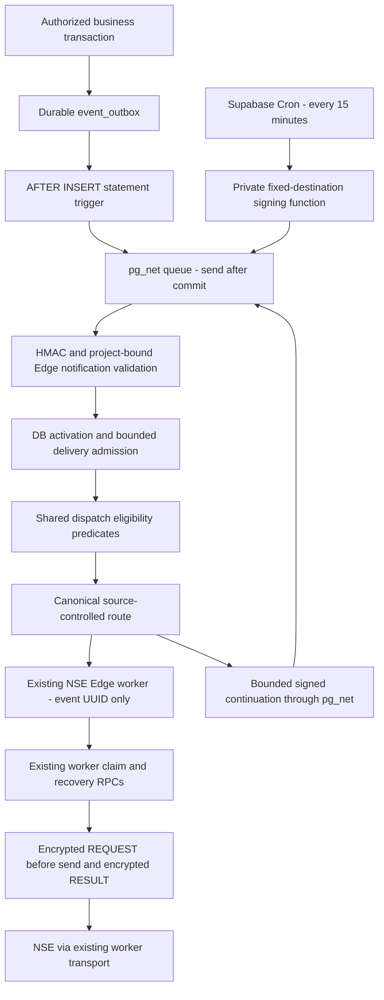

# MONEYBOWL-M2 — Supabase-native outbox dispatcher

Local candidate for independent security review. Not deployed or commissioned.
Verified remote develop base: `6863740e126be834a00b021314d2ab45c7c54cbb`.
Branch: `feature/m2-supabase-event-dispatcher`.
The canonical develop worktree and running Oracle service remain untouched.

## Existing implementation and boundaries

The Oracle Python service reads `list_dispatchable_outbox_events`, then POSTs an
`event_outbox_id` to a source-controlled NSE worker using `NSE_WORKER_TOKEN`.
It receives metadata only, never investor payloads. Worker RPCs own financial
claims, leases, retries and evidence. The repository defaults to a five-second
poll, with a configurable ceiling of 60 seconds; the operational brief describes
approximately 60 seconds. M2 did not inspect live environment values. The older
README route list omitted seven mappings; the two actual JSON contracts agree
on all 17 below.

M2 adds a finite Edge handler and transactional notifications. There is no Oracle
runtime dependency, container, permanent Edge task, external receiver, or NSE
transport in the replacement. The old Python source and deployment artifacts
remain available and compatible for rollback.



## Complete routing contract

`services/outbox-dispatcher/routes.json` is the sole editable routing source.
`scripts/generate_outbox_routes.py` generates the legacy deployment contract and
Edge `routes.generated.ts`; `--check` in CI rejects drift and verifies all worker
entrypoints exist. The source and legacy generated contract remain byte-identical
to the verified base. The reconciler's historical minimum-route floor is retained
as a compatibility assertion, not another complete route authority. No caller
selects event type, token name, worker slug, URL or NSE endpoint.

| Event type | Worker |
| --- | --- |
| `integration.nse.ucc_registration_requested` | `nse-ucc-registration-worker` |
| `integration.nse.ucc_verification_requested` | `nse-ucc-reconciliation-worker` |
| `integration.nse.order_status_requested` | `nse-order-status-worker` |
| `integration.nse.prov_orders_requested` | `nse-prov-orders-worker` |
| `integration.nse.client_readiness_requested` | `nse-client-readiness-worker` |
| `integration.nse.order_funding_requested` | `nse-order-funding-worker` |
| `integration.nse.settlement_redemption_requested` | `nse-settlement-redemption-worker` |
| `integration.nse.sip_xsip_reports_requested` | `nse-sip-xsip-reports-worker` |
| `integration.nse.stp_swp_reports_requested` | `nse-stp-swp-reports-worker` |
| `integration.nse.master_download_requested` | `nse-master-download-worker` |
| `integration.nse.mandate_status_requested` | `nse-mandate-status-worker` |
| `integration.nse.mandate_registration_requested` | `nse-bank-mandate-worker` |
| `integration.nse.bank_add_requested` | `nse-bank-mandate-worker` |
| `integration.nse.bank_del_requested` | `nse-bank-mandate-worker` |
| `integration.nse.bank_mandate_verify_requested` | `nse-bank-mandate-worker` |
| `integration.nse.onboarding_kyc_check_requested` | `nse-onboarding-kyc-worker` |
| `integration.nse.ekyc_registration_requested` | `nse-onboarding-kyc-worker` |

All 17 mappings use the project-local `NSE_WORKER_TOKEN`. Unknown types fail
closed. Only fixed same-project `/functions/v1/<allowlisted-worker>` URLs are
constructed; all Edge fetches reject redirects.

## Database contracts and notification semantics

The additive migration creates the private `moneybowl_dispatch` schema, a
singleton activation/admission row, per-event delivery timestamps and short-lived
notification receipts. All private tables have RLS with no client policies and
no API-role table/schema grants. It installs an inert AFTER INSERT statement
trigger. A bulk INSERT emits at most one eligible event UUID; the subsequent
recovery continuation drains remaining work. No UPDATE trigger exists, so worker
updates cannot recurse or produce notification storms. Transactional changes
that become eligible after insertion are found by recovery.

`pg_net` starts HTTP requests only after transaction commit. Rollback removes the
queued notification. Notifications contain only version, random request UUID,
Unix issue time, environment, expected project origin, kind, nullable event UUID,
and bounded continuation hop. They contain no payload, PAN, bank/account data,
NSE credentials or evidence. The trigger uses metadata eligibility before waking;
the dispatcher checks it again after commit. A failed queue insert raises only
`outbox_notification_unavailable` and preserves business persistence. pg_net's
queue/responses are not the durable outbox; its unlogged queue may be lost on
restart, and responses normally expire. Cron is required for recovery.

The existing public feed retains its signature, validations, result columns,
ordering, limit and service-role grant. Its eligibility query is extracted into
one private SQL helper, now shared by legacy feed, admission, trigger and final
send authorization. This narrow additive refactor is necessary to support direct
UUID lookup and fair backlog selection beyond the legacy 50-row ceiling without
duplicating eligibility or starving later records. No applied migration is edited.

The helper preserves the **latest composed feed**, including B07 write/verification
recovery exceptions, member-owned reference jobs and onboarding KYC operations;
it is not the original September-only integration_operations query. Integration
operations retain pending/QUEUED, retryable failed/SUBMISSION_FAILED after 30
seconds, and expired processing leases including eligible SUBMISSION_FAILED
read/write recovery. Master jobs retain enabled UAT connection/workspace and
no-completion guards. Onboarding retains QUEUED, delayed RETRY, and expired
CLAIMED/SUBMITTING paths. Ambiguous integration outcomes
and reconciliation-required operations remain excluded. The feed is advisory:
worker-specific attempts, safety classifications, scope and evidence may still
deny a claim. M2 does not broaden these rules or infer that a timeout was not sent.

## Authentication, privileges and credential ownership

The private database signer reads exactly `moneybowl_outbox_notification_key`
from project-local Vault, signs fixed fields using HMAC-SHA256, and queues to the
configured project's fixed Edge route. It never returns a key or accepts a key
name/URL. No new Vault grants are added. Only the database owner can invoke the
signer directly or change private configuration. Functions use empty search paths,
qualified application/extension names, and revoked PUBLIC/anon/authenticated
execution. The trigger transition relation is the sole unqualified relation; it
is supplied by PostgreSQL to that trigger invocation.

The matching `OUTBOX_NOTIFICATION_KEY` is independently provisioned as an Edge
Secret. Generate at least 256 random bits encoded as printable text; never use a
worker token or service-role key as the signing key. Headers carry a signature,
not a reusable bearer secret. Sign the exact UTF-8 string:

`1|request_id|issued_at|environment|project_url|kind|event_uuid_or_-|hop`

The handler validates method, path, JSON type, exact fields, UUIDs, a 2 KiB input
limit, two-second body deadline, bounded timestamp skew of five minutes, and the
signature. The signed kind binds event versus recovery paths. Database receipts
reject accepted nonce reuse for ten minutes; replay during an active batch is
busy, and duplicate notifications with fresh nonces are delivery-throttled. HMAC
is authentication, never transaction authorization. No browser endpoint or CORS
access is supplied. `verify_jwt=false` is intentional for custom HMAC auth; absent
or invalid HMAC cannot reach a privileged RPC.

The dispatcher uses the platform's project-local `SUPABASE_SERVICE_ROLE_KEY`
only for three fixed RPCs. Each is granted only to service_role and also checks
`auth.role()`. The pre-send RPC checks activation, project, environment, the
batch token, event membership, lease and current eligibility. The worker token
is used only for existing worker authentication. Neither role credential nor
worker token is sent to Vault, frontend or GitHub. This retains the existing
service-role compatibility contract; it is a broad credential inside the trusted
Edge runtime, an explicit residual risk rather than a claim of a restricted DB
role. A future custom JWT role would require separate project provisioning.

No NSE login credentials are resolved by this function. Existing workers keep
M1's independent credential provider and all business authorization. Secret
properties are non-enumerable; config exceptions and HTTP responses are fixed
codes, never provider messages or bodies. Never log environment snapshots.

## Canonical environment and activation contract

The same code uses M1 `resolveNseRuntime` and `assertNseOrigin`, with explicit
`MONEYBOWL_ENV`, matching expected/injected project URLs, and NSE origin policy.
Hosted project origins must match `https://<project-ref>.supabase.co`; custom
Supabase domains are deliberately unsupported until reviewed. There is no
branch-name, HTTP-body, frontend-define or DEV fallback authority.

| Control | DEV | QA | PROD |
| --- | --- | --- | --- |
| Vendor origin validated | NSE UAT | NSE Production | NSE Production |
| Edge mode default | disabled | disabled | disabled |
| DB mode on migration | disabled, unbound | disabled, unbound | disabled, unbound |
| observe | Explicit matching project configuration | Same code, own secrets | Same code, own secrets |
| active | Separate authorized cutover | Rejected in code and SQL constraint | Rejected in code and SQL constraint |

Both Edge `OUTBOX_DISPATCH_MODE` and DB `mode` must match (`disabled`, `observe`,
`active`). Observe reads eligible IDs and reports sanitized metadata; it never
calls workers, creates event delivery attempts, or chains continuation. DB mode
is rechecked before every worker call; changing it cannot cancel a call already
in flight. The migration creates no project binding, secret, extension activation
or Cron job, and enabling only an Edge variable cannot activate dispatch.

See the [synthetic manifest](../examples/moneybowl-outbox.env.example). The DB
row also stores the independently verified expected environment and project URL.
An administrator who deliberately mislabels every setting is outside this binding
model; the commissioning owner must verify project identity. QA must receive its
own secrets directly, never via DEV, Oracle, Codex or GitHub Actions. No active
flag can bypass M1's persisted UAT contracts; future QA/PROD support requires
reviewed environment-aware claim/evidence schema and worker changes first.

## Recovery, bounded continuation and latency

Cron calls `moneybowl_dispatch.notify(NULL,0)` every 15 minutes, using the same
signer, Edge handler, eligibility and routing as insert notifications. The route
is `/outbox-dispatcher/recovery`; callers cannot supply event selection there.
A row lock serializes admission and creates a 150-second delivery batch lease.
At most four candidates are offered per invocation, with at most four concurrent
worker HTTP attempts. Worker POST timeout is 45 seconds, each DB RPC timeout is
eight seconds, and the notification HTTP timeout is 75 seconds. A normal handler
finishes within approximately 70 seconds, below the documented 150-second Free
Edge lifetime. There is no background waitUntil task or permanent loop.

Per-event delivery offers are persisted before worker calls and cooled down for
15 minutes. Oldest offers, including never-offered events first, avoid repeatedly
selecting a failing head of queue. This is delivery bookkeeping, not worker claim
ownership. Successful bounded batches release admission and enqueue one signed
recovery continuation in the same transaction; hops 0–15 allow at most 16
invocations (up to 64 offers) per chain. An event-first chain starts with one
candidate. Empty batches and observe mode stop. A lost continuation or a full
chain leaves backlog durable for the next Cron sweep/new wake.

A worker transport error/timeout leaves admission leased, sends no immediate
continuation and does not resend that event. Edge interruption behaves likewise.
Lease expiry and the next recovery sweep resume work; RPC/HTTP failures never
mark an event complete. HTTP 2xx means only `worker_accepted`. A timed-out worker
may still run after its client disconnects; four is the dispatcher HTTP fanout
bound, not a guarantee that only four remote worker isolates exist. Worker claims
remain the final duplicate fence, and expired write claims follow evidence-aware
PROVEN_NOT_SENT versus MAYBE_SENT reconciliation behavior unchanged.

Existing feed delay is 30 seconds and most worker leases are 120 seconds. These
are safety thresholds, not a documented recovery SLO. M2 deliberately increases
recovery latency: missed first notifications normally wait up to 15 minutes;
a recently offered failed/expired event may wait almost 30 minutes with cooldown
and Cron alignment. Outages, chain limits, large backlogs and poison routes can
extend that. **Accept this latency and measure throughput before DEV activation.**
No 60-second replacement polling loop is introduced. Tune only after review;
a tighter business SLO requires a separately designed scheduled wake mechanism.

## Monitoring and safe diagnostics

Allowlisted Edge log fields are event UUID, canonical event type, fixed outcome,
and numeric worker status. Responses expose fixed code and candidate count only.
Alert on repeated dependency failures, worker authorization rejections, unknown
routes (dependency failure), notification queue warnings, no recent successful
Cron runs, oldest eligible-event age, batch-lease age and growing backlog. Observe
mode supplies non-sending routing validation, not financial completion proof.

Inspect pg_net status/time/error presence, never raw headers, body or response
content in shared logs. Cron command text contains only the private function call.
Monitor `cron.job_run_details` and Edge completion independently: successful Cron
SQL only proves enqueue was attempted. The signer returns NULL and warns on failure.
Use worker evidence/state to establish business success. Restrict direct pg_net
queue access to trusted database operators; it contains signatures valid briefly.

Receipts are pruned during successful admission after ten minutes; an idle system
may retain the last small set. One delivery row per offered outbox event persists
until that outbox record is legitimately deleted. No financial history deletion
is introduced. Include its storage/index growth in retention planning. Admission
queries and control-row contention need realistic-load commissioning; the existing
outbox scan index is retained rather than adding speculative financial indexes.

## DEV commissioning and cutover — not executed by M2

1. Obtain independent security review and a separate live commissioning approval.
   Confirm Oracle health and record its exact known-good image, settings, route
   count and restart/reconciliation owners without exporting credential values.
2. Verify target project identity, M1 DEV/UAT settings and current versions of
   pg_net, pgcrypto, Vault and Supabase Cron. Enable missing extensions only under
   that approval. Review their queue/schema ACLs; do not broaden Vault access.
3. Apply the reviewed additive migration and deploy `outbox-dispatcher` with its
   tracked JWT setting. Confirm DB `mode=disabled` with no binding, Edge mode
   disabled, no Cron job, and existing Oracle feed health. Promotion must explicitly
   include this function; the M2 CI workflow performs no deployment.
4. Provision a fresh project-local signing secret in Vault under the fixed name
   and in Edge Secrets under `OUTBOX_NOTIFICATION_KEY`. Retain existing DEV
   `NSE_WORKER_TOKEN`; use the platform service-role injection. Do not print values.
5. Bind the private row to the verified DEV public project origin and set both
   modes to `observe`. Exercise missing/invalid/stale signature and wrong project
   tests, then owner-only `SELECT moneybowl_dispatch.notify(NULL,0);`. Confirm eligible
   routing without a worker call. Use synthetic, non-sending tests; do not create
   real investor operations to validate notification mechanics.
6. Validate post-commit notification and rollback behavior in a separately approved
   synthetic DB fixture. Confirm deployed HMAC interoperability, URL path handling,
   auth, no raw payload logs and safe discovery of existing eligible backlog.
7. Accept measured retry/backlog latency and capacity. Quiesce Oracle, disable its
   service/reconciler/timer restart sources through their owner, wait for in-flight
   workers/leases, and verify no further Oracle dispatch. This is a separate live
   operation; M2 performs none of it. Never enable both active dispatchers.
8. Provision the recovery schedule as the DB owner, then set Edge mode `active`
   and finally DB mode `active` through an explicitly approved config change. Both
   modes must match before any worker is invoked. Example owner SQL, after binding:

   ```sql
   SELECT cron.schedule('moneybowl-outbox-recovery', '*/15 * * * *',
     $job$SELECT moneybowl_dispatch.notify(NULL,0);$job$);
   ```

   The schedule contains no secret and is inactive in effect while DB mode is
   disabled. Do not grant this function to service_role to make Cron work; use
   the commissioning database owner. Record the job ID for rollback.
9. Wake bounded backlog recovery using the same private `notify(NULL,0)` function.
   Monitor eligible age, duplicate claims, lease recovery, retry limits and worker
   REQUEST/RESULT evidence. Leave ambiguous outcomes for reconciliation. Do not
   clear/reset events to accelerate draining.
10. Confirm Oracle remains inactive, the scheduler owner will not restart it,
    pg_net/Edge/Cron health is good, and business outcomes match evidence. Keep the
    rollback image and configuration under the existing operator controls.

Example non-secret DB binding (synthetic; replace with verified project identity):

```sql
UPDATE moneybowl_dispatch.control
SET environment='DEV', project_url='https://synthetic-dev.supabase.co', mode='disabled'
WHERE singleton;
```

## Independently executable rollback — not executed by M2

1. Set DB mode to `disabled` first as owner. Set Edge mode to `disabled`; unschedule
   the recorded recovery job with `cron.unschedule(job_id)`. Database pre-send checks
   deny new calls; already in-flight workers may complete and must not be assumed
   unsent. Disable the function deployment if necessary after stopping admissions.
2. Verify no new native dispatch; inspect outstanding admission and worker leases
   and evidence. Wait for in-flight completion/recovery eligibility. Do not erase
   delivery rows, event states, claims or encrypted evidence.
3. With native dispatch disabled, restore the independently recorded known-good
   Oracle image/settings and its authorized startup owner. Its original feed and
   routing contract remain present; verify health and safe backlog processing.
4. Retain the additive migration in disabled mode. No down migration, financial
   rewrite, secret copying or downgrade of QA/PROD to pre-M1 workers is necessary.
   If native delivery later resumes, existing 15-minute offer cooldowns still apply.
5. Investigate using safe diagnostic fields and review before another cutover.
   This rollback is executable without Codex or ChatGPT.

## Future private QA and promotion

CI validates develop and qa changes using synthetic values, generated route
parity, Deno format/type/unit tests, migration history, a disposable database and
actual-role/concurrency SQL regressions. No QA project or integration is created,
no deployment credential is added and no Production pipeline is touched.

Future promotion is develop → DEV validation → PR to qa → owner approval/merge →
private QA deployment of identical files and migrations. The owner provisions
QA secrets directly in private QA; neither Oracle nor CI needs privileged QA
credentials. A future deployment mechanism must satisfy that restriction (for
example a separately controlled project integration), and is not configured here.
QA remains disabled until environment-aware persisted database/worker contracts
are independently commissioned. Remove neither UAT constraints nor activation
fences merely to obtain a green deployment.

## Validation and remaining risks

The detailed validation record below distinguishes local tests from commissioning.
There are no real NSE calls, live migrations, live notifications, Cron changes,
service restarts, secret inspections, pushes or PRs in M2.

Residual risks: hosted gateway/HMAC/pg_net behavior and platform version differences
require commissioning; broad service-role scope remains inside Edge; admission
serialization and notification volume require load measurements; clock skew over
five minutes discards wakes and relies on recovery; lower-frequency recovery adds
latency; existing feed omissions remain existing behavior; operator project binding
and cutover ownership are prerequisites. Database notification tests replace HTTP
queueing with a transactional capture function and cannot certify actual hosted
HTTP delivery. PostgreSQL tests use cached 17.6, not hosted 17.11.

## Platform references checked during implementation

[pg_net documentation](https://supabase.com/docs/guides/database/extensions/pg_net)
confirms asynchronous post-commit requests, unlogged queues and short response
retention. [Cron](https://supabase.com/docs/guides/cron) provides database-native
scheduled SQL. [Edge limits](https://supabase.com/docs/guides/functions/limits)
justify bounded invocations. [Edge authentication](https://supabase.com/docs/guides/functions/auth)
supports explicitly implemented custom authentication when JWT verification is off.
[Vault](https://supabase.com/docs/guides/database/vault) documents decrypted-view
access; M2 adds no general retrieval API.

The [current changelog](https://supabase.com/changelog) and relevant
[PostgreSQL minor upgrade notice](https://supabase.com/changelog/postgres-15-19-17-11-breaking-changes)
were inspected. Legacy PGP-cipher changes do not affect the new SHA256 HMAC path.
[Extension version pinning changes](https://supabase.com/changelog/extension-version-pinning-ignored)
reinforce checking actual project extension versions at commissioning.

## Local validation record

Deno executable: `/opt/moneybowl-toolchains/deno/2.9.6/aarch64-unknown-linux-gnu/deno`.
All Edge test transports are mocked with `--deny-net --deny-env`. Docker tests use
`--network none`, temporary storage and synthetic platform fixtures only. The SQL
runner rebuilds all 91 migrations in a fresh database, rather than resetting any
existing local/shared Supabase stack. It removes only its own test container.

| Command / check | Result |
| --- | --- |
| Cached Python test image, read-only `services/outbox-dispatcher` mount; `python -m pytest -q -p no:cacheprovider` | 63 passed, 0 failed |
| `deno test --cached-only --deny-net --deny-env supabase/functions/outbox-dispatcher` | 79 passed, 0 failed, including real 45-second worker abort and two-second input deadline |
| `deno test --cached-only --deny-net --deny-env supabase/functions/_shared/nse supabase/functions/nse*-worker supabase/functions/nse-uat-smoke-test` | 981 passed, 0 failed |
| `bash scripts/test_m2_outbox_sql.sh` | 91 migrations applied; 20 SQL suites passed, 0 failed; two concurrent sessions produce exactly one admission and one busy result |
| SQL runner's pre-M2 feed snapshot versus replacement | Automatic equality checks across limits 1/4/50 and retry delays 0/30/3600 after fixture event mutations; all passed |
| SQL `plpgsql_check` and catalog/actual-role checks | Passed for new RPCs/signer and legacy feed; statement transition-table trigger exercised by bulk/rollback tests |
| `deno check --cached-only supabase/functions/nse*/index.ts supabase/functions/outbox-dispatcher/index.ts` | All 15 entrypoints passed |
| `deno fmt --check supabase/functions/_shared/nse supabase/functions/nse*-worker supabase/functions/nse-uat-smoke-test supabase/functions/outbox-dispatcher` | 118 files passed |
| `deno lint supabase/functions/outbox-dispatcher` | Five files passed |
| `python3 scripts/generate_outbox_routes.py --check` | All 17 mappings and generated artifacts match |
| `python3 services/outbox-dispatcher/deploy/reconcile.py --validate-routes services/outbox-dispatcher/routes.json` | ROUTES_VALID |
| `python3 scripts/test_outbox_compose.py` | Passed synthetic deployment preflight |
| `bash -n` for both M2 runners and existing dispatcher bootstrap | Passed |
| `python3 .github/scripts/validate_docs.py` | Passed |
| `python3 .github/scripts/validate_migration_history.py` | Passed; 27 historical files frozen through the existing boundary; no historical migration edited |
| `python3 .github/scripts/validate_commits.py 'feat(outbox): add disabled Supabase-native event dispatcher'` | Passed |
| `git diff --check` | Passed |

Expected SQL warnings `outbox_notification_unavailable` are deliberate queue
failure injections (two cases), confirming business persistence survives them.
The Python invocation disables its cache plugin and emits one benign warning
about the existing `cache_dir` setting; it does not fail a test. No new unresolved
issue-specific validation errors remain. Local schema reconstruction and focused
PL/pgSQL lint substitute for CLI reset/lint against an existing stack; no remote
advisors or live SQL were run. These results support independent review, not
hosted certification or authorization to activate.

## Changed-file inventory

Added:

- `supabase/functions/outbox-dispatcher/config.ts`
- `supabase/functions/outbox-dispatcher/handler.ts`
- `supabase/functions/outbox-dispatcher/handler_test.ts`
- `supabase/functions/outbox-dispatcher/index.ts`
- `supabase/functions/outbox-dispatcher/routes.generated.ts`
- `supabase/migrations/20261009101859_m2_native_outbox_dispatcher.sql`
- `supabase/tests/m2_native_outbox_dispatcher_test.sql`
- `supabase/tests/fixtures/m2_feed_parity.sql`
- `scripts/generate_outbox_routes.py`
- `scripts/test_m2_outbox_sql.sh`
- `scripts/test_m2_outbox_concurrency.sh`
- `docs/examples/moneybowl-outbox.env.example`
- `docs/architecture/MONEYBOWL_M2_NATIVE_OUTBOX_DISPATCHER.md`

Modified:

- `supabase/config.toml`
- `.github/workflows/outbox-dispatcher.yml`
- `docs/PROJECT_STATE.md`
- `docs/CHANGELOG.md`
- `docs/architecture/SYSTEM_ARCHITECTURE.md`

Oracle source, routes, route-contract bytes, Compose and service/reconciler code
are unchanged. No worker, claim, evidence, financial payload or state-machine
implementation is modified.

## M2A commissioning automation

The [M2A candidate](MONEYBOWL_M2A_COMMISSIONING.md) replaces routine operator SQL with
reviewed migration provisioning and a private commissioning controller. Its rollout
requires separate review; M2 financial routing and worker safety contracts remain unchanged.
