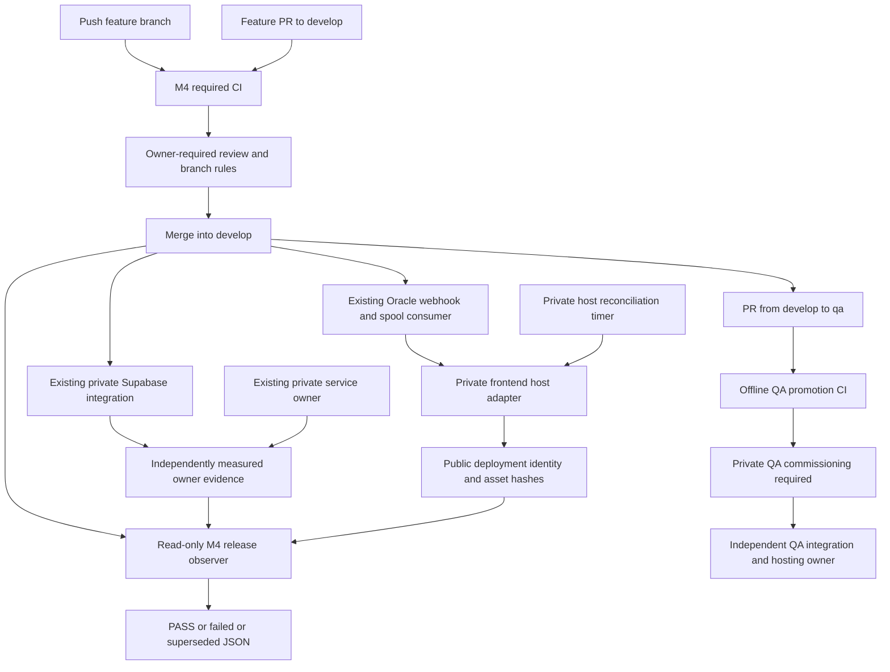

# MONEYBOWL M4 — unified environment promotion

Status: implemented local review candidate; **end-to-end commissioning BLOCKED**.
No hosted deployment was performed. Base `origin/develop` was fetched and verified
at `8993ce141ceed6a1cae95c2a7edbfbfcf24524f8`. The canonical checkout was left intact.
The user's commissioning context supersedes older M1/M2/M2A local-candidate notes:
DEV native dispatch is active, one recovery Cron runs every 15 minutes, and Oracle's
financial dispatcher is retired. M4 does not independently recertify those live facts.

## Promotion and deployment ownership

| Component | DEV deployment owner | QA owner | M4 behavior |
| --- | --- | --- | --- |
| Migrations, declared Edge Functions, declared Storage | Existing private Supabase GitHub integration on `develop` | Future separately owned Supabase integration on `qa` | Observe only; no CLI deployments or admin credentials in Actions |
| Flutter web | Existing Oracle webhook/spool and `deploy-develop.sh` | Future independent QA hosting runner | Versioned host adapter replaces the called deploy implementation after installation review; no second webhook consumer |
| Ingestion support API, ClamAV, Caddy | Existing Oracle private Compose owner; automatic release owner not established by inspected files | Future private QA service owner | Immutable API override generator; running-service evidence mandatory; no automatic service restart installed |
| NSE financial dispatch | M2 native dispatcher inside Supabase | Disabled; independent schema/evidence commissioning needed | No lifecycle operations; preserve active DEV; Oracle dispatcher remains retired |
| Director and host infrastructure | Separate owners | Separate owners | Outside application release; never deployed by M4 |

The ingestion application source, Dockerfile, dependencies, Compose files and
Caddyfile are one hashed component. ClamAV/Caddy images and configuration are thus
included in compatibility evidence; an unchanged API alone is insufficient when
that component changes. The retired `services/outbox-dispatcher` is tested for
compatibility but is deliberately never a deployable component. There is no
claim that ingestion changes deploy automatically today.

## Exact Actions trigger graph

[Environment promotion workflow](../../.github/workflows/environment-promotion.yml)
has no path filters:

- Every push to `feature/**`, `develop`, or `qa` runs `M4 Contracts`, `M4 Flutter`,
  and `M4 Backend and Integration`, then the always-evaluated `M4 Required CI` gate.
- PR opened, synchronized, reopened or marked ready targeting `develop` or `qa`
  runs the same validation. No PR job deploys or contacts hosted project APIs.
- Only a push to `develop` or `qa` enters `M4 Environment Release`, after the CI
  gate resolves, even if CI failed. Checkout is exactly `github.sha`.
- The release job serializes by `m4-release-refs/heads/<branch>` without cancelling
  an in-progress observer and uses `queue: max`. Up to 100 waiting jobs are retained;
  older slow CI runs cannot replace a newer pending observer. Beyond the platform
  limit, cancellation must alert for a latest-revision workflow rerun. Host deployment
  convergence does not depend on Actions queue ordering.
- QA fails with `environment_not_commissioned` before network access. Neither a
  repository variable nor a workflow dispatch can enable QA; a separately reviewed
  policy change and private infrastructure are required. No manual dispatch exists.
- `main`, tags and Production have no new trigger or target. Existing unrelated
  main-branch validation workflows remain unchanged in purpose.

Existing commit/documentation/migration workflows also recognize `qa`; the M4 gate
always validates migration history, including when their path filters skip them.
The existing outbox workflow is retained. New action references are pinned to full
SHAs. Shared CI uses GitHub-hosted runners and `contents: read` only. No new workflow
references a secret, self-hosted runner, private key, Supabase token or QA admin.
Checkout's automatic repository token is read-only and is never a build define.

The contracts gate records the full PR head SHA. `develop` requires a same-repository
`feature/*` source; `qa` requires the same repository's `develop` source with that
head SHA in fetched develop ancestry. The tested QA merge tree must equal the
reviewed develop tree, preventing QA-only source additions. Advancing develop later
does not invalidate an already reviewed ancestor. No applied migration from the PR
base or previous push may change, disappear or be renamed. Only additions are allowed;
the pre-existing frozen migration manifest is also checked.

## Required repository-owner branch rules

Configure before relying on the zero-command release contract:

1. Require reviewed PRs for `develop` and future `qa`; prohibit direct pushes,
   force pushes, deletion and administrator bypass. Dismiss stale approvals, require
   approval of the latest push, and require resolution of review conversations.
2. Require `M4 Required CI`, existing commit/documentation checks, and the actual
   Supabase integration's migration validation check. Verify exact check names in
   the repository UI. Require branches to be up to date. The unconditional M4 gate
   supplies migration safety even for changes outside existing path filters.
3. Protect workflow files, deployment tools, environment policy and migrations with
   designated reviewers/CODEOWNERS under repository-owner policy.
4. For QA, use the merge strategy whose result preserves the reviewed develop tree;
   resolve any QA divergence through develop before promotion. Preserve SHA ancestry
   for rollback rejection. Do not rebase, force-reset or silently recreate an
   environment branch. Merge queue is not configured by this implementation.
5. Restrict Supabase integration bindings: DEV only `develop`; future QA only `qa`.
   Disable automatic preview creation if feature/PR events would provision shared or
   unwanted projects. Verify these private integration settings separately.

Code cannot infer approval from branch names. Without these rules, branch updates
are not proof of review. M4 does not change repository settings.

## Release identity and independent evidence

[Contract](../../tools/deployment/contract.py),
[observer](../../tools/deployment/observe.py), and
[host adapter](../../tools/deployment/host.py) share environment/branch/project
bindings. DEV is pinned to `rskryngwzyuzmiwtriyy`; QA's project is deliberately null.
The CLI `supabase/config.toml` project identifier is never a deployment target.
Production is rejected by all M4 entrypoints.

The observer requires a fresh HTTPS owner receipt (maximum age five minutes) for
exact environment, project, branch and full merged SHA. Receipt URLs are repository
owner-controlled public configuration, served by the independent private verification
owner. Redirects, proxies, unbounded JSON and credentials in URLs are rejected.
Only bounded transient or not-yet-current **reads** are retried (30 observations,
ten-second interval, per-request ten-second timeout; workflow capped at 25 minutes).
Migrations, financial operations and deployment writes are never retried by the observer.

The backend evidence producer is **not commissioned or implemented against the live
integration**. M4 defines and tests its consumer contract. A JSON document assembled
from the requested SHA is not proof. Before enabling an endpoint the private owner
must implement and independently validate all of the following measurements:

- Confirm actual project identity and integration source revision through trusted
  integration records; bind those records to the exact promoted revision.
- Inspect applied migration history and stored migration content against all source
  migration files, rejecting failed, missing, edited or unexplained extra migrations.
- Download/inspect actual deployed bundles and deployment configuration for every
  declared function, including shared imports, then compare against reviewed source.
  Readiness responses or an integration check merely named “success” are insufficient.
- Inspect the actual running ingestion image digest, immutable build provenance,
  selected source paths, Compose/Caddy/ClamAV configuration and non-mutating readiness.
  Image labels alone are not provenance. No provider or financial requests are health probes.
- Confirm M1 project/NSE origin binding and policy, DEV dispatcher commissioning state
  unchanged, one canonical recovery job, and Oracle retirement. QA must prove disabled
  financial operation policy; use no M2A bootstrap/activation/rollback for routine releases.

An unchanged component may retain an older physical deployment only when independent
measurement proves identical source content and compatibility with this requested
revision. The receipt's `git_commit` describes the release being verified; it must
never be represented as the component's physical deployment SHA. The integration
owner must retain actual deployment IDs, migration records and image provenance in
private audit storage and bind their measurements to this receipt.

The exact receipt JSON shape is exercised in
[synthetic tests](../../tools/deployment/test_deployment.py). Required fields:
`schema_version=1`, uppercase `environment`, `git_commit`, `git_branch`,
`supabase_project`, numeric UTC epoch `observed_at`, `financial_policy` (`preserve`
for DEV, `disabled` for QA), canonical `nse_origin`, `oracle_dispatcher=retired`,
and `components` with exactly `migrations`, `edge_functions`, `ingestion_support`.
A `dispatcher` measurement must also report authenticated readiness, exactly 17
routes, one Cron with schedule `*/15 * * * *`, and DEV active mode/active Cron or
QA disabled mode/inactive Cron. This matches the supplied DEV commissioning state;
a deliberately paused DEV must stay paused, report unverified, and receive separate
owner review instead of being automatically activated to satisfy a release check.
Each component requires `state=deployed`, `healthy=true`, a `source_digest`, and
respectively `proof=applied_history`, `downloaded_bundle`, or `running_image`.
`manifest(repo, sha)` computes SHA-256 of sorted Git `ls-tree -r` records for the
component paths. These expected digests must only be emitted after actual measurement.
The authenticated HTTPS endpoint is a trust boundary, not a cryptographic proof
against a malicious environment administrator. Do not host editable receipts in
an ordinary frontend release directory or let PR code publish them.

Flutter `deployment.json` binds uppercase environment, project, branch, exact SHA,
whole release content digest, and SHA-256 hashes of `index.html` and `main.dart.js`.
The observer fetches both served assets and compares hashes, checks the release health
file, and rechecks the current branch. Health-file success proves static serving;
it does not prove interactive sign-in or financial health. The host validates the
whole immutable directory digest when reusing a release. Cache behavior must allow
fresh identity/assets (configure no-store for deployment/health files and HTML).

The structured report distinguishes code validated, deployment detected, backend
deployed, frontend deployed, services deployed, post-deployment passed, and entire
environment release verified. Only `state=pass` means environment PASS. `superseded`
exits successfully as an observer completion but always retains
`environment_release=not_verified`; it is not deployment success. Partial deployment
may exist after failure and is reported by stage. No status is synthesized from CI.
The Actions summary and 30-day JSON artifact are the consolidated record; setup or
observer termination produces an explicit failure fallback. Infrastructure cancellation
may prevent artifact upload; a cancelled job is never evidence of deployment.

## Configuration and private installation

| Name/location | Owner | Purpose |
| --- | --- | --- |
| `tools/deployment/environments.json` | Reviewed source | Environment branch/project/financial policy; QA disabled |
| `M4_DEV_FRONTEND_ORIGIN` | Repository public variable | Exact HTTPS DEV frontend origin |
| `M4_DEV_EVIDENCE_URL` | Repository public variable | Independent read-only receipt endpoint; no query/credentials |
| `M4_QA_FRONTEND_ORIGIN`, `M4_QA_EVIDENCE_URL` | Future owner public variables | Future public or sanitized QA evidence; not credentials |
| Host config `environment`, `host_authority`, `repository`, `release_root`, `flutter`, `public_defines`, `frontend_origin` | Private environment host | Explicit deployment paths/ownership; never source shell env files |
| `MONEYBOWL_ENV` | Public Flutter JSON | `dev` or `qa`; frontend Production convention remains `prod` but unsupported here |
| `SUPABASE_URL`, `SUPABASE_ANON_KEY` | Public Flutter JSON | Exact project HTTPS URL and project-specific publishable key (legacy anon JWT accepted with matching ref/role) |
| `NSE_CONSOLE_ENABLED`, `MONEYBOWL_DEV_ONBOARDING_PREVIEW` | Public Flutter JSON | String true/false; true permitted only in DEV |

An opaque publishable key cannot be decoded to prove project provenance. The private
owner must validate its public project pairing during installation. No backend/NSE/
worker/HMAC/service-role field is accepted as a build define. Every build starts
with an explicit clean process environment and a temporary HOME; no inherited
backend values, proxy settings or DART_DEFINES enter the compiler. No secret files
were read to prepare these examples. Unknown build keys fail rather than being copied.

One-time DEV installation is a **separate authorized host change**, not executed here:

1. Review the local commit and existing host permissions. Preserve the current release,
   webhook signature validation, spool and consumer identity. Copy the approved
   deployment Python files and policy to an owner-controlled `/opt/moneybowl-deployment`;
   do not execute a mutable source checkout as the deployment controller.
2. Provide Python 3.12+, an owner-controlled full source mirror with read-only GitHub
   access, and pinned Flutter 3.44.6/Dart 3.12.2. Configure a dedicated deployment user,
   release-root ownership and public-only defines. Review the
   [host config example](../../tools/deployment/host.dev.example.json) and
   [public defines example](../../tools/deployment/public.dev.example.json).
   The public key placeholder intentionally fails validation.
3. Stage-test against a temporary root and synthetic frontend. Verify the old current
   symlink is inside `releases`, full source ancestry is available, and the existing
   deployment identity is compatible. No canonical develop checkout update is required.
4. Replace only the existing `deploy-develop.sh` called by `process-spool.sh` with a
   reviewed wrapper executing `python3 /opt/moneybowl-deployment/host.py --config
   /etc/moneybowl-deployment/dev.json`. Preserve one consumer; do not install the old
   dispatcher webhook override, a second listener, or a financial dispatcher.
   Install the wrapper atomically only after draining the old deploy lock so old
   and new implementations cannot overlap. Retain the original for host rollback.
5. Adapt and review the provided [service](../../tools/deployment/moneybowl-release-reconcile.service)
   and [timer](../../tools/deployment/moneybowl-release-reconcile.timer) for that same
   user/controller/root. Set an appropriate service timeout and monitoring. The timer
   drives the same latest-revision adapter and lock, not another webhook consumer.
   It is necessary because the old spool moves failed batches out of its queue and
   does not itself retry; it also covers lost deliveries and busy-branch exhaustion.
6. Commission the existing ingestion deployment owner separately. Use
   `service_manifest.py` to generate a JSON Compose override for an approved immutable
   `registry/path@sha256:<64hex>` image, exact revision, environment and one API replica.
   Build provenance must bind the image to the reviewed source. Apply through that
   owner's existing Compose project and private configuration using `--no-build` and
   the explicit `api` service. Preserve volumes and Caddy/ClamAV ownership. Never
   enable `outbox-dispatch` profiles. Generator success means **manifest prepared**,
   not deployment. No new service deployment command runs in Actions or the host adapter.
7. Commission and certify the evidence producer described above; set only the public
   observer variables. Verify an approved merge through every deployed component,
   public assets, receipts and final Actions report. Exercise failed build, missing
   integration evidence, duplicate delivery and rapid successive merges in a safe
   host staging area. Record the complete live receipt before declaring DEV commissioned.

## Races, failures, recovery and rollback

The host holds one flock per environment across the build and activation. It fetches
the current branch before building and immediately before activation. Source is an
exact Git archive; builds use isolated directories and lockfile enforcement. A failed
build cannot touch the old current link. New releases are staged on the same filesystem,
renamed into `releases/<sha>`, and never overwritten. Symlink artifacts are rejected.
Activation uses a temporary symlink and atomic rename. Reuse verifies identity and
content and public-configuration digest; duplicates converge without rebuilding.
A configuration change requires a new reviewed revision instead of silently reusing
an old bundle. Legacy same-SHA releases lacking the new manifest fail closed; install
the adapter for a new approved revision, never relabel an existing legacy release. The previous revision must be an
ancestor of the new one, so branch resets cannot silently roll back the application.

A stale explicit SHA returns `superseded`. The normal spool/timer call omits SHA and
tries up to four latest revisions; a branch advancing during a build leaves that
release inactive and moves on. Continued churn fails for a later timer reconciliation.
GitHub and a filesystem switch cannot be one distributed transaction: a commit can
arrive immediately after the final fetch. Later locked reconciliation advances to
that commit; the current link cannot move behind a newer already activated release.
No finite deployment-time check promises the branch will remain unchanged afterward.
Actions independently rechecks the branch before and after observation. Configure
alerts for failed release reports, missing receipts, failed reconciliation units and
an approved branch head remaining undeployed beyond the expected build window.

Component owners are not transactionally coupled. A frontend may advance while a
migration fails; the aggregate report stays failed. Releases must therefore preserve
backward compatibility across rollout skew (additive schema first, compatible workers,
then frontend). There is no automatic rollback, database retry, event reset, lease
cleanup or financial replay. Retry safe observation or the immutable frontend build
through the same reconciler after resolving the cause. Retain failed reports.

A rollback is a new reviewed forward commit reverting application behavior; it still
uses the normal pipeline and new identity. Never move the branch or symlink to an old
SHA, rewrite applied migrations, clear financial evidence/claim tokens, retry MAYBE_SENT,
or restart Oracle dispatch. A schema repair is a new additive migration reviewed
against current data and integration behavior. Emergency host restoration requires
its own owner review and reconciliation policy so the timer cannot fight the operator.

## Future private QA onboarding

Do not create QA resources from this implementation. A separately authorized owner
must provision a distinct private project, hosting runner, integrations, DNS/TLS,
monitoring, least-privilege access and project-specific public frontend settings.
QA administrator, service-role, NSE, HMAC and worker credentials stay inside QA's
private owners; none goes to Oracle DEV or shared Actions. Shared CI can validate
all QA promotion logic without that project. If the private QA receipt cannot be
safely exposed read-only to Actions, the same observer must run on QA's independent
runner and publish sanitized results; shared runners must not gain private access.

Privately establish environment `QA`, correct project identity, intended NSE origin
`https://www.nseinvest.com`, and disabled persisted financial workflows. Do not copy
DEV credentials or activation history. Review schema/evidence readiness separately;
M4 does not authorize financial commissioning. Only after independent review set the
actual QA public project binding and enable its policy, install the private QA adapter
and service owner, configure integration on `qa`, and create branch/rules through the
owner's separate authorization. QA host authority must be `qa-private`. The DEV host
installation keeps a DEV-only pinned policy; do not give it a QA-enabled controller.
No QA administrator credential is needed to run synthetic tests or the shared workflow.

## Status matrix and limitations

| Capability | Implemented | Locally tested | Already live evidence | Pending |
| --- | --- | --- | --- | --- |
| Feature/PR CI and QA compatibility | Yes | Synthetic and repository regressions | Not published | Review, publication, required branch checks |
| Existing DEV Supabase deployment | Existing integration retained | Migration and Edge regressions | User-supplied working DEV context | Independent revision attestor and live M4 release certification |
| Existing DEV Flutter/webhook | Existing working scripts inspected read-only | New adapter filesystem/process tests | User-supplied existing deployment context | Reviewed wrapper/timer installation and public identity upgrade |
| Ingestion service promotion | Immutable override generator | Generator and existing service regressions | Repository records hosted DEV service | Automatic private service owner, provenance and receipt producer |
| Consolidated status | Observer/workflow implemented | Positive, negative and timeout tests | None from this implementation | Trustworthy receipt endpoint and full live verification |
| QA deployment framework | Shared code, disabled policy | Synthetic isolated QA success/denial | No QA environment | All independent private commissioning |
| Financial state preservation | No mutation interfaces in M4 | Existing M1/M2/M2A safety/SQL tests | User reports DEV active, one Cron, Oracle retired | Live release preservation measurement by private owner |

No local test is hosted deployment evidence. “M4 implementation readiness” remains
BLOCKED for the operational objective until the deployment owners and independent
verification are commissioned. Code may be reviewed as a local implementation
candidate without claiming the zero-command full-stack path is complete.

Current references: [Supabase integration ownership and scope](https://supabase.com/docs/guides/deployment/branching/github-integration)
and [GitHub concurrency semantics](https://docs.github.com/en/actions/how-tos/write-workflows/choose-when-workflows-run/control-workflow-concurrency).
Supabase changelog was checked; no database/platform upgrade is part of M4. Existing
SQL tests use the repository's pinned disposable Postgres image, not a hosted database.
See [validation record](MONEYBOWL_M4_VALIDATION.md) for commands and observed outcomes.
