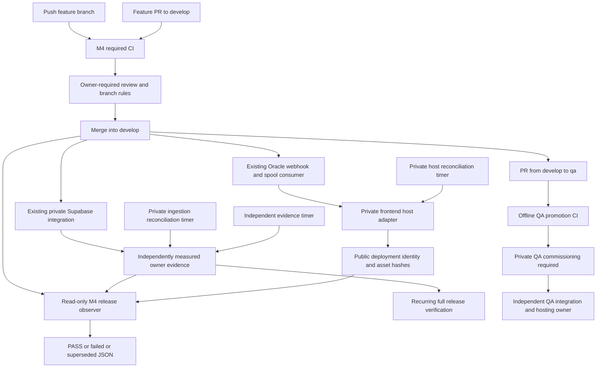

# MONEYBOWL M4 — unified environment promotion

Status: corrected local review candidate, 2026-10-10; **end-to-end commissioning BLOCKED**.
No hosted deployment was performed. Base `origin/develop` was fetched and verified
at `8993ce141ceed6a1cae95c2a7edbfbfcf24524f8`. The canonical checkout was left intact.
The user's commissioning context supersedes older M1/M2/M2A local-candidate notes:
DEV native dispatch is active, one recovery Cron runs every 15 minutes, and Oracle's
financial dispatcher is retired. M4 does not independently recertify those live facts.

## Promotion and deployment ownership

| Component | DEV deployment owner | QA owner | M4 behavior |
| --- | --- | --- | --- |
| Migrations, declared Edge Functions, declared Storage | Existing private Supabase GitHub integration on `develop` | Future separately owned Supabase integration on `qa` | Observe only; no CLI deployments or admin credentials in Actions |
| Flutter web | Existing Oracle webhook/spool and `deploy-develop.sh` | Future independent QA hosting runner | Versioned host adapter replaces the called deploy implementation after installation review; no second webhook consumer |
| Ingestion support API | Private existing Compose owner plus versioned reconciliation adapter | Future private QA service owner | Exact-source build, registry digest, API-only activation, measured verification; installation pending |
| ClamAV and Caddy | Existing Oracle infrastructure owner | Independent QA infrastructure owner | Existing running configuration/images verified and preserved; infrastructure changes require separate review |
| NSE financial dispatch | M2 native dispatcher inside Supabase | Disabled; independent schema/evidence commissioning needed | No lifecycle operations; preserve active DEV; Oracle dispatcher remains retired |
| Director and host infrastructure | Separate owners | Separate owners | Outside application release; never deployed by M4 |

The ingestion application source, Dockerfile, dependencies, Compose files and
Caddyfile are one hashed component. ClamAV/Caddy images and configuration are thus
included in compatibility evidence; an unchanged API alone is insufficient when
that component changes. The retired `services/outbox-dispatcher` is tested for
compatibility but is deliberately never a deployable component. The automatic ingestion owner is implemented locally; there is no
claim that it is installed or deploying today.

## Exact Actions trigger graph

[Environment promotion workflow](../../.github/workflows/environment-promotion.yml)
has no path filters:

- Every push to `feature/**`, `develop`, or `qa` runs `M4 Contracts`, `M4 Flutter`,
  and `M4 Backend and Integration`, then the always-evaluated `M4 Required CI` gate.
- PR opened, synchronized, reopened or marked ready targeting `develop` or `qa`
  runs the same validation. No PR job deploys or contacts hosted project APIs.
- Only a push to `develop` or `qa` enters `M4 Environment Release`, after the CI
  gate resolves, even if CI failed. Checkout is exactly `github.sha`.
- The release job serializes by `m4-release-refs/heads/<branch>` without cancelling
  an in-progress observer and uses `queue: max`. Up to 100 waiting jobs are retained;
  older slow CI runs cannot replace a newer pending observer. Beyond the platform
  limit, cancellation must alert for a latest-revision workflow rerun. Host deployment
  convergence does not depend on Actions queue ordering.
- QA fails with `environment_not_commissioned` before network access. Neither a
  repository variable nor a workflow dispatch can enable QA; a separately reviewed
  policy change and private infrastructure are required. No manual dispatch exists.
- `main`, tags and Production have no new trigger or target. Existing unrelated
  main-branch validation workflows remain unchanged in purpose.

Existing commit/documentation/migration workflows also recognize `qa`; the M4 gate
always validates migration history, including when their path filters skip them.
The existing outbox workflow is retained. New action references are pinned to full
SHAs. Shared CI uses GitHub-hosted runners and `contents: read` only. No new workflow
references a secret, self-hosted runner, private key, Supabase token or QA admin.
Checkout's automatic repository token is read-only and is never a build define.

The contracts gate records the full PR head SHA. `develop` requires a same-repository
`feature/*` source; `qa` requires the same repository's `develop` source with that
head SHA in fetched develop ancestry. The tested QA merge tree must equal the
reviewed develop tree, preventing QA-only source additions. Advancing develop later
does not invalidate an already reviewed ancestor. No applied migration from the PR
base or previous push may change, disappear or be renamed. Only additions are allowed;
the pre-existing frozen migration manifest is also checked.

## Required repository-owner branch rules

Configure before relying on the zero-command release contract:

1. Require reviewed PRs for `develop` and future `qa`; prohibit direct pushes,
   force pushes, deletion and administrator bypass. Dismiss stale approvals, require
   approval of the latest push, and require resolution of review conversations.
2. Require `M4 Required CI`, existing commit/documentation checks, and the actual
   Supabase integration's migration validation check. Verify exact check names in
   the repository UI. Require branches to be up to date. The unconditional M4 gate
   supplies migration safety even for changes outside existing path filters.
3. Protect workflow files, deployment tools, environment policy and migrations with
   designated reviewers/CODEOWNERS under repository-owner policy.
4. For QA, use the merge strategy whose result preserves the reviewed develop tree;
   resolve any QA divergence through develop before promotion. Preserve SHA ancestry
   for rollback rejection. Do not rebase, force-reset or silently recreate an
   environment branch. Merge queue is not configured by this implementation.
5. Restrict Supabase integration bindings: DEV only `develop`; future QA only `qa`.
   Disable automatic preview creation if feature/PR events would provision shared or
   unwanted projects. Verify these private integration settings separately.

Code cannot infer approval from branch names. Without these rules, branch updates
are not proof of review. M4 does not change repository settings.

## Release identity and independent evidence

[Contract](../../tools/deployment/contract.py),
[observer](../../tools/deployment/observe.py), and
[host adapter](../../tools/deployment/host.py) share environment/branch/project
bindings. DEV is pinned to `rskryngwzyuzmiwtriyy`; QA's project is deliberately null.
The CLI `supabase/config.toml` project identifier is never a deployment target.
Production is rejected by all M4 entrypoints.

The observer requires a fresh HTTPS owner receipt (maximum age five minutes) for
exact environment, project, branch and full merged SHA. Receipt URLs are repository
owner-controlled public configuration, served by the independent private verification
owner. Redirects, proxies, unbounded JSON and credentials in URLs are rejected.
HTTP 404, safe transient transport/408/429/5xx reads, explicit pending components,
and a correctly bound frontend at a proven ancestor may be retried. HTTP 401/403,
untrusted TLS, malformed/mismatched evidence and owner failures are permanent.
Only bounded **reads** are retried (30 observations,
ten-second interval, per-request ten-second timeout; workflow capped at 25 minutes).
Migrations, financial operations and deployment writes are never retried by the observer.

The independent [evidence owner](../../tools/deployment/evidence_owner.py) and
[Supabase measurement transport](../../tools/deployment/supabase_reader.py) are now
implemented and synthetically tested. They are **not installed, provisioned or live
certified**. The deployment integration remains the sole Supabase writer. The owner:

1. Fetches current `develop` into its own mirror; extracts that exact revision into
   a temporary source tree. A requested SHA or CI result supplies expectations only.
2. Reads actual migration versions and stored statements through the Management API's
   read-only query endpoint. Requires the complete source history, no extra versions,
   and equal tokenized SQL (comments/whitespace/separators ignored; literals and dollar
   bodies preserved). Missing versions are pending; absent statements, changed content
   or unexplained migrations fail. There is no history repair or migration execution.
3. Lists deployed function IDs, versions, status and JWT configuration. Downloads each
   declared function with the pinned Supabase CLI `functions download --use-api` into
   an isolated temporary HOME. Compares actual exported local module bytes and their
   import closure to Git. Extra functions, changed configuration, incomplete exports,
   import maps/computed imports or source mismatches fail. Missing/deploying functions
   remain pending. Re-reads the metadata and migration snapshots before certifying.
4. Reads only the private project/control identity and canonical Cron projection;
   calls dispatcher **readiness** with a separately provisioned readiness-only HMAC key. Requires the exact project,
   DEV active mode, 17 canonical routes and one active 15-minute recovery Cron.
   The expected NSE origin is supported by the measured dispatcher/runtime source
   and authenticated readiness validation; it is not a new provider/financial probe.
5. Requires a fresh, independently controlled service-owner receipt with actual
   image ID, registry digest, source provenance and measured Oracle retirement.
   Missing service evidence cannot manufacture a retirement claim. Rechecks the
   current branch and publishes sanitized `<sha>.json` atomically.

The receipt includes a digest of the actual migration/metadata snapshot, not raw SQL,
function bodies, environment values or credentials. Source digests are emitted only
following the comparisons above. Unavailable evidence yields 404 or explicit pending
components; unauthorized/malformed/unverifiable measurements yield a bound failure.
A mismatch is not retried within the observer as propagation. The next private timer
cycle remeasures actual state, allowing independent owners to finish convergence.
This may produce a failed Actions observation while an older backend is still serving;
only a later successful measurement can replace that conclusion for the new snapshot.

An unchanged Supabase component may retain an older physical deployment when actual
content matches the approved revision. `git_commit` means the release whose content
was measured, **not** an invented provider deployment SHA. Actual migration records
and function metadata remain the provider's authoritative audit records. The owner
hashes their measured snapshot; private audit retention can archive these records
under separately reviewed data policy. The receipt does not assert that a provider
exposes a trustworthy Git SHA when it does not.

Measurement prerequisites are deliberately fail-closed:

- A privately provisioned, project-scoped Management read capability must permit
  `edge_functions_read` and `database_read`, including the exact migration history,
  `moneybowl_dispatch.commission_identity`, `moneybowl_dispatch.control`, and the
  canonical `cron.job` projection in `supabase_reader.py`. The documented read-only
  endpoint is beta and runs as `supabase_read_only_user`. Private-schema permissions,
  RLS and Cron visibility may prevent these measurements on existing DEV. **No grants,
  administrator fallback or bypass are installed here.** If direct read-only access
  cannot be commissioned safely, review a minimal private measurement projection and
  adapter change independently. Do not substitute the write-capable query endpoint.
- Verify the pinned CLI's real exported module layout/content on the private project.
  Synthetic exports do not establish actual bundle round-trip compatibility. Any
  normalization/unsupported import map requires a reviewed verifier extension, never
  accepting only an entrypoint hash. Remote dependencies retain the Supabase platform
  resolver and approved source pinning trust boundary; they are not independently
  downloaded or execution-attested by this adapter.
- Applied migration statements must actually be retained. Missing historical content
  requires independent provider/audit evidence and a separately reviewed adapter;
  never stamp Git's requested content into history and call it measurement.
- `OUTBOX_READINESS_KEY` is a separate, independently generated readiness-only
  credential. M4 never receives `OUTBOX_NOTIFICATION_KEY`, the database service-role
  key or the worker token. The new key is optional at dispatcher startup: leaving it
  absent preserves existing M2/M2A operation; dedicated M4 authentication fails closed.
  When configured it must be 32–4096 printable non-space ASCII characters, distinct
  from all three existing credentials. Invalid or reused configured values fail
  dispatcher configuration, so never provision a blank/example placeholder.
  The property is non-enumerable and never included in diagnostics.

## Readiness-only authentication and private commissioning

Legacy M2/M2A readiness, event and recovery signatures retain `x-outbox-signature`
and the unchanged canonical signing input. M4 exclusively sends
`x-outbox-readiness-signature`, signing `moneybowl-readiness-v1|` followed by the
same canonical readiness envelope. This header is accepted only on the two explicit
readiness route aliases. Mixed headers fail; no fallback to legacy signing occurs.
Even fresh, otherwise valid event/recovery envelopes signed with the compromised
readiness key fail under either header/signing scheme. Successful readiness returns
before any RPC, admission, continuation or worker request.

Before enabling evidence production, separately authorize and review these steps:

1. Publish/deploy the reviewed dispatcher code through its existing Supabase owner.
   Deployment alone does not need the new secret or change DEV mode, Cron, routes,
   Vault notification key, or M2A commissioning state. Do not bootstrap, activate,
   roll back or rotate dispatch as part of this change.
2. Generate a new independent random readiness secret in the private commissioning
   environment (at least 32 random bytes, encoded as hex, is suitable). Provision
   it as the DEV Edge secret `OUTBOX_READINESS_KEY` and as the evidence service's
   `LoadCredential=readiness-only-key:/private/credentials/m4-readiness-only-key`.
   Use the environment owner's reviewed secret-management process. Do not retrieve,
   copy, derive from or redistribute any existing notification/worker/database key.
   No credential goes to Git, Actions, Flutter, receipts or logs. Supabase's
   [Edge secret configuration](https://supabase.com/docs/guides/functions/secrets)
   is the provider interface; no provisioning command is run by M4.
3. Do not carry forward the former `readiness-key` credential file or service mapping.
   This controller reads only `readiness-only-key` and fails if it is absent or
   malformed; it never falls back to a notification credential or environment variable.
   Independently verify the evidence environment has no notification signing secret.
   Any cleanup of an earlier installation requires separate owner authorization.
4. Keep evidence production disabled until its separate Management read capability,
   actual export/history measurements and dedicated readiness response are verified.
   Confirm readiness returns the existing DEV active mode/project/17 routes and the
   independent read-only Cron measurement is unchanged. The negative financial-path
   tests are synthetic: commissioning does not need event/recovery or financial probes.
5. Enable the private owner/timer only through the separately reviewed installation
   procedure below. Archive sanitized measurement evidence, not credentials. QA needs
   its own independently provisioned key and remains disabled in this implementation.

Primary contracts: [read-only Management query](https://supabase.com/docs/reference/api/v1-read-only-query)
and [deployed function inventory](https://supabase.com/docs/reference/api/v1-list-all-functions).

The exact receipt JSON shape is exercised in
[synthetic tests](../../tools/deployment/test_deployment.py). Required fields:
`schema_version=1`, uppercase `environment`, `git_commit`, `git_branch`,
`supabase_project`, numeric UTC epoch `observed_at`, `financial_policy` (`preserve`
for DEV, `disabled` for QA), canonical `nse_origin`, `oracle_dispatcher=retired`,
and `components` with exactly `migrations`, `edge_functions`, `ingestion_support`.
A `dispatcher` measurement must also report authenticated readiness, exactly 17
routes, one Cron with schedule `*/15 * * * *`, and DEV active mode/active Cron or
QA disabled mode/inactive Cron. This matches the supplied DEV commissioning state;
a deliberately paused DEV must stay paused, report unverified, and receive separate
owner review instead of being automatically activated to satisfy a release check.
Each component requires `state=deployed`, `healthy=true`, a `source_digest`, and
respectively `proof=applied_history`, `downloaded_bundle`, or `running_image`.
`manifest(repo, sha)` computes SHA-256 of sorted Git `ls-tree -r` records for the
component paths. These expected digests must only be emitted after actual measurement.
The authenticated HTTPS endpoint is a trust boundary, not a cryptographic proof
against a malicious environment administrator. Do not host editable receipts in
an ordinary frontend release directory or let PR code publish them.

Flutter `deployment.json` binds uppercase environment, project, branch, exact SHA,
whole release content digest, and SHA-256 hashes of `index.html` and `main.dart.js`.
The observer fetches both served assets and compares hashes, checks the release health
file, and rechecks the current branch. Health-file success proves static serving;
it does not prove interactive sign-in or financial health. The host validates the
whole immutable directory digest when reusing a release. Cache behavior must allow
fresh identity/assets (configure no-store for deployment/health files and HTML).

The structured report distinguishes code validated, deployment detected, backend
deployed, frontend deployed, services deployed, post-deployment passed, and entire
environment release verified. Only `state=pass` means environment PASS. `superseded`
exits successfully as an observer completion but always retains
`environment_release=not_verified`; it is not deployment success. Partial deployment
may exist after failure and is reported by stage. No status is synthesized from CI.
The Actions summary and 30-day JSON artifact record that observation; the private
evidence timer publishes an independent timestamped full-release report after later
convergence. Old snapshots are not current health proof; verify freshness and branch
identity before relying on either. The original Actions result is not rewritten; setup or
observer termination produces an explicit failure fallback. Infrastructure cancellation
may prevent artifact upload; a cancelled job is never evidence of deployment.

## Configuration and private installation

| Name/location | Owner | Purpose |
| --- | --- | --- |
| `tools/deployment/environments.json` | Reviewed source | Environment branch/project/financial policy; QA disabled |
| `M4_DEV_FRONTEND_ORIGIN` | Repository public variable | Exact HTTPS DEV frontend origin |
| `M4_DEV_EVIDENCE_URL` | Repository public variable | Independent HTTPS backend receipt base directory; append `/<sha>.json`, no query/credentials |
| `M4_QA_FRONTEND_ORIGIN`, `M4_QA_EVIDENCE_URL` | Future owner public variables | Future public or sanitized QA evidence; not credentials |
| Host config `environment`, `host_authority`, `repository`, `release_root`, `flutter`, `public_defines`, `frontend_origin` | Private environment host | Explicit deployment paths/ownership; never source shell env files |
| `MONEYBOWL_ENV` | Public Flutter JSON | `dev` or `qa`; frontend Production convention remains `prod` but unsupported here |
| `SUPABASE_URL`, `SUPABASE_ANON_KEY` | Public Flutter JSON | Exact project HTTPS URL and project-specific publishable key (legacy anon JWT accepted with matching ref/role) |
| `NSE_CONSOLE_ENABLED`, `MONEYBOWL_DEV_ONBOARDING_PREVIEW` | Public Flutter JSON | String true/false; true permitted only in DEV |

An opaque publishable key cannot be decoded to prove project provenance. The private
owner must validate its public project pairing during installation. No backend/NSE/
worker/HMAC/service-role field is accepted as a build define. Every build starts
with an explicit clean process environment and a temporary HOME; no inherited
backend values, proxy settings or DART_DEFINES enter the compiler. No secret files
were read to prepare these examples. Unknown build keys fail rather than being copied.

One-time DEV installation is a **separate authorized host change**, not executed here:

1. Review the local commit and existing host permissions. Preserve the current release,
   webhook signature validation, spool and consumer identity. Copy the approved
   deployment Python files and policy to an owner-controlled `/opt/moneybowl-deployment`;
   do not execute a mutable source checkout as the deployment controller.
2. Provide Python 3.12+, an owner-controlled full source mirror with read-only GitHub
   access, and pinned Flutter 3.44.6/Dart 3.12.2. Configure a dedicated deployment user,
   release-root ownership and public-only defines. Review the
   [host config example](../../tools/deployment/host.dev.example.json) and
   [public defines example](../../tools/deployment/public.dev.example.json).
   The public key placeholder intentionally fails validation.
3. Stage-test against a temporary root and synthetic frontend. Verify the old current
   symlink is inside `releases`, full source ancestry is available, and the existing
   deployment identity is compatible. No canonical develop checkout update is required.
4. Replace only the existing `deploy-develop.sh` called by `process-spool.sh` with a
   reviewed wrapper executing `python3 /opt/moneybowl-deployment/host.py --config
   /etc/moneybowl-deployment/dev.json`. Preserve one consumer; do not install the old
   dispatcher webhook override, a second listener, or a financial dispatcher.
   Install the wrapper atomically only after draining the old deploy lock so old
   and new implementations cannot overlap. Retain the original for host rollback.
5. Adapt and review the provided [service](../../tools/deployment/moneybowl-release-reconcile.service)
   and [timer](../../tools/deployment/moneybowl-release-reconcile.timer) for that same
   user/controller/root. Set an appropriate service timeout and monitoring. The timer
   drives the same latest-revision adapter and lock, not another webhook consumer.
   It is necessary because the old spool moves failed batches out of its queue and
   does not itself retry; it also covers lost deliveries and busy-branch exhaustion.
6. Stage the [ingestion owner](../../tools/deployment/ingestion_owner.py) separately
   using the [disabled example](../../tools/deployment/ingestion-owner.example.json).
   Inventory the existing Compose project, private `.env`, data volumes, daemon ID,
   Caddy/ClamAV containers, the fixed DEV retirement inventory below and its independently verified full container ID.
   Bind an unlabelled legacy API image to its independently verified original revision
   and image ID. Do not infer that revision from the next requested release.
   Pin Docker/systemctl binaries by SHA-256; pin/review the Compose plugin installation
   too (plugin byte pinning is an installation responsibility). Privately provision
   registry auth and exact registry repository. This owner has Docker socket access,
   a root-equivalent capability; isolate it from app users and shared Actions.
7. Review the ingestion [service](../../tools/deployment/moneybowl-ingestion-owner.service)
   and [timer](../../tools/deployment/moneybowl-ingestion-owner.timer). They converge
   the latest branch every 60 seconds after completion, through one private flock.
   Build the exact archived service source with no private context or build args,
   capture Docker's image ID, push to the private registry and bind its immutable
   repository digest in the private ledger. Verify image labels **and** that ledger.
   Generate the existing immutable override; execute only Compose `up` for `api`
   with `--no-deps --no-build --pull never --scale api=1 --wait`. There is no `down`,
   orphan removal, volume deletion, legacy dispatch profile, or dependency restart.
   API readiness is non-financial. Verify running image/configuration, the exact
   single-worker command and absent entrypoint override, one API container,
   unchanged Caddy/ClamAV IDs/images/config hashes and retirement before publishing.
   Source changes to Compose/Caddy fail for separate infrastructure review, rather
   than pretending undeployed infrastructure changes succeeded. Preserve all data.
8. Stage the [evidence configuration](../../tools/deployment/evidence-owner.example.json),
   [service](../../tools/deployment/moneybowl-evidence-owner.service) and
   [timer](../../tools/deployment/moneybowl-evidence-owner.timer) in its own private
   measurement environment. Provision the capabilities listed above, read-only Git
   mirror and pinned Supabase CLI 2.115.0 binary. The ingestion and evidence owners
   use separate mirrors/state/locks; neither shares credentials with the frontend.
   Example configurations remain `commissioned: false`; private reviewed configs
   need `true` plus the already reviewed DEV-only policy.
9. Set config files to 0600 and keep installed code, parent directories, credential
   directories, private state/ledger and source mirrors writable only by their owners.
   Symlinked config/working roots and roots inside the application repository fail.
   Serve only sanitized backend/service/final-status directories over independently
   controlled TLS with `Cache-Control: no-store`. Give the web server read access to
   these report directories only; keep provenance, temporary output and credentials
   private. Atomic files use 0644 inside those protected directories. Do not put
   receipts in a frontend-writable release root. Mirror authentication must be
   read-only and host-owned; public source tests use only disposable local Git.
10. Configure service receipt base URL in the private evidence config, frontend
    origin and separate final-status root. Set Actions' public DEV variables only
    after authentic endpoint ownership is independently established. All backend and
    service URLs resolve as `<base>/<full-sha>.json`. Missing files must return real
    404, not an HTML fallback or stale cached success. The evidence timer also runs
    full frontend/asset checks and writes `<release_status_root>/<sha>.json` after
    measurement. Monitor this independent report as well as Actions.
11. Safely stage duplicate calls, failed build, invalid receipts, stale revisions and
    rapid merges. With separate deployment authorization, verify one approved merge
    across the existing Supabase integration, frontend adapter, ingestion owner and
    both reporting paths. Retain exact live receipts and branch/revision identity.
    No timer or service in this procedure was installed or executed against DEV here.

Automatic convergence after commissioning is: approved branch update independently
reaches the existing Supabase integration and webhook; the frontend timer covers lost
spool deliveries; the ingestion timer fetches the latest approved branch; the evidence
timer waits by remeasurement and publishes full status after all components match.
No new webhook consumer exists. Shared Actions only observes; it cannot operate any
private owner. A finite Actions timeout remains failed even if a later timer verifies
the release. The later timestamped private result is separate evidence, with
`code_validated=not_observed`; it never rewrites CI or fabricates an approval check.
Repository branch rules remain the authority that makes a branch revision approved.

## DEV Oracle retirement boundary

The private ingestion owner requires this exact versioned inventory; config omissions
or substitutions cannot waive it. The example remains uncommissioned and requires
`retired_container_id` to be independently bound to the actual 64-hex stopped object.
No live object was inspected to prepare that example.

| Artifact | Required measured state |
| --- | --- |
| `moneybowl-ingestion-support-outbox-dispatcher-1` | Same full container ID; `Status=exited`, PID zero, Running/Restarting/Paused/Dead false, Docker restart policy `no`, expected Compose project/service labels |
| `moneybowl-outbox-dispatcher-reconcile.service` | Persistent unit-file state `masked`, load state `masked`, active state `inactive`, substate `dead` |
| `moneybowl-outbox-dispatcher-reconcile@.service` | Persistent unit-file state `masked`; all discovered concrete instances also persistently masked and inactive/dead |
| `moneybowl-outbox-dispatcher-reconcile.timer` | Unit-file state `disabled`, load state `loaded`, active state `inactive`, substate `dead` |

The checks use only Docker inspect/list and systemctl list/show operations. Missing
containers/units, temporary masks (`masked-runtime`), failed/active/unknown states,
duplicate/missing properties, unexpected dispatcher containers or reconciliation
units, and command errors fail closed. The template is checked as a unit file;
loaded instances and instance-specific files are enumerated so a masked template
cannot hide a still-running or unmasked instance. A masked timer is not substituted
for the commissioned disabled/inactive timer contract.

Retirement gates run before building, before activation and before publishing success.
Application activation selects only `api` with `--no-deps`; no retirement remediation,
systemd mutation or dispatcher start command exists in this owner. A failing final
measurement withholds PASS without restarting or rolling back dispatch. These are
snapshots, not protection against a privileged host actor changing state between
checks. Independent host ownership and commissioning remain necessary. QA retirement
ownership is not inferred from DEV: the concrete Docker adapter rejects QA until a
separate reviewed retirement inventory/verification contract is implemented.

## Races, failures, recovery and rollback

The host holds one flock per environment across the build and activation. It fetches
the current branch before building and immediately before activation. Source is an
exact Git archive; builds use isolated directories and lockfile enforcement. A failed
build cannot touch the old current link. New releases are staged on the same filesystem,
renamed into `releases/<sha>`, and never overwritten. Symlink artifacts are rejected.
Activation uses a temporary symlink and atomic rename. Reuse verifies identity and
content and public-configuration digest; duplicates converge without rebuilding.
A configuration change requires a new reviewed revision instead of silently reusing
an old bundle. Legacy same-SHA releases lacking the new manifest fail closed; install
the adapter for a new approved revision, never relabel an existing legacy release. The previous revision must be an
ancestor of the new one, so branch resets cannot silently roll back the application.

A stale explicit SHA returns `superseded`. The normal spool/timer call omits SHA and
tries up to four latest revisions; a branch advancing during a build leaves that
release inactive and moves on. Continued churn fails for a later timer reconciliation.
GitHub and a filesystem switch cannot be one distributed transaction: a commit can
arrive immediately after the final fetch. Later locked reconciliation advances to
that commit; the current link cannot move behind a newer already activated release.
No finite deployment-time check promises the branch will remain unchanged afterward.
Actions independently rechecks the branch before and after observation. Configure
alerts for failed release reports, missing receipts, failed reconciliation units and
an approved branch head remaining undeployed beyond the expected build window.

Component owners are not transactionally coupled. A frontend may advance while a
migration fails; the aggregate report stays failed. Releases must therefore preserve
backward compatibility across rollout skew (additive schema first, compatible workers,
then frontend). There is no automatic rollback, database retry, event reset, lease
cleanup or financial replay. Retry safe observation or the immutable frontend build
through the same reconciler after resolving the cause. Retain failed reports.

A rollback is a new reviewed forward commit reverting application behavior; it still
uses the normal pipeline and new identity. Never move the branch or symlink to an old
SHA, rewrite applied migrations, clear financial evidence/claim tokens, retry MAYBE_SENT,
or restart Oracle dispatch. A schema repair is a new additive migration reviewed
against current data and integration behavior. Emergency host restoration requires
its own owner review and reconciliation policy so the timer cannot fight the operator.

## Future private QA onboarding

Do not create QA resources from this implementation. A separately authorized owner
must provision a distinct private project, hosting runner, integrations, DNS/TLS,
monitoring, least-privilege access and project-specific public frontend settings.
QA administrator, service-role, NSE, HMAC and worker credentials stay inside QA's
private owners; none goes to Oracle DEV or shared Actions. Shared CI can validate
all QA promotion logic without that project. If the private QA receipt cannot be
safely exposed read-only to Actions, the same observer must run on QA's independent
runner and publish sanitized results; shared runners must not gain private access.

Privately establish environment `QA`, correct project identity, intended NSE origin
`https://www.nseinvest.com`, and disabled persisted financial workflows. Do not copy
DEV credentials or activation history. Review schema/evidence readiness separately;
M4 does not authorize financial commissioning. Only after independent review set the
actual QA public project binding and enable its policy, install the private QA adapter
and service owner, configure integration on `qa`, and create branch/rules through the
owner's separate authorization. QA host authority must be `qa-private`. The DEV host
installation keeps a DEV-only pinned policy; do not give it a QA-enabled controller.
No QA administrator credential is needed to run synthetic tests or the shared workflow.

## Status matrix and limitations

| Capability | Implemented | Locally tested | Already live evidence | Pending |
| --- | --- | --- | --- | --- |
| Feature/PR CI and QA compatibility | Yes | Synthetic and repository regressions | Not published | Review, publication, required branch checks |
| Existing DEV Supabase deployment | Existing integration retained; independent measurement adapter implemented | Mock API/export comparisons and repository regressions | User-supplied working integration; no M4 receipt | Private read permissions, export compatibility, Independent readiness-only key, installation and live certification |
| Existing DEV Flutter/webhook | Existing working scripts inspected read-only | New adapter filesystem/process tests | User-supplied existing deployment context | Reviewed wrapper/timer installation and public identity upgrade |
| Ingestion service promotion | Immutable manifest, private build/deploy/verify adapter and timer examples | Mock Docker/provenance/race/failure tests; 194 service tests | Repository records hosted DEV service; new adapter not installed | Registry, baseline/daemon binding, private config, controlled installation and real verification |
| Consolidated status | Bounded observer plus independent recurring backend/full-release evidence owner | Delayed/partial/404/permanent/race tests and synthetic full sequence | None from this implementation | Private measurement capabilities, receipt hosting, timer installation and full live verification |
| QA deployment framework | Shared code, disabled policy | Synthetic isolated QA success/denial | No QA environment | All independent private commissioning |
| Financial state preservation | No mutation interfaces in M4 | Existing M1/M2/M2A safety/SQL tests | User reports DEV active, one Cron, Oracle retired | Live release preservation measurement by private owner |

Local implementation is ready for independent security review, not security-approved.
End-to-end live commissioning remains **BLOCKED** by the explicit private prerequisites
above. No local test is hosted deployment evidence or establishes operational completion.
The Management read permissions, deployed export format, actual Docker/Compose behavior,
real endpoint ownership and Actions execution remain unverified runtime assumptions.

Current references: [Supabase integration ownership and scope](https://supabase.com/docs/guides/deployment/branching/github-integration)
and [GitHub concurrency semantics](https://docs.github.com/en/actions/how-tos/write-workflows/choose-when-workflows-run/control-workflow-concurrency).
Supabase changelog was checked; no database/platform upgrade is part of M4. Existing
SQL tests use the repository's pinned disposable Postgres image, not a hosted database.
See [validation record](MONEYBOWL_M4_VALIDATION.md) for commands and observed outcomes.
