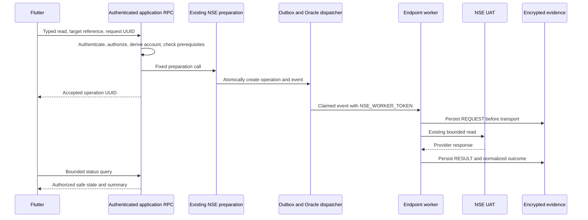

# NSE Frontend Integration V1 — architecture and implementation plan

Analysis: 2026-10-02. Program authority: `/home/ubuntu/nse-uat-contract/analysis/NSE_COHERENT_IMPLEMENTATION_PLAN_V2_001.md` and its JSON companion.

Fresh source: `origin/develop` **eb874f207227edb80d6d8ec9a4f46f8161a9d50b**, independently checked with read-only `git ls-remote origin refs/heads/develop`. This includes B04 (PR #176). The canonical checkout was clean and was not changed. Source proves implementation, not current hosted deployment.

Implementation worktree: `/home/ubuntu/moneybowl-worktrees/nse-frontend-integration-v1-local`; branch `feature/nse-frontend-integration-v1-local`. The user subsequently requested local implementation of this plan. This document retains the architectural decisions and future commissioning procedure. Hosted deployment and actual NSE commissioning remain separate, unperformed work.

## 1. Recommendation and boundaries

Use six **authenticated database RPCs** as the MoneyBowl application boundary. They authorize the user, derive the integration account, accept a closed typed read command, and invoke existing preparation functions in a transaction. Flutter receives a durable operation reference immediately and polls an authorized, allowlisted status projection.

Reuse the existing outbox, Oracle dispatcher, endpoint workers, encrypted immutable evidence, summaries and backend retry policy. Add no new provider transport, service-role Edge gateway, general executor, report storage framework or Realtime publication.

The user explicitly selected:

- Active assigned advisors, plus the active workspace owner/admin, may read a client.
- V1 covers account-scoped reports and B03 owned-order selection. Other advanced identifier selectors are deferred.

Non-goals: UCC registration; NORMAL/SWITCH/orders; payments; mandates; bank/declaration/document mutation; systematic registration/cancellation/modification; communication/link-generation actions; secret administration; new financial projection; new member-connection architecture; automatic write reconciliation; production enablement. No write is enabled because a read succeeds.

The DEV/UAT console can be replaced later. Authentication, authorization, typed commands, idempotent receipts, operation queries, and asynchronous controllers are reusable application infrastructure.

## 2. Current-state assessment

| Existing component | Reuse / limit |
| --- | --- |
| `integration_accounts` | Workspace/investor/provider/environment identity, registration state, trusted UCC. No browser grant. |
| `integration_operations` | Durable state, category, attempts, retry/ambiguity flags, timestamps and correlation. Existing states remain authoritative. |
| `integration_api_interactions` | Immutable encrypted REQUEST/RESULT pairs; never a browser API. |
| Endpoint `prepare_nse_*` functions | Trusted scope/selector checks and atomic operation/outbox creation. Existing service-only grants remain intact. |
| `event_outbox`, Oracle dispatcher | Existing routes, claims, fencing, recovery and bounded retry scheduling. |
| Endpoint workers and `_shared/nse` | Endpoint-specific builders/parsers, one bounded transport per attempt, evidence first, SQL reclassification and fail-closed interpretation. |
| Existing report summaries | Counts and normalized categories. Most families derive summaries from retained encrypted evidence; ORDER_STATUS has a private observation table. |
| Current Flutter | Supabase authentication; Provider/ChangeNotifier; repository interfaces; feature folders; guarded routes; advisor dashboard with verification/qualification consoles. |

`SUBMISSION_FAILED` with `retry_allowed=true` is pending backend work. Some invalid provider responses are stored as `BUSINESS_FAILED`; classification must inspect the normalized category. A successful report with invalid underlying orders is still a successful read. Zero results do not prove that a financial action never happened.

Client Master is currently purpose-bound UCC verification. Successful registration automatically queues one lifetime post-registration verification. Display that state and existing verification metadata; do not disguise the lifetime operation as an on-demand refresh or expose ambiguous-write reconciliation controls.

Existing general workspace helpers are broader than the chosen assignment policy. `requireAdvisor` in the shared Edge helper is not sufficient authorization for this feature. User JWT workspace claims and UI profile checks are context only.

## 3. Alternatives considered

| Alternative | Benefits | Drawbacks / security / operational fit | Decision |
| --- | --- | --- | --- |
| Authenticated Edge gateway with service-role preparation | Familiar HTTP interface, TypeScript validation, central HTTP controls | Adds privileged runtime and credentials; separate authorization and preparation still need transactional SQL to avoid races | Not needed in V1 |
| Authenticated RPC facade | Atomic authorization/idempotency/audit/enqueue; no new runtime secrets; established MoneyBowl repository pattern | Privileged SQL needs narrow grants, safe errors and actual-role tests | Recommended |
| Thin Edge adapter forwarding user JWT to facade | Can support future HTTP/non-Supabase clients | Another deployment and failure point without changing V1 authority | Future optional transport |
| Dedicated application service | Independent scaling and richer orchestration | New hosting, authentication and operational ownership; duplicates existing infrastructure | Disproportionate |
| Direct tables + Realtime | Convenient streaming | Existing rows contain internal scope/evidence metadata; safe streaming requires a separate projection and authorization | Reject direct access |
| Bounded facade polling | Simple refresh/reconnect; fresh authorization on each query; no publication changes | Repeated bounded reads | Recommended |

Supabase references consulted: [database functions](https://supabase.com/docs/guides/database/functions), [API security](https://supabase.com/docs/guides/api/securing-your-api), [Edge authentication](https://supabase.com/docs/guides/functions/auth), [Realtime Postgres Changes](https://supabase.com/docs/guides/realtime/postgres-changes). The changelog was checked, including the [legacy-cipher change](https://supabase.com/changelog/postgres-15-19-17-11-breaking-changes); inspected NSE encryption explicitly uses AES256. No platform upgrade is proposed.

## 4. Flow and trust boundaries



Flutter has only public Supabase configuration and the signed-in user session. It must not contain service-role keys, NSE_WORKER_TOKEN, provider credentials/Basic Auth, encryption keys/references, encrypted evidence, raw provider rows/diagnostics, event UUIDs or claim tokens.

The new public facade is an intentionally narrow SECURITY DEFINER boundary because the caller has no direct access to the integration tables or preparation functions. Use empty search paths, qualified references, fixed dispatch branches and explicit EXECUTE revocations/grants. Private helpers and application tables live in unexposed `nse_app`, with no browser/service-role schema usage or table access. Enable RLS on the new tables as defense in depth.

Existing service-role permissions remain exclusively backend permissions. Oracle still authenticates to workers with NSE_WORKER_TOKEN. Workers still independently validate event/account/claim context. Encryption/decryption stays in existing database evidence functions. No new secret is required.

## 5. Exact authorization policy

Every public query/command resolves `auth.uid()` to exactly one profile through `current_user_profile_id()`. Require an active advisor/admin profile, advisor application account state, and an existing non-anonymous, non-deleted, non-banned auth user. Fail closed on missing or ambiguous identity.

`target_ref` is an existing investor `workspace_memberships.id`, not an integration-account or arbitrary workspace UUID. Derive its workspace/investor, require the workspace and investor profile active, and require active non-ended investor membership.

Allow either:

1. Active non-ended advisor membership in that workspace plus active non-ended `advisor_investor_assignments` relationship to that investor; or
2. Active non-ended admin membership and `workspaces.owner_profile_id` equal to the authenticated profile.

Assignments have no workspace column. Prove shared active workspace independently; the assignment alone is insufficient. Platform admin, operations, investor, family guest, inactive member, unrelated advisor and cross-workspace user do not get an exemption.

Derive one `NSE_INVEST`/`UAT` account for this workspace/investor. Account readiness also checks registration, usable UCC, cross-account UCC collision, and the owned verified canonical PAN for families requiring it. Existing preparation/source validators remain final authority.

New submissions lock/recheck authority rows after acquiring actor/workspace serialization locks, then hold authority until acceptance. No caller identity parameter, user-editable metadata role or JWT workspace claim establishes authority.

Authorization at acceptance delegates one durable read to the backend. Later advisor reassignment prevents new submissions/status access; it does not promise cancellation of already accepted work. Existing workers continue pre-send workspace/investor/account/identity checks. There is no browser cancel or provider retry command.

## 6. Current contract inventory and V1 eligibility

Eligibility here means source-supported and appropriate for the facade, not verified hosted deployment. All execution also needs the deployment gate and current account prerequisites.

| API | V1 behavior / blockers |
| --- | --- |
| ORDER_STATUS | Account UCC/date read; seven inclusive dates; defaults ALL transaction/order/suborder |
| PROV_ORDERS | Account UCC/date read; own REQUEST DATE default; do not add its date_type to ORDER_STATUS |
| CLIENT_AUTHORIZATION | B01 account read, required dates, AUTH_SENT_DATE |
| CLIENT_DETAIL | B01 account read, required dates, MODIFIED_DATE |
| TWO_FA | B01 account read, no product selector |
| CLIENT_KYC_REPORT | B01 trusted canonical PAN-only slice |
| FATCA_REPORT | B01 trusted canonical PAN-only slice |
| ELOG_REPORT | B01 trusted UCC-only slice |
| ORDER_LIFECYCLE | B02 UCC/date slice; product selection deferred |
| TRANSACTION_DETAIL | B02 UCC/date slice, REQUEST_DATE; order/systematic selectors deferred |
| FUND_ORDER | B02 UCC/date slice; ambiguous bank-reference selector disabled |
| FUND_AGE | B02 UCC/date slice; may return known AMC-invalid business failure; no sample/guessed AMC fallback |
| SIP_REG_REPORT | B04 account-UCC slice; member selection deferred |
| SIP_CAN_REPORT | B04 account-UCC slice |
| SIP_INST_DUE_REPORT | B04 account-UCC slice; preserve optional date validation |
| SIP_TOPUP_REPORT | B04 account-UCC slice; parent selectors excluded |
| STEPUP_REG_REPORT | B04 account-UCC slice; registration selectors excluded |
| XSIP_REG_REPORT | B04 account-UCC slice; member selection deferred |
| XSIP_CAN_REPORT | B04 account-UCC slice |
| XSIP_INST_DUE_REPORT | B04 account-UCC slice; preserve optional date validation |
| XSIP_TOPUP_REPORT | B04 account-UCC slice; parent selectors excluded |
| ALLOTMENT_STATEMENT | B03 needs positive owned normal-purchase ORDER_STATUS evidence |
| REDEMPTION_STATEMENT | B03 needs positive owned normal-redemption evidence |
| REDEMPTION_PAYOUT | B03 redemption evidence; exact payout contract |
| REDEMPTION_PAYOUT_NON_DEMAT | B03 redemption evidence plus nonblank owned folio |
| CLIENT_MASTER_REPORT / stable CLIENT_MASTER | Existing verification state is display-only; no new general refresh/reconciliation command |
| CLIENTCOMMON183 / UCC | Implemented write; excluded from frontend execution |
| MASTER_DOWNLOAD | NAV smoke-only tooling; excluded; member reference architecture remains program work |

Thus 21 account-scoped reports plus four conditional B03 reports. The coherent catalog has 84 contracts: 27 have scoped implementations (including UCC and Client Master), one additional contract has smoke-only coverage, and 56 lack a completed scoped adapter in this baseline. Remaining contracts stay with their existing program batch owners.

B03 is implemented; the user reports deployment, but this task did not independently inspect hosted inventory. Its current real commissioning is blocked by absent positive owned ORDER_STATUS rows. B03 must stay blocked rather than offering a doomed provider call.

B04 is merged. Account-UCC variants need no registration IDs; individual live envelopes still need characterization, including SIP's malformed handbook total-field example. Never apply other families' success-diagnostic exceptions to B04.

Track implementation, verified deployment, executability, commissioning and positive commissioning separately. V1 context reports commissioning UNKNOWN; historical operation success is not an automatic certification. Update reviewed commissioning artifacts only after separate authorized endpoint/variant checks.

## 7. Browser-safe contracts

All RPCs return `{"schema_version":1,"data":...}` or `{"schema_version":1,"error":{"code":"FIXED_CODE"}}` and `Cache-Control: no-store`. Public endpoints are:

| RPC | Arguments | Data |
| --- | --- | --- |
| `list_nse_read_targets_v1` | `p_after uuid?` | Up to 50 target refs, authorized MoneyBowl client/workspace labels, next UUID cursor |
| `get_nse_read_context_v1` | `p_target_ref uuid`, `p_command jsonb?` | Registration/verification state, deployment gate, 25 capabilities, optional command eligibility |
| `list_nse_settlement_candidates_v1` | target, `p_kind text`, `p_source_operation_id uuid`, `p_after integer=-1` | Up to 20 examined row ordinals, eligibility and generated labels; next row cursor |
| `submit_nse_read_v1` | target, `p_request_id uuid`, `p_command jsonb` | ACCEPTED/REPLAYED, request ID, server operation ID, local state, polling hint |
| `list_nse_read_operations_v1` | target, optional paired before-time/before-ID cursor | 20 operation metadata rows, next cursor; no history-wide decryption |
| `get_nse_read_operation_v1` | exactly one operation UUID or request UUID | Safe state/detail; request lookup is actor-scoped |

Each API has one closed command tag `read_` + its lowercase API key. Catalog entries map to explicit preparation branches; no caller function name, provider path or raw request is accepted.

```json
{
  "p_target_ref": "<investor-membership-uuid>",
  "p_request_id": "<client-generated-uuid>",
  "p_command": {
    "kind": "read_order_status",
    "options": {"from": "2026-09-26", "to": "2026-10-02"}
  }
}
```

Backend-derived values: authenticated actor, workspace/investor, integration account, fixed provider/environment, UCC/PAN, preparation family, event routing, contract version, provider date format/default enums and B03 selectors. Arbitrary account/workspace/UCC/PAN/AMC/scheme/order/member identifiers reject, including extra blank fields.

### Option shapes and defaults

Browser dates are strict ISO dates. The facade converts to native formatting; no date truncation or ambiguous parse is allowed.

- ORDER_STATUS/PROV_ORDERS: `from,to`; maximum six-day difference (seven inclusive dates); ALL defaults; provisional REQUEST DATE.
- First three B01 APIs: `from,to`; maximum seven-day difference; explicit family date defaults. Other B01 APIs: `{}`.
- ORDER_LIFECYCLE/TRANSACTION_DETAIL: `from,to`, seven-day difference; transaction REQUEST_DATE.
- FUND_ORDER: `from,to`; local V1 maximum 31-day difference, explicitly not a vendor maximum. Console defaults to a short interval.
- FUND_AGE: `date`; backend retains its lowercase `all` settlement behavior.
- B04: `{}` by default, optional complete `from,to`; existing strict positive gap, 31/7-day maxima and India-day non-past due checks. Effective UCC overrides dates: do not describe them as narrowing the report.
- B03: `from,to` (maximum 30-day difference), `source_operation_id`, 1–50 distinct `row_indices`; fixed order selector; payouts `Order Date`, allotment `ORD_DATE`. Other backend variants remain unexposed.

Reject unknown keys/types, inappropriate nulls, invalid dates, and unsupported kinds. The command body is limited to 8 KiB before preparation.

### Safe operation detail

```json
{
  "schema_version": 1,
  "data": {
    "operation_id": "<local-operation-uuid>",
    "target_ref": "<authorized-membership-uuid>",
    "kind": "read_order_status",
    "api": "ORDER_STATUS",
    "state": "SUCCESS",
    "display_status": "SUCCESS",
    "terminal": true,
    "backend_retry_pending": false,
    "attempt_count": 1,
    "created_at": "<timestamp>",
    "submitted_at": "<timestamp>",
    "completed_at": "<timestamp>",
    "updated_at": "<timestamp>",
    "fetched_at": "<timestamp>",
    "summary": {"native_status":"S","category":"order_status_no_records","record_count":0,"valid_count":0,"invalid_count":0,"other_count":0}
  }
}
```

Only successful validated summaries expose counts; missing/unsuccessful counts are absent, not fabricated zeros. Order-report counts are endpoint-specific. Native envelope status is only S/F/null. Categories have a fixed server allowlist; unknown stored text becomes a generic code. Remove workspace/account/result-interaction IDs from service summaries. Never return service summary JSON wholesale.

Errors: NOT_AUTHORIZED, TARGET_UNAVAILABLE, INVALID_COMMAND, BLOCKED_PREREQUISITE, FEATURE_DISABLED, REQUEST_CONFLICT, OPERATION_IN_PROGRESS, RATE_LIMITED, TEMPORARILY_UNAVAILABLE. Missing and inaccessible operation references have the same result. Unexpected SQL errors roll back and return a fixed code, never SQLERRM, detail, hint or stack trace.

## 8. Persistence, idempotency, and B03 lineage

New private tables:

- `nse_app.submission_receipts`: actor/request UUID unique key, authorized target, workspace/account, accepted non-sensitive typed command, unique operation UUID and timestamp. Immutable, retained for the operation lifetime. No cleanup in V1.
- `nse_app.dev_access`: workspace-scoped UAT enablement, verified release SHA/time; disabled by absence/default. No API paths, function names or request templates. Only trusted database administration can write; changes audit into existing immutable workspace logs.

Add account/time history and actor/workspace/account-kind receipt indexes. No public views, direct table grants, provider observation tables, or Realtime publication changes.

Submission locks actor then workspace, holds/rechecks current authority rows, and returns the receipt first for an identical accepted request. Replay does not re-run source validation/preparation, allowing recovery even after source identity changes. JSONB ignores object-key order; changing any actual command value or row-order selection conflicts.

For a new request: check gate, allowlist, current prerequisites and limits; lock account; generate operation UUID server-side; call the one fixed existing preparation function; insert receipt and audit; commit together. Audit failure rolls back operation/outbox/receipt. Audit actor/role and workspace come from trusted rows. No transaction is held during provider transport.

Limits: one outstanding read per account/API; 10 new reads per actor/minute; 60 per workspace/minute; 10 seconds between accepted reads of the same account/kind. Replays consume no new allowance. Backend retry budgets remain unchanged.

B03 selection starts with an authorized successful ORDER_STATUS operation. Resolve its RESULT privately, revalidate paired immutable evidence using the existing B03 validator, and return only eligibility and row positions. Candidate labels are generated, not provider content. On submission revalidate the selected operation and 1–50 positions again. Require normal P/R source fields, exact member lineage and folio for non-demat. No fallback to PROV_ORDERS or arbitrary identifiers. An older positive result remains selectable; history pagination must not infer global absence from only the newest page.

## 9. State model and async UX

| Canonical condition | Display |
| --- | --- |
| Missing prerequisites; no operation created | BLOCKED_PREREQUISITE capability |
| PREPARED / QUEUED | Queued |
| SUBMITTING | Running |
| SUBMISSION_FAILED + retry allowed | Waiting for backend retry; nonterminal |
| SUCCESS + valid detail summary | Success |
| Recognized provider rejection | Business failed |
| Invalid schema/scope/unknown diagnostic/interpretation | Failed closed |
| Terminal transport/HTTP failure | Failed with safe category |
| RECONCILIATION_REQUIRED | Review required; no frontend retry |
| SUCCESS but detail unavailable | Result unavailable — review required |
| Query/network error | Last-known status marked stale; never manufacture provider failure |

Poll at 2,4,8,then at most 15 seconds with jitter and one refresh in flight. Stop at terminal/disposal/sign-out/background; resume with immediate query. Show delay notice after two minutes; pause automatic checks after ten minutes, retaining nonterminal state and offering manual status refresh.

Create one secure request UUID on submit and persist the non-sensitive pending command in user-namespaced tab sessionStorage before HTTP. Double presses are suppressed. Lost acceptance can be looked up by request UUID or retried with the exact same UUID/command. Neither path asks a worker to retry transport. Block a new submit while an earlier submission remains uncertain. Clear pending storage on sign-out, including when the console route is closed. Native fallback storage is process-local; server history remains durable.

The guarded `/nse-integration?target=<local-ref>&operation=<local-ref>` route stores no provider identifiers. Update browser route state as selection changes so refresh restores the target/operation, with authorization rechecked. Each operation response carries its authorized target reference; Flutter rejects a restored result for a different selected client, even when the actor can access both. History uses cursor pagination and only selected detail decrypts evidence.

## 10. Flutter structure and visibility

Use `lib/features/nse_integration/{domain,data,presentation}`: typed command/state models; repository interface and Supabase implementation; tab-scoped pending storage; ChangeNotifier controller with injected clock/timer/UUID; route guard/session cleanup; responsive console page. Existing Provider manages controller lifetime. Widgets do not invoke Supabase directly.

Add the entry to existing desktop/mobile advisor navigation. Require both `NSE_CONSOLE_ENABLED=true` and `MONEYBOWL_ENV=dev`, plus current authenticated active advisor/admin application state. Server gate and assignment checks remain authoritative even with a forged build/route.

UI shows authorized workspace/client, registration and existing Client Master verification progress, 25 read capabilities with reasons, typed date forms, B03 candidate selection, queued/running/result state, attempt/timestamp metadata and bounded history. Reuse the application Material theme; test 320px/desktop, large text, keyboard-friendly fields, disabled prerequisites and safe failures.

## 11. Security and test plan

Actual API-role SQL tests must cover owner, assigned/unrelated advisor, operations, platform admin, investor/family guest, inactive/ended memberships and assignments, suspended/deleted users, and cross-workspace/client operation IDs. Test self-role/membership/assignment mutation attempts; do not manufacture broad test grants to make behavior pass.

Test all 21 account commands, blocked B03 and synthetic eligible P/R/folio variants. Reject foreign/mixed/duplicate/failed/source-REQUEST/unsupported source evidence and invalid positions through existing validators. SQL and Flutter do not introduce provider-ID fields.

Test same-key replay, different-command conflict, simultaneous sessions, response loss, new UUID double clicks, rate limits, atomic audit failure and immutable receipts. Underlying NSE grants/RLS/evidence immutability must retain their existing exact-role regressions.

Test stored state versus presentation, retryable SUBMISSION_FAILED, provider rejection versus invalid envelope, missing summary and reconciliation state. Use sentinel private values in evidence; verify they never appear in RPC JSON, Flutter errors or logs.

Flutter tests cover serialization/unknown schema, request correlation, no implicit provider retry, timer cancellation/backoff, stale async callbacks, reconnect, session cleanup, positive/blocked UI and compact/large-text layouts. Build the web app with the explicit DEV flag. Keep existing route/auth regression tests.

The repository disposable SQL runner creates a network-none PostgreSQL container and applies every current migration from scratch; no local shared Supabase reset or hosted connection is used. Extend it with the application test and a two-session concurrency check, then remove the container. Validate NSE manifest and existing worker/dispatcher regressions with the pinned offline toolchain.

## 12. Five implementation milestones

| Milestone | Components and tests | Dependency / completion gate |
| --- | --- | --- |
| 1. Authorization/contracts | Additive migration; private gate; actor/target helpers; catalog/context/target facade; actual-role tests | Fresh develop; existing ACLs unchanged; gate off; role matrix passes |
| 2. Submission/status | Immutable receipts, audit, limits, fixed preparation dispatch, metadata/detail facade | M1; 21 reads route correctly; race/replay/audit rollback tests pass; no sensitive JSON |
| 3. B03 prerequisites | Safe source-operation/row candidate facade and existing selector validation | M2; missing evidence creates no event; synthetic eligible evidence queues only correct reads |
| 4. Flutter console | Models/repository/controller/storage/page/route/nav; async and layout tests | M1–3; no privileged client configuration; refresh/reconnect cannot duplicate operations |
| 5. DEV commissioning | Verify backend versions, deploy gate-off, enable approved workspace and test actual Flutter path | Separate authorization; migration/worker/dispatcher deployment proof; honest endpoint-specific commissioning record |

Milestones 1–4 are local code and synthetic verification. Milestone 5 is not complete merely because a build or local test passes.

## 13. Later authorized DEV deployment procedure

1. Reverify the target DEV project and implementation SHA. Inspect actual applied migrations, all six read worker families and Oracle event routes; do not infer deployment from Git.
2. Apply the additive migration with no enabled gate rows. Verify function/schema/table ACLs and RPC DTOs using approved users.
3. Deploy the Flutter DEV build with both required defines. Existing provider/worker secrets remain unchanged.
4. Record the verified backend release SHA/time and enable only the approved workspace through trusted database administration. Do not offer a browser gate editor.
5. Run one owned ORDER_STATUS read from Flutter. Follow local operation correlation through outbox, worker, REQUEST/RESULT and safe result. Do not inspect/copy raw evidence into the UI.
6. Exercise B01/B02/B04 individually. Record empty success, business rejection and fail-closed results distinctly. FUND_AGE's known rejection is not a reason to insert a guessed AMC.
7. Confirm B03 remains blocked without positive owned evidence. Never initiate a financial write merely to manufacture a test fixture.
8. Record endpoint/variant/version, deployment SHA, safe operation reference and normalized outcome in reviewed commissioning artifacts. Positive commissioning requires actual owned nonempty evidence and review.
9. Disable the gate to stop new submissions during rollback; preserve receipts, outbox and evidence. Accepted operations continue under existing lifecycle policy. Hiding UI alone is not a backend rollback.

Observe queue age, attempt counts, retry exhaustion, safe failure categories and operation durations. Logs/audits use local IDs and fixed codes only; no request/response body, PAN/UCC/folio, Basic Auth or key material. Do not send logs/telemetry to a new external service.

## 14. Future writes and open gates

Reuse identity, authorization plumbing, request receipts and operation queries. Add separate purpose-specific write contracts, user intent/consent, confirmation/expiry, original order/leg lineage, payment/schedule models, positive reconciliation receipts, ambiguity recovery and audited manual intervention. Do not append financial actions to the read enum. B11–B27 remain program owners; this feature does not resolve their outstanding vendor/business questions.

No unresolved product choice prevents local implementation with the defaults above. Remaining operational gates: hosted deployment versions; approved DEV users/fixtures; B03 positive owned evidence; B04 actual envelopes and positive commissioning; FUND_AGE trusted AMC/reference solution. No hosted inventory or new NSE call was made during research/implementation.

## 15. Source inventory and investigation record

Inspected both coherent-plan artifacts (84 contracts/31 batches), AGENTS.md, MoneyBowl implementation/security skills and the Flutter finance UI skill. Relevant source groups:

- `supabase/migrations/20260901152955_nse_ucc_vertical_slice.sql`, automatic verification/retry corrections, ORDER_STATUS/PROV migrations, B01/B02 fixes and B03/B04 migrations through `20261001220721_nse_b04_sip_xsip_reports.sql`.
- Current auth/RBAC/workspace migrations, Issue #31 canonical profile/grant corrections and Issue #114 workspace authorization RPC.
- All seven `docs/architecture/NSE_*_VERTICAL_SLICE.md` family documents.
- `supabase/functions/_shared/nse/`, endpoint worker handlers, adapters and tests, manifest and SQL vertical-slice tests.
- `services/outbox-dispatcher/routes.json`, dispatcher tests, and `scripts/test_nse_order_status_sql.sh`.
- `lib/providers/auth_provider.dart`, `lib/services/workspace_service.dart`, authentication route guard, identity models, order/verification repositories and controllers, `lib/main.dart`, `lib/screens/admin_dashboard.dart`.

Planning checks: remote SHA matched local HEAD; static inventory and manifest validation passed; checkout stayed clean. No disposable code prototype was necessary for choosing the architecture. Subsequent implementation tests use synthetic local data only. No environment credential file was copied, hosted system changed, provider request sent, PR/push/merge performed or secret rotated.

Critical review: facade permissions are new, but existing NSE permissions are not broadened. Authorization, preparation, receipt and audit are transactional. Backend evidence and retry ownership remain intact. DEV visibility is separate from backend enablement. Remaining commissioning blockers stay visible, and no report is promoted to financial truth.

## 16. Local implementation validation

Milestones 1–4 are implemented locally. Milestone 5 remains unperformed. The candidate adds:

- `supabase/migrations/20261002064309_nse_frontend_integration_v1.sql`: six authenticated RPCs, private schema/gate/immutable receipts, indexes, transactional authorization/audit/limits, B03 candidate validation and safe status projection. Existing service-only grants are unchanged.
- `lib/features/nse_integration/`: typed models, repository, session storage, async controller, guarded entry and responsive console. `lib/main.dart` and both advisor-dashboard navigation layouts connect the feature.
- `supabase/tests/nse_frontend_integration_v1_test.sql`, `scripts/test_nse_frontend_concurrency.sh`, extensions to the existing disposable SQL runner, and `test/features/nse_integration/nse_integration_test.dart`.

Validation on 2026-10-02 used synthetic data and offline/cached dependencies:

| Check | Result |
| --- | --- |
| `scripts/test_nse_order_status_sql.sh` | PASS: all 70 migrations applied from scratch in a disposable PostgreSQL 17.6.1.155 container with `--network none`; generic outbox/UCC regressions; ORDER_STATUS, PROV_ORDERS, B01–B04 and new facade suites twice; rollback checks; two simultaneous submissions produce one operation/event/receipt/audit |
| PL/pgSQL lint, inside that harness | PASS: `plpgsql_check` reports no errors or warnings for new facade/private functions, including the gate audit trigger |
| Facade security/lifecycle coverage | Actual anon/authenticated roles, assigned advisor/owner and denied personas, banned/deleted/anonymous actor, ended/revoked access, forged input/IDOR, 21 account commands, blocked/eligible B03, rate limits, replay/conflict, audit rollback, immutable receipts, fail-closed/retry/missing-summary states and private-data sentinels |
| Pinned `nse-test-runner manifest-v1 check` and `test` | PASS: existing NSE workers/builders/parsers; **502 tests**, no provider transport |
| `/tmp/moneybowl-prov-test-env/bin/python -B -m pytest` in `services/outbox-dispatcher` | PASS: **16 tests** using the existing local test environment |
| `flutter test --no-pub test/features/nse_integration test/authentication/route_guard_test.dart test/referral_attribution_test.dart` | PASS: **50 tests**, including duplicate/lost acceptance, reload recovery, polling/backoff, acceptance during an older in-flight poll, rejected submissions preserving an existing watch, background/sign-out cleanup, cross-client route correlation and 320px/desktop layouts with large text |
| `flutter analyze --no-pub lib/features/nse_integration test/features/nse_integration` | PASS: no issues |
| `flutter build web --no-pub --dart-define=NSE_CONSOLE_ENABLED=true --dart-define=MONEYBOWL_ENV=dev` | PASS: JavaScript web build; feature still requires a separately enabled database gate |
| NSE manifest validator, documentation validator, `git diff --check` | PASS |
| Commit validator | PASS for inherited recent history; no new commit was created |

Flutter toolchain: 3.44.6 / Dart 3.12.2. The pinned NSE runner is `/opt/moneybowl-toolchains/nse-test/deno-2.9.6-env-003/nse-test-runner`. Local verification logs are `/tmp/nse-frontend-{sql,flutter-tests,feature-analyze,analyze,build,deno-check,deno-tests,docs}.log`; they are not checked in.

Warnings and limitations are classified explicitly:

- **Pre-existing baseline:** including `lib/main.dart` and `lib/screens/admin_dashboard.dart` in analysis exits 1 with 44 existing warnings/info (deprecated APIs, unused declarations and related dashboard findings). None are in the new feature or changed logic. The web build reports existing `dart:js` WASM incompatibilities in the dashboard/Excel utility and a missing CupertinoIcons font declaration. This validates the JavaScript web target, not WASM.
- **Resolved new findings:** PL/pgSQL lint identified the date helper's overly strong volatility annotation and implicit JSON casts; the helper is now STABLE, literals have explicit JSONB casts, and the final lint is clean. Review also added operation-to-selected-client correlation and authority/gate row locks. The controller drains an older in-flight poll before watching a newly accepted operation, ignores results for a replaced operation, and preserves an existing watch when a different submission rejects.
- **Resolved environment limits:** the default Python environment lacks pytest; the existing isolated test environment passed. Flutter tests needed the permitted local test-runner socket. Database reset/lint were performed in the disposable container instead of resetting or connecting to any shared Supabase project.
- **Unperformed external verification:** no hosted migration, gate change, DEV Flutter/provider round trip, Oracle deployment check or actual NSE commissioning. No positive B03 evidence was manufactured. Those remain the explicit milestone-5 gates above.

Final review confirms that this is a local, disabled-by-default candidate: no financial write command; no provider identifiers supplied by Flutter; no direct access to evidence tables or keys; unchanged worker/service-role boundaries; no new secret. The canonical checkout remains clean. No push, PR, merge, hosted mutation or NSE call occurred.
