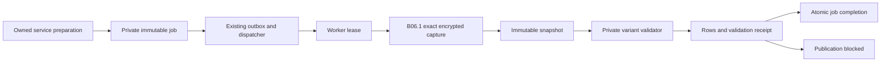

# NSE B06.2 — shared MASTER_DOWNLOAD runtime and staged SCH

Local implementation on merged B06.1 (`6721741c7654325df8b6aebc5b83b936ac2fceb8`).
No NSE call, hosted mutation, deployment, push or PR. The
[B06.1 foundation](NSE_MASTER_DOWNLOAD_FOUNDATION.md) remains the ownership and
exact-evidence authority; its applied migration and transport are unchanged.

## Source decision

Handbook v1.9.7 pp191–192 and recursively inspected Postman request #58 agree on
POST `/nsemfdesk/api/v2/reports/MASTER_DOWNLOAD`, body `{"file_type":"SCH"}`,
pipe-delimited text success and JSON failure. Neither specifies SCH columns;
Postman retains no response sample. The coherent plan B06/F02/F03/C035 requires
member scope, distinct source identities, complete evidence and gated publication.

Historical `analysis/live_uat/live_response_schema_catalog.json` under
`/home/ubuntu/nse-uat-contract` retains the exact **44-column** SCH header, a
15,243-row observation and string field shapes, **not literal row values**. Its
SHA256 is `b20796672fb14a480f5934ad1271b098e0e73554c8719bd7194f90ba0f28c007`.
The historical response was 4,057,995 bytes and marked `response_truncated_or_bounded`;
it is not complete-file or current semantic proof. The header is retained in the
synthetic test fixtures without any historical values.

The supporting `NSE_MF_WebfileStructure.pdf`, pp77–79 (SHA256
`67ee2e34c7cf776a2731e950837bd3aa6f2e6f7e5f521cbdbbce5cc60aae307d`) describes a
**43-column DEMAT** master with different names and ambiguous flag conventions.
It cannot justify silently aliasing that schema to current consolidated SCH.

## Durable execution and recovery



`prepare_nse_master_download(workspace, connection, file_type, idempotency_key)`
locks the B06.1 connection and atomically inserts one job and one metadata-only
outbox event. B06.2 initially enables only SCH; [B06.3](NSE_SYSTEMATIC_PRODUCT_MASTERS.md)
adds SIP/STP/SWP and [B06.4](NSE_NAV_SET.md) adds NAV observations and terminal
rejected SET evidence through the same registry. A repeated key returns the same job; it never
refreshes data. A new explicit service preparation is required for another read.
No investor account, UCC, browser facade or console command is created.

The ordinary `integration.nse.master_download_requested` route uses
`nse-master-download-worker` and the existing `NSE_WORKER_TOKEN`. The commissioned
Oracle reconciler consumes the updated routes contract. Its deployment path and
host settings are unchanged; only the local route-validation CLI now reads the
same candidate contract already consumed by deployment.

The worker accepts only an event UUID and a bounded 256-byte request. SQL loads
all scope identifiers. A process-local claim token fences a fixed 300-second lease;
job capture wrappers delegate to the exact B06.1 begin/chunk/finish RPCs. Every
wrapper rechecks active workspace, enabled connection and lease. The new download
trigger also enforces job/evidence scope and variant equality. Lock order is
connection, event, then evidence. Production capture remains disabled.

Claim acknowledgement retries reuse the same token. Recovery before begin can
claim again (at most three pre-capture claims). Once begin is durable, that download
ID is never sent again. An expired unsealed capture becomes `ABANDONED`, preserving
its unusable evidence. A sealed capture resumes at finalization. Finalization
acknowledgement retries return the existing immutable completion. HTTP failures,
oversize, unverifiable length, truncation and transport failure are terminal for
that job. No automatic provider retry or deployment automation was introduced.

B06.1's separate 16 MiB / 64 × 256 KiB evidence cap, identity encoding, comparable
Content-Length, EOF, full SQL-verified digest, encryption and 120-second transport
deadline all remain in force. B01–B05 limits are unchanged. A dispatcher timeout
may precede completion; later delivery obeys the durable lease and never causes
resubmission of a begun capture. Host timeout tuning was not performed.

## SCH interpretation and identities

`SCH_OBSERVED_44_V1` validates **structure and source identity only**. The receipt
explicitly records `validation_scope=STRUCTURE_AND_IDENTITY_ONLY`. `STAGED_VALIDATED`
therefore means this limited validation succeeded; it conveys no eligibility,
currentness, catalogue completeness or publication approval.

The parser requires the exact ordered 44-column header and exactly 44 fields in
every row. It accepts UTF-8, an optional initial BOM, consistent LF or CRLF, and
exactly one terminal newline. It rejects quotation ambiguity, embedded controls
or BOMs, reordered/extra/missing headers, empty files, malformed rows and duplicate
scheme codes or serial numbers, including otherwise identical duplicates. No
partial rows survive rejection. Local support bounds are 100,000 rows, 16,384
characters per row and 2,048 per field. Serial numbers must be 1–11 digits; scheme
and AMC codes must be nonblank, unpadded and at most 128 characters; names at most
512. An optional ISIN must have its 12-character lexical form. These conservative
support limits are not assertions about all vendor-valid data.

One immutable identity is `(connection, NSE_SCH, exact scheme_code)`. Each snapshot
retains separate RTA/AMC codes, AMC, ISIN, plan/type, name, RTA-agent and dividend
flag observations plus all 44 native strings. A code identity is not proof that a
fund's economic identity is stable across snapshots. Unknown native flags,
amount/date formats and plan/option values remain uninterpreted and unusable for
business decisions; they do not gain truth from their field names.

Crosswalk candidates bind an exact SCH snapshot/identity to an existing fund,
explicit target namespace and provenance reference. They are owner-maintained,
append-only review evidence, with only `PROPOSED`, `AMBIGUOUS` or `REJECTED` states.
There is no APPROVED state, auto-match, publisher or consumer. No candidate is
created merely because codes, names or ISINs match. `mutual_funds`, registrar data,
NAVs, holdings and investor operations receive no writes.

Finalization stages the immutable foundation snapshot, verifies its whole digest,
inserts all SCH rows and its validation receipt, and completes the job in one
transaction. Rejection retains the snapshot and a zero-accepted-row receipt.
Foundation snapshots remain `STAGED_UNVALIDATED`; validation is a separate immutable
receipt, so B06.1 history is not rewritten. `get_nse_master_download_job` supplies
a service-only, ownership-checked summary without native rows or provider messages.
All new tables have RLS, zero API-role table grants and zero policies. Public RPCs
are service-only definers with empty search paths; private functions deny API roles.

## B06.3 / B06.4 extension contract

Add a private `nse_reference.validate_<variant>_vN(snapshot_id uuid) RETURNS jsonb`
function and register that name/version in the migration-owned `validators` table.
The shared runtime passes an integrity-checked, owned snapshot inside the final
transaction. Return `status`, `category`, `row_count`, `rejected_rows`, and
`validation_scope`; insert only variant-owned immutable rows. Status is
`STAGED_VALIDATED` or `REJECTED`; categories are fixed `nse_reference_*` codes.
Failure must insert no accepted rows. Schema and semantic proofs belong in the
variant parser and its tests, never in the transport worker. No TypeScript worker,
event type, dispatcher or investor operation change is needed to enable a parser.
A reviewed migration is required for registration. Existing receipts never reparse;
a new capture/snapshot is required for another parser version in this slice.

[B06.3](NSE_SYSTEMATIC_PRODUCT_MASTERS.md) now registers SIP/STP/SWP through this
contract. Shared finalization remains staging-only with a blocked publication gate;
B06.3 adds a separate reference-only publisher with explicitly uncommissioned
product semantics. SCH publication and crosswalk approval remain blocked.

## Remaining publication gate

Publication is structurally blocked. Required evidence is: a current authoritative
consolidated SCH layout and representative values; characterized numeric/date/flag,
blank-field and plan/option semantics; transport and whole-catalogue completeness
proof (including a vendor-side file truncated on a row boundary); an approved
NSE/RTA/AMC/ISIN/plan/option-to-fund crosswalk with registrar namespace and ambiguity
resolution; source precedence and a defined consuming catalogue. Only then can a
separate change add an atomic current pointer and expected-prior-version check.
No historical row count, filename date or code equality substitutes for those gates.

## Local validation

Validation uses synthetic data, the protected offline Deno runner and fresh
network-isolated PostgreSQL containers. The maintained SQL harness applies the
entire migration chain, lints new functions, runs UCC/dispatcher and B01–B06/facade
regressions, and exercises concurrent preparation, claiming and finalization.
The SCH suite covers full-file validation, ownership/roles, evidence/replay fences,
malformed/duplicate rows, a 15,243-row synthetic file, crosswalk denial, publication
noninterference and atomic rollback on completion failure. Final results are
recorded below.

| Check | Result |
| --- | --- |
| Protected Deno manifest fmt/check/test | 66 files; 661 tests pass (645 baseline) |
| Fresh full migration chain and PL/pgSQL lint | Pass; no new lint findings |
| Full NSE/UCC/dispatcher/B01–B06/facade SQL and concurrency | Pass |
| SCH SQL contract | 235 assertions plus actual service/browser-role exercises |
| Dispatcher and reconciler pytest | 55 pass |
| Manifest/diagnostic-policy/Compose tests | 22 pass |
| Documentation, frozen migrations, shell syntax, commit format, whitespace | Pass |
| Every persistent SQL test on a fresh restored database | Baseline 21 pass / 15 fail; candidate 22 pass / same 15 fail |
| Existing order-claim and payment concurrency | Pass on baseline and candidate |
| Existing registrar and referral concurrency | Same baseline failures on candidate |

The broad SQL suite is **not green**. Baseline failures are the workspace SELECT
ACL assertion (#114), cancellation assertion (#28), old timestamp fixtures
(#29/#30/#89/sprint hardening), missing local PAN key (#32/PAN verification),
entitlement visibility (#39), referral profile resolution (#40), and final-hardening
profile mapping. Registrar concurrency also lacks the PAN key; referral concurrency
fails profile resolution. No existing pass becomes a failure and no CI or business
rule was relaxed. See the [foundation baseline classification](NSE_MASTER_DOWNLOAD_FOUNDATION.md)
for the same failure inventory.

Reproduce the relevant suite with:

```bash
/opt/moneybowl-toolchains/nse-test/deno-2.9.6-env-003/nse-test-runner manifest-v1 fmt
/opt/moneybowl-toolchains/nse-test/deno-2.9.6-env-003/nse-test-runner manifest-v1 check
/opt/moneybowl-toolchains/nse-test/deno-2.9.6-env-003/nse-test-runner manifest-v1 test
bash scripts/test_nse_order_status_sql.sh
python3 -m unittest scripts/nse_test_manifest_v1_test.py scripts/nse_response_diagnostics_policy_test.py scripts/test_outbox_compose.py
(cd services/outbox-dispatcher && python -m pytest)
```

The SQL harness resets only its own `--network none` disposable database and runs
`plpgsql_check`; no shared local Supabase stack or linked database is reset/linted.
The generic HTTP gateway regression needs a running local API and was not pointed
at hosted infrastructure. Full comparison receipts are
`/tmp/b062-validation-comparison.json`, `/tmp/b062-{baseline,verified}-all-db.log`,
`/tmp/b062-verified-sql.log`, `/tmp/b062-extra-checks.log` and `/tmp/b062-deno.log`.
The final focused SCH run, including the independent source-header assertion, is
in `/tmp/b062-final-issue_33_order_auto_approval_concurrency_test.sh.log`.

## 2026-10-07 UAT commissioning update

A live DEV UAT SCH request returned HTTP 200 `text/plain`, identity encoding and no
Content-Length. The prior transport policy correctly retained that attempt as
`UNVERIFIABLE`; it did not read or publish a prefix. A reviewed additive compatibility
change now accepts bounded identity-encoded EOF without Content-Length while retaining
the 16 MiB cap, chunk and whole-body digests, malformed/framing rejection and exact
length equality whenever the header is supplied. See
[NSE_SCH_FUND_SEARCH.md](NSE_SCH_FUND_SEARCH.md).

Fund Search now has a narrow authenticated projection over the latest validated SCH
snapshot. Raw reference tables remain private and SCH fields remain reference evidence,
not automatic eKYC-code, registrar, transaction-eligibility or NAV authority.
