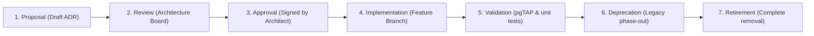

# Decision Lifecycle

## Purpose
This document defines the lifecycle states and approval stages that all architectural, product, and engineering decisions must progress through.

## Scope
Applies to all new technical patterns, library introductions, product direction shifts, and deprecations.

---

## Detailed Guidelines

All project decisions must follow these sequence steps:

### 1. Proposal
- **Action**: Create a draft ADR using the template `docs/decisions/ADR-TEMPLATE.md`.
- **Criteria**: Explain the context, business problems, alternatives considered, and security implications. Status is set to **Proposed**.

### 2. Review
- **Action**: Share the draft ADR with the repository coordinators.
- **Criteria**: The proposal is evaluated against security, performance, and scalability standards.

### 3. Approval
- **Action**: The Chief Architect changes the ADR status to **Accepted**.
- **Criteria**: Once approved, the team commits the ADR to the repository prior to code implementation.

### 4. Implementation & Validation
- **Action**: Develop the feature and write tests validating the decision rules (e.g. pgTAP tests for RLS).
- **Criteria**: The feature must pass the full CI/CD checklist before the PR merges.

### 5. Deprecation & Retirement
- **Action**: When a decision is superseded by a new ADR, mark the legacy ADR status as **Superseded** and link to the replacement file. Retain the old ADR to preserve history.

---

## References
- [ADR Index](../decisions/README.md)
- [Definition of Done](../engineering/definition-of-done.md)
