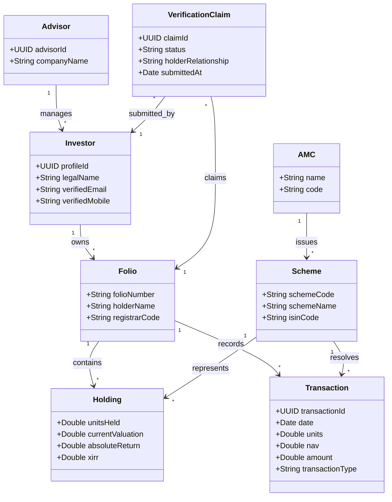

# Domain Model

## Purpose
This document maps the conceptual business domain entities, relationships, card definitions, and validation rules.

## Audience
Domain developers, business analyst teams, and SQL database engineers.

## Business Context
Ensuring that developers and stakeholders share a unified language around business entities prevents schema drift and mismatch in business logic implementation.

---

## Detailed Explanation

### Core Business Entities

1. **Asset Management Company (AMC)**: The fund house (e.g. SBI Mutual Fund, HDFC Mutual Fund) that issues and manages investment schemes.
2. **Mutual Fund Scheme**: A specific financial product managed by an AMC (e.g. HDFC Mid-Cap Opportunities Fund).
3. **Folio**: A unique account record generated by an AMC/Registrar representing an investor's investments.
4. **Investor**: The legal owner of the assets. In our DB system, represented by a business `profile` row.
5. **Advisor (Distributor)**: The licensed financial advisor managing the investor accounts.
6. **Portfolio**: A consolidated read-model summarizing all holdings and valuations associated with an Investor.
7. **Transaction**: An immutable ledger entry representing an asset action (buy, sell, switch, dividend reinvest).
8. **Holding**: The compiled current asset balance (units held, current valuation) for a specific Scheme within a Folio.
9. **Verification**: The lifecycle workflow event (claim, review, decision, grant) that authorizes an investor account to read a Folio.

---

## Business Domain Class Diagram

---

## References
- [Target Architecture Contract: Section 8](../architecture/ARCHITECTURE.md#8-supabase-architecture-and-schema-recommendations)
