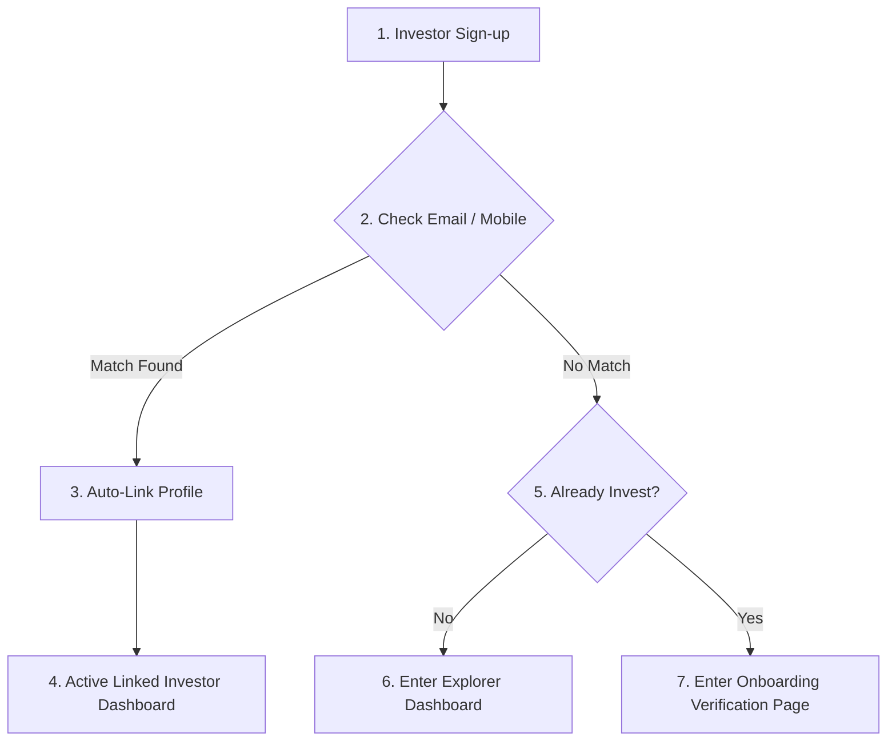
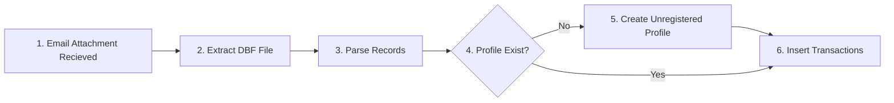
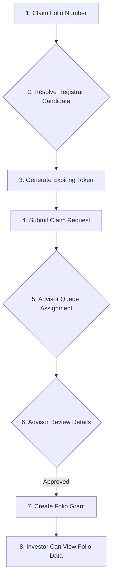
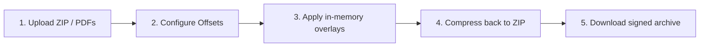

# User Journeys

## Purpose
This document maps step-by-step user interactions across the platform.

## Audience
Product owners, UX engineers, QA testers, and developers.

## Business Context
Mapping workflows ensures that both frontend screen sequences and backend permission gates align to complete business objectives.

---

## Detailed Explanation

### 1. Investor Onboarding Journey

- **Steps**:
  1. The user registers with email/password.
  2. The system checks if the email matches an imported contact record.
  3. If unique match is found, creates an active link automatically.
  4. If not, prompts the user to select whether they are an existing investor or exploring.

---

### 2. Portfolio Statement Ingestion Journey

- **Steps**:
  1. The RTA mailbox statement arrives.
  2. The database parses transaction records (extracts PAN, folio, investor name).
  3. If no matching profile exists, creates a placeholder unregistered profile.
  4. Inserts holdings and transactions.

---

### 3. Portfolio Verification & Grant Journey

- **Steps**:
  1. Investor types their folio number.
  2. System verifies candidate matching without revealing internal IDs.
  3. Advisor reviews the claim request within their assigned workspace.
  4. On approval, active grant authorizes access.

---

### 4. PDF Invoice Signer Journey

- **Steps**:
  1. Advisor uploads a zip of invoices.
  2. Configures signature coordinates.
  3. System signs files in-memory.
  4. Downloads signed output ZIP.

---

## Future Evolution
- **AI-Assisted Claims**: Future workflows will match statement uploads via optical character recognition (OCR) and auto-approve sole holder claims.
