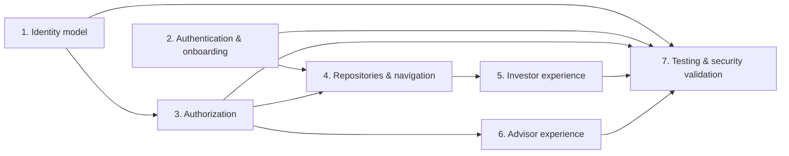

# Sprint 3 Implementation Plan

## Purpose and scope

This document turns the approved role-based identity architecture and Sprint
3.1 audit into an implementation blueprint. It does not change the completed
Invoice Signer architecture. In particular, the following boundaries remain
unchanged:

- `RegistrarDetectionService`
- `ProcessingReport`
- `ArchiveManifest`
- `RegistrarProcessor`
- `CamsProcessor`
- `KfintechProcessor`
- shared PDF discovery

The implementation order is security-first: no Investor Dashboard expansion
should ship before the authorization and identity foundations are in place.

## Design decision: account state and investor links

`account_state` should **not** be stored on `profiles`. A profile is the
distributor's business investor record and can exist before an Auth account,
survive account removal, and potentially be relinked under an approved support
process. Placing Auth lifecycle state on that record would incorrectly couple
business identity to login identity.

`account_state` should also not be the only state on
`investor_account_links`. Explorer and Link Pending accounts can legitimately
exist without a link row, and Advisor accounts do not represent investor links.

The recommended model is:

| Entity | Ownership | State |
|---|---|---|
| `user_accounts` | Authentication identity; one row per `auth.users` user | `advisor`, `explorer`, `link_pending`, or `linked_investor` |
| `investor_account_links` | Controlled relationship from an Auth account to a business investor `profiles` row | `active`, `revoked`, and optional verification/audit metadata |
| `profiles` | Distributor business identity | No application account state; PAN and registrar-derived investor data remain here |

This makes the current Flutter session resolve from `user_accounts`, while RLS
uses an active `investor_account_links` row to determine ownership. It also
supports an existing investment record before signup and prevents creating a
portfolio as a side effect of authentication.

## Delivery sequence

Workstreams 1 and 3 are blocking prerequisites. Workstreams 5 and 6 may begin
only after their relevant repository, route, and authorization foundations are
verified.

## Change classification

| Change | Migration | Breaking schema change | Data migration | Independent work |
|---|---:|---:|---:|---:|
| `user_accounts` and `investor_account_links` | Yes | No, additive | Yes, create rows for existing Auth users | No; prerequisite |
| Correct `profiles.user_id` usage | Yes | Potentially, for old ID assumptions | Yes | No; prerequisite |
| Account-state RLS and Investor read-only policies | Yes | Yes, removes current writes | No data rewrite expected | No; prerequisite |
| Edge Function authorization | Function deployment | No schema break | No | Can begin independently, must finish before release |
| Secure RPC execution rules | Yes | Yes, removes broad RPC execution | No | No; prerequisite |
| Signup/onboarding UI | No initially, after schema exists | No | No | Depends on workstreams 1 and 3 |
| Repositories and protected navigation | No | No | No | Depends on resolved identity contract |
| Investor Dashboard read model | No initially | No | No | Depends on workstreams 1, 3, and 4 |
| Advisor UI cleanup | No initially | No | No | Depends on workstream 3 |
| Test suites | No | No | Test fixtures/data only | Can begin alongside all workstreams |

## Workstream 1 — Identity Model

### Objective

Separate Supabase Auth identity from the business investor record, preserve
registrar-originated portfolios before signup, and establish a controlled
one-account-to-investor linking lifecycle.

### Database changes

- Add a database enum or constrained values for account state:
  `advisor`, `explorer`, `link_pending`, `linked_investor`.
- Add `user_accounts`, keyed by `auth.users.id`, with:
  - `id` / `user_id`;
  - `account_state`;
  - timestamps;
  - minimal verified-contact snapshots or references;
  - no PAN.
- Add `investor_account_links` with:
  - Auth account ID;
  - business investor `profiles.id`;
  - link status;
  - link method (`verified_email`, `verified_mobile`, `pan_verification`,
    future `folio`, future `advisor_assisted`);
  - verified/linked/revoked timestamps and actor IDs.
- Add uniqueness constraints for one active investor link per Auth account and
  one active Auth account per business investor, unless a later approved policy
  explicitly changes that rule.
- Add indexes for verified-contact matching and active-link ownership checks.
- Retain `profiles` as the business identity record. Do not add account state
  to it.
- Stop treating `profiles.id` as the Auth ID; normalize all access through
  `profiles.user_id` only where it remains needed for legacy transition.

### Data migration

- Backfill `user_accounts` from existing Auth-linked profiles.
- Create active `investor_account_links` for legitimate existing
  `profiles.user_id` relationships after a conflict review.
- Detect and quarantine duplicate, missing, or ambiguous email/mobile values;
  never automatically choose an arbitrary record.
- Preserve imported profiles with no Auth account as unlinked business
  investors.

### Flutter changes

- Introduce domain models: `AccountState`, `UserAccount`,
  `InvestorAccountLink`, and an identity-resolution result.
- Replace raw string role handling with a typed role/account-state contract.
- Keep PAN out of login, signup, client-side authentication metadata, and
  general profile models used by Explorer screens.

### Supabase changes

- Replace the current `handle_new_user()` behavior. It may create a basic
  `user_accounts` row but must not assign Advisor status, create a portfolio,
  or claim a business investor record merely from unverified data.
- Create secured database functions for identity resolution and linking, with
  safe, non-enumerating responses.

### Expected files to change

- New migration files under `supabase/migrations/`.
- `lib/providers/auth_provider.dart`.
- `lib/services/supabase_service.dart` or replacement identity service.
- New `lib/features/authentication/` and `lib/features/investor_identity/`
  domain/data files.
- New focused unit and integration tests.

### Risks and dependencies

- **Risk:** legacy profiles may use `id = auth.uid()` while new imported
  profiles do not. Backfill must be reviewed before constraints are enforced.
- **Risk:** contact data may be absent or duplicated in imported records.
- **Dependency:** workstream 3 must secure access before exposing linking
  endpoints.

### Test strategy

- Migration tests for legacy linked, imported-unlinked, duplicate-contact, and
  orphaned-auth scenarios.
- RLS tests for active-link ownership.
- Unit tests for account-state transitions and uniqueness decisions.

### Acceptance criteria

- Imported investors can exist with a portfolio and no Auth user.
- Every Auth user has exactly one `user_accounts` state.
- Explorer and Link Pending users need no investor link.
- Linked Investors have exactly one active, auditable investor link.
- PAN is absent from signup/login payloads and account-state rows.

## Workstream 2 — Authentication & Onboarding

### Objective

Provide one secure email/mobile authentication flow and implement the approved
automatic-linking, Explorer, and Link Pending journeys.

### Database changes

- Use the workstream 1 account model.
- Add privacy-safe link-attempt/audit data only if required for operational
support; never store raw PAN in logs.

### Flutter changes

- Extend the existing login experience with approved signup and OTP/password
  paths.
- Add session bootstrap that resolves `UserAccount` before any role shell is
  rendered.
- Add onboarding pages:
  - automatic-match loading/result;
  - required “Do you already invest through Sharan Fincorp?” choice;
  - Explorer confirmation;
  - Link Pending explanation;
  - secure PAN verification form shown only after “Yes, I already invest.”
- Add generic failure messages that do not reveal whether a PAN, email, mobile,
  or investor record exists.
- Add logout and session-expiry behavior that clears transient account and
  portfolio state.

### Supabase changes

- Use Supabase Auth email/mobile verification capabilities as configured for
  the production environment.
- Automatic linking order must be: verified email, then verified mobile.
- A match is linked only when it is safe and unique.
- PAN verification is a secured, rate-limited post-choice operation.

### Expected files to change

- `lib/screens/login_screen.dart` or its replacement feature screens.
- `lib/main.dart` bootstrap/auth shell.
- `lib/providers/auth_provider.dart`.
- New authentication and investor-identity feature widgets/controllers.
- New secured linking Edge Function or RPC wrapper, if chosen by the detailed
  design.
- Auth/onboarding tests.

### Risks and dependencies

- **Dependency:** identity schema and RLS from workstreams 1 and 3.
- **Risk:** production confirmation/OTP settings cannot be inferred from the
  repository; they require environment validation.
- **Risk:** automatic contact matching must not use stale, unverified, or
  duplicate contact details.

### Test strategy

- Widget tests for all four resulting account states.
- Integration tests for verified-email match, verified-mobile match, no match
  → Explorer, no match → Link Pending, PAN verification success/failure.
- Negative tests proving PAN is never requested before the user chooses the
  existing-investor path.

### Acceptance criteria

- Signup requests only email/mobile and password or OTP.
- No automatic match always presents the approved two-option question.
- Explorer receives no portfolio access or PAN prompt.
- Link Pending cannot access portfolio data until a successful secure link.
- Automatic matching never links an ambiguous record.

## Workstream 3 — Authorization: RBAC, RLS, RPCs, and Edge Functions

### Objective

Make Supabase the enforcement point for Advisor, Linked Investor, Explorer,
and Link Pending permissions.

### Database changes

- Replace `is_admin()` with a helper based on the normalized account model;
  never rely on `profiles.id = auth.uid()` or untrusted JWT metadata.
- Remove self-service role/account-state/business-identity updates.
- Remove Investor `INSERT` and `UPDATE` access to portfolios and transactions.
- Rewrite portfolio/transaction `SELECT` policies to authorize only an active
  investor link to the owner `profiles.id`.
- Add state-aware RLS for profiles, preferences, factsheets, logs, and future
  documents.
- Enable RLS and define policies for `ingestion_logs`.
- Review and restrict `cams_statements`; it contains PAN, contact, bank, and
  nominee data.
- Revoke broad execution on `SECURITY DEFINER` functions, especially
  `process_cams_records` and `recalculate_portfolio_value`; grant only the
  minimum server-side role path required.

### Supabase changes

- Every Advisor-only Edge Function validates the caller JWT and confirms
  Advisor permission before creating a service-role client or processing data:
  - `cams-kfintech-ingestion`;
  - `daily-nav-updater`;
  - Invoice Signer signing/decryption services;
  - tracker-update service, if deployed.
- Split the generic `proxy-get` behavior from Invoice Signer. Use an allowlist
  for approved public fund-data endpoints and deny private/internal targets.
- Configure function-level JWT enforcement in deployment settings and verify
  that deployment configuration matches code-level checks.
- Define Storage buckets, path conventions, and `storage.objects` policies
  before storing private investor documents.

### Flutter changes

- Centralize permissions in a policy service; UI visibility becomes a consumer
  of authorization state, never the authority.
- Ensure Advisor-only operation controls are not rendered for non-Advisor
  states.
- Ensure Explorer and Link Pending views never issue portfolio queries.

### Expected files to change

- New security migrations under `supabase/migrations/`.
- Existing Edge Functions under `supabase/functions/`.
- New `lib/app/security/` models/policy service.
- Function invocation wrappers and their tests.
- Storage migration/policy files if document storage is introduced.

### Risks and dependencies

- **Breaking change:** removing Investor write policies can affect any
  undocumented direct-write clients; audit usage before deployment.
- **Risk:** tightening function authorization can interrupt scheduled jobs;
  use a separately authenticated scheduler/service path.
- **Dependency:** normalized identity model from workstream 1.

### Test strategy

- SQL/RLS integration matrix: unauthenticated, Explorer, Link Pending, Linked
  Investor (own data), Linked Investor (other data), and Advisor.
- RPC execution-denial tests for browser/session roles.
- Edge Function tests for missing JWT, Investor JWT, Advisor JWT, and scheduler
  credentials.
- SSRF allowlist tests for the fund-data proxy.

### Acceptance criteria

- An Investor cannot read another investor’s profile, portfolio, transactions,
  raw statements, or documents.
- An Investor cannot mutate portfolio or transaction records.
- Explorer and Link Pending receive no portfolio rows.
- Advisor-only functions reject unauthenticated and non-Advisor callers.
- Invoice Signer remains functionally unchanged for Advisors and unavailable to
  all other states.

## Workstream 4 — Repository & Navigation Architecture

### Objective

Replace dashboard-owned data access with feature repositories and enforce
session/account-state navigation centrally.

### Flutter changes

- Introduce protected declarative navigation with guards for:
  - authenticated;
  - Advisor;
  - Linked Investor;
  - Explorer;
  - Link Pending;
  - ownership-scoped record routes.
- Create repositories in priority order:
  - `IdentityRepository` / `InvestorLinkRepository`;
  - `PortfolioRepository`;
  - `FactsheetRepository`;
  - `AdvisorOperationsRepository`.
- Move direct `Supabase.instance.client` queries out of:
  - `lib/screens/client_dashboard.dart`;
  - `lib/screens/client_detail_screen.dart`;
  - `lib/screens/admin_dashboard.dart`.
- Preserve the Invoice Signer service/controller boundary; route its existing
  entry point through the Advisor shell rather than refactoring its processors.
- Replace silent null/false service failures with typed, user-safe result or
  error states.

### Database and Supabase changes

- None required beyond workstreams 1 and 3.

### Expected files to change

- `lib/main.dart`.
- New `lib/app/navigation/` and `lib/app/security/` files.
- New `lib/repositories/` files.
- Existing dashboard screens as repositories are adopted.
- Repository, guard, and widget tests.

### Risks and dependencies

- **Dependency:** stable identity-resolution API and RLS policies.
- **Risk:** a broad dashboard rewrite could regress completed operations.
  Migrate one feature/data path at a time.

### Test strategy

- Unit tests for route guard decisions.
- Widget tests that each account state sees only its allowed navigation.
- Repository tests against mocked/controlled Supabase responses.

### Acceptance criteria

- No presentation layer portfolio/identity query calls remain in the Investor
  flow.
- Direct navigation cannot bypass account-state protection.
- Existing Advisor Invoice Signer path still reaches the same controller and
  output behavior.

## Workstream 5 — Investor Experience

### Objective

Deliver the Linked Investor, Explorer, and Link Pending experiences on top of
the secured identity and repository foundations.

### Flutter changes

- Build role-specific shells:
  - Linked Investor: Portfolio, Holdings, Transactions, Analytics, Factsheets,
    Personal Settings.
  - Explorer: education, calculators, factsheets, contact advisor, settings.
  - Link Pending: linking progress, factsheets, education, contact advisor,
    settings.
- Convert `ClientDashboard` portfolio reads to the linked-investor repository.
- Keep transaction/portfolio views read-only.
- Build personal settings with a separate preference model; do not expose
  Advisor business settings.

### Database and Supabase changes

- Add `user_preferences` if it is not included in workstream 1.
- No investor portfolio creation or direct Investor transaction writes.

### Expected files to change

- `lib/screens/client_dashboard.dart` or feature replacements.
- New `lib/features/portfolio/`, `lib/features/documents/`, and
  `lib/features/settings/` files.
- Shared widgets for state-specific shells.
- Investor widget and integration tests.

### Risks and dependencies

- **Dependency:** completed workstreams 1–4.
- **Risk:** UI must distinguish “no portfolio because Explorer/Pending” from
  “linked investor with no holdings” without querying unauthorized data.

### Test strategy

- Widget tests for each state shell.
- End-to-end tests for linked portfolio read, no cross-investor access, and
  no portfolio calls for Explorer/Link Pending.

### Acceptance criteria

- Linked Investor sees only the linked portfolio and read-only transactions.
- Explorer and Link Pending never see an empty portfolio as a substitute for
  their distinct onboarding states.
- Factsheets and permitted shared resources are available to all authenticated
  non-Advisor states.

## Workstream 6 — Advisor Experience

### Objective

Keep Advisor operations available while moving enforcement out of the UI and
making operational data access auditable.

### Flutter changes

- Place Admin navigation behind the central Advisor guard.
- Route ingestion, NAV update, factsheet management, and Invoice Signer through
  authorized operation/repository wrappers.
- Replace dashboard-owned client and portfolio queries with repositories.
- Preserve existing Invoice Signer UI, processor order, downloads, and
  business rules.

### Database and Supabase changes

- Add operations/audit records only after the security baseline is complete.
- Add Advisor settings storage separately from investor preferences.

### Expected files to change

- `lib/screens/admin_dashboard.dart` or feature replacements.
- New `lib/features/client_management/`, `lib/features/administration/`, and
  `lib/features/operations/` adapters.
- Existing privileged Edge Functions under `supabase/functions/`.
- Advisor authorization and regression tests.

### Risks and dependencies

- **Dependency:** workstream 3 function authorization.
- **Risk:** scheduled ingestion and manual operations need distinct authorized
  server-to-server invocation paths.
- **Risk:** Invoice Signer is stable baseline functionality; avoid architectural
  redesign during this workstream.

### Test strategy

- Advisor UI visibility tests.
- Edge Function authorization tests.
- Regression runs for CAMS and KFintech Invoice Signer flows.
- Ingestion and NAV update smoke tests using non-production fixtures.

### Acceptance criteria

- Advisor can access every current business module.
- Non-Advisor callers cannot invoke or view Advisor operations.
- Invoice Signer behavior remains unchanged for an Advisor.

## Workstream 7 — Testing & Security Validation

### Objective

Make authorization and identity behavior verifiable before investor-facing
features are released.

### Test suites to add

- Database migration/backfill tests.
- RLS integration tests across all account states.
- RPC permission tests, including denial of security-definer functions.
- Edge Function JWT/Advisor authorization tests.
- Flutter unit tests for account-state resolution and permission policy.
- Flutter widget tests for onboarding, routing, and navigation visibility.
- Repository tests for linked portfolio selection.
- Regression tests for Invoice Signer, factsheets, ingestion, and login.

### Security validation checklist

- Verify no Auth signup payload contains PAN.
- Verify no frontend request can set `advisor` state or role.
- Verify failed contact/PAN verification does not enumerate investor records.
- Verify logs exclude raw PAN, account numbers, IFSC, and credentials.
- Verify storage objects are inaccessible without a permitted session/path.
- Verify production secrets remain only in Supabase/Deno environment settings.
- Verify the production Auth confirmation and OTP configuration explicitly;
  local `config.toml` is not proof of production configuration.

### Expected files to change

- `test/` and new Supabase SQL/function test assets.
- Existing test fixtures only where redacted and approved.
- CI workflow files only if a test runner is introduced later.

### Risks and dependencies

- Requires a non-production Supabase project or isolated test database with
  representative linked/unlinked investor records.
- Must not use production PANs, credentials, account numbers, or client
  documents as test fixtures.

### Acceptance criteria

- Every account-state and cross-investor denial scenario passes.
- All privileged functions reject unauthorized callers.
- Existing Invoice Signer tests and manual regressions pass.
- `flutter test`, `flutter analyze`, SQL/RLS tests, and function tests pass
  before release approval.

## Recommended milestone plan

1. **Sprint 3.1A — Security containment:** workstream 3 minimum baseline,
   privileged function protection, and denial tests.
2. **Sprint 3.1B — Identity schema and data migration:** workstream 1, with a
   migration rehearsal and legacy-link conflict report.
3. **Sprint 3.1C — Authentication and onboarding:** workstream 2, ending with
   all four account states reachable through approved journeys.
4. **Sprint 3.2 — Navigation and investor foundation:** workstreams 4 and 5.
5. **Sprint 3.3 — Advisor operational hardening:** workstream 6, including
   Invoice Signer and ingestion regression verification.
6. **Release gate:** workstream 7 validation, security review, and approved UAT.

## Out of scope for the initial implementation

- KFintech/CAMS Invoice Signer business-rule changes.
- Registrar selection or changes to automatic detection.
- Folio-based verification and advisor-assisted linking; these are future
  linking methods.
- Invitation/SMS campaigns beyond designing the compatible account-link model.
- Portfolio analytics, commission reporting, and goal planning.
