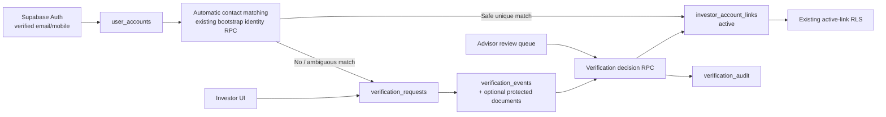
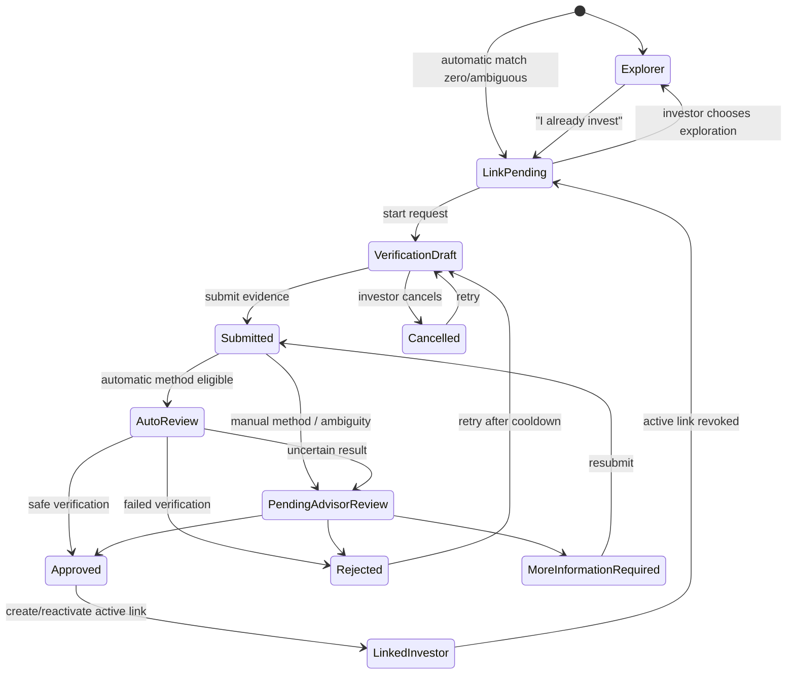
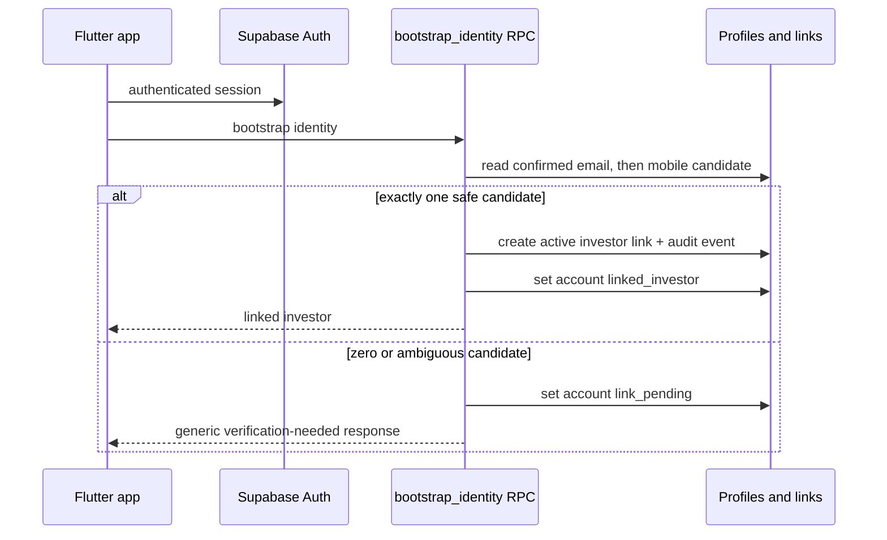
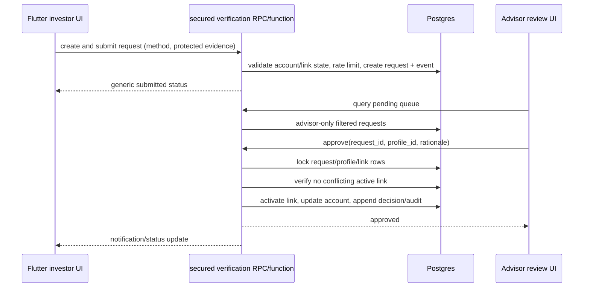

# Investor verification workflow design

## Purpose and non-negotiable boundaries

This document is the implementation blueprint for Sprint 4 Workstream 2B. It
designs a secure, auditable way for an authenticated person to link to an
existing imported investor profile.

It preserves the approved ownership model:

```text
auth.users
  -> user_accounts
  -> investor_account_links
  -> profiles
  -> portfolios
  -> transactions
```

It does not change the ownership model, create portfolios at signup, or use
PAN as a login credential. A registrar/IMAP import remains the source of truth
for business investor records and portfolio data.

The currently deployed design already provides:

- `user_accounts.account_state`: `explorer`, `link_pending`,
  `linked_investor`, and `advisor`;
- `investor_account_links` with active/revoked lifecycle and partial unique
  indexes for one active link per account and per profile;
- automatic verified-email, then verified-mobile matching in
  `bootstrap_identity()`;
- server-enforced ownership through active links; and
- placeholder PAN, folio, and advisor-assisted verification choices in
  Flutter.

Workstream 2B fills the deliberate gap between a Link Pending state and a
server-authorized active link.

## 1. Overall architecture

Verification is an application service, not a widget action or direct table
update. The caller may submit evidence, but only an authorized server-side
decision can create, reactivate, revoke, or replace an investor link.



### Design principles

1. **Server authority:** Flutter never inserts or updates links, approval
   states, business identities, or verification evidence directly.
2. **Non-enumeration:** public responses never confirm that a PAN, folio,
   email, mobile, or profile exists. A failed attempt uses a generic outcome.
3. **Least disclosure:** an investor only sees their own request and its
   status. Advisors see only the minimum information necessary to resolve a
   request.
4. **Immutable evidence trail:** events and decisions are append-only; the
   current request state is a projection of that trail.
5. **No implicit approval:** an ambiguous match, a revoked link, or a retry
   can never select an arbitrary profile.
6. **Method extensibility:** method-specific attributes live in a constrained
   payload and method registry, not as a new column on `profiles` per method.

## 2. User journeys

### 2.1 Automatic verified-contact match

This remains the first path after signup or first login. The existing secured
`bootstrap_identity()` RPC checks confirmed Auth email, then confirmed Auth
mobile, against the imported profile's `verified_email` and
`verified_mobile`.

- Exactly one safe match: create the existing active link, set the account to
  `linked_investor`, and record an automatic-link audit event.
- Zero or multiple matches: set `link_pending`; do not expose the candidate
  count or identity.
- Existing active link: preserve it and return `linked_investor`.

Workstream 2B must add audit coverage around the existing automatic path, but
must not weaken its uniqueness or verified-contact requirements.

### 2.2 Explorer becomes a Linked Investor

1. Explorer selects **“I already invest through Sharan Fincorp.”**
2. The existing onboarding action changes the account to `link_pending`.
3. The app explains why verification is needed and displays available
   methods, initially PAN and advisor-assisted assistance; folio becomes
   available when its data contract is implemented.
4. The investor submits one verification request.
5. The server evaluates it automatically where possible, otherwise queues it
   for Advisor review.
6. Approval creates or reactivates one active `investor_account_links` row
   transactionally and changes the account to `linked_investor`.

### 2.3 Link Pending submits and retries verification

- A Link Pending user may create a request only when no active request exists
  for the same account.
- A rejected, expired, cancelled, or revoked-linked request may be retried
  after a server-enforced cooldown.
- Retrying creates a new request and event trail; it does not overwrite prior
  evidence or decisions.
- The investor can cancel a draft/submitted request before approval. They may
  not cancel an approved request or edit submitted evidence.

### 2.4 PAN verification

PAN is requested only after the investor explicitly chooses the
existing-investor path. The Flutter client sends the PAN only to a secured RPC
or Edge Function over TLS; it must not write PAN into `user_metadata`, logs,
analytics, or a general client-side model.

The server normalizes and validates format, performs a constant-shape lookup
against the business identity record, and returns a generic status. Store only
a protected digest/fingerprint in verification evidence where possible. If a
raw PAN must be retained for a short review window, encrypt it at rest, limit
access to the approval function, and delete it after the configured retention
period.

### 2.5 Folio verification

Folio is a future method. It requires a normalized, registrar-derived folio
source associated with a business profile. The request carries a normalized
folio value or a protected digest; the service must require a unique safe
profile match. It must not infer ownership from an unverified filename or
statement upload.

### 2.6 Advisor-assisted verification and manual resolution

An Advisor may open a pending request, search imported profiles using
advisor-only controls, and approve, reject, or request more information. The
decision must identify the selected `profile_id`, method, rationale code, and
actor. Manual selection is required for ambiguous candidates; it is never
performed automatically.

### 2.7 Revoked link and re-verification

Revocation immediately sets the link to `revoked`, records the reason and
actor, and moves the affected account to `link_pending` unless an approved
business rule explicitly moves it to Explorer. Existing portfolio RLS then
returns no investor rows. The person must complete a new verification request
to obtain a new active link.

## 3. State machine

`user_accounts.account_state` remains the account experience state.
`verification_requests.status` is the separate verification lifecycle. Link
status remains the relationship lifecycle.



### Allowed transitions

| From | Actor/event | To | Required server action |
|---|---|---|---|
| Explorer | Investor chooses existing-investor path | Link Pending | Update own account through secured onboarding RPC. |
| Link Pending | Investor starts request | Draft | Create one owned request. |
| Draft | Investor submits | Submitted | Validate method payload, rate limit, append event. |
| Submitted | Automatic evaluation | Approved / Rejected / Pending Review | Evaluate without disclosing candidate existence. |
| Pending Review | Advisor decision | Approved / Rejected / More Info | Append immutable decision/event. |
| More Info | Investor resubmits | Submitted | Version evidence; preserve prior request events. |
| Approved | Transactional approval | Linked Investor | Activate exactly one link and update account state. |
| Linked Investor | Advisor/system revokes | Link Pending | Revoke active link and append audit event. |

### Forbidden transitions

- Explorer, Link Pending, or Linked Investor directly setting a link active.
- An Advisor assigning themselves or a public signup user the Advisor state.
- Approval with zero, multiple, inactive, or arbitrary candidate profiles.
- Reactivating a revoked link without a new approval event.
- Editing or deleting submitted evidence, decisions, or audit events.
- Replacing a different user’s active link without explicit revocation and a
  separately auditable approval transaction.

## 4. Sequence diagrams

### Automatic verified-contact linking



### PAN or folio submission and advisor approval



### Revocation

```mermaid
sequenceDiagram
  participant Advisor
  participant API as secured decision RPC
  participant DB
  participant Investor
  Advisor->>API: revoke active link (reason)
  API->>DB: lock link and account
  API->>DB: set link_status=revoked; account_state=link_pending
  API->>DB: append audit/event
  API-->>Advisor: revoked
  DB-->>Investor: existing RLS access returns no portfolio rows
  API-->>Investor: re-verification notification
```

## 5. Proposed database design

No migration is created in this workstream. The following is the proposed
additive schema for Workstream 2B.

### 5.1 `verification_methods`

Reference/registry table, seeded by migration and managed only by trusted
administration.

| Column | Purpose |
|---|---|
| `code` (PK) | `verified_email`, `verified_mobile`, `pan`, `folio`, `advisor_assisted`, `otp`, `document_upload` |
| `display_name` | UI label controlled by product configuration |
| `review_mode` | `automatic`, `advisor`, or `hybrid` |
| `enabled` | Safe rollout/feature gating |
| `requires_document` | Enables future document route |
| `created_at`, `updated_at` | Governance |

Automatic email/mobile matching should be recorded as a method event even
when it does not create a user-facing request.

### 5.2 `verification_requests`

One request represents one attempt to link one Auth account. It must not
contain an unprotected raw PAN or other sensitive evidence.

| Column | Purpose |
|---|---|
| `id` (UUID PK) | Request identity |
| `user_id` (FK `user_accounts`) | Request owner |
| `method_code` (FK `verification_methods`) | Chosen method |
| `status` | `draft`, `submitted`, `automatic_review`, `pending_advisor_review`, `more_information_required`, `approved`, `rejected`, `cancelled`, `expired` |
| `candidate_profile_id` (nullable FK `profiles`) | Server-only candidate after safe resolution; never returned to ordinary users |
| `submitted_at`, `resolved_at`, `expires_at` | Lifecycle dates |
| `retry_of_request_id` (nullable self FK) | Retry lineage |
| `created_at`, `updated_at` | Auditability |
| `version` | Optimistic concurrency control |

Partial unique index: at most one open request per `user_id`, where open is
draft/submitted/automatic-review/pending-review/more-information-required.

### 5.3 `verification_events`

Append-only request timeline.

| Column | Purpose |
|---|---|
| `id` | Event identity |
| `request_id` | Related request |
| `event_type` | created, submitted, validation_failed, automatic_match, queued, more_info_requested, approved, rejected, cancelled, expired, notification_sent |
| `actor_type`, `actor_user_id` | Investor, advisor, system, or service actor |
| `reason_code` | Structured non-sensitive reason |
| `metadata` (sanitized JSONB) | Method version, channel, and safe operational detail |
| `created_at` | Immutable timestamp |

No update/delete policy is granted to clients. Avoid PAN, raw folio, document
content, email/mobile values, access tokens, and free-form sensitive notes in
`metadata`.

### 5.4 `verification_audit`

An immutable security audit log for actions affecting relationship lifecycle.
It can either be a dedicated table or a hardened generic audit service; a
dedicated table is recommended for retention and reporting.

| Column | Purpose |
|---|---|
| `id`, `occurred_at` | Audit identity/time |
| `action` | link_created, link_revoked, request_approved, decision_reversed, evidence_deleted, etc. |
| `actor_user_id`, `actor_role` | Who acted |
| `subject_user_id`, `profile_id`, `link_id`, `request_id` | What was affected |
| `method_code`, `reason_code` | Why/how, structured |
| `correlation_id` | Connect RPC, Edge Function, and notification events |
| `before_state`, `after_state` (sanitized JSONB) | State transition only, never raw evidence |

### 5.5 `verification_documents` (future, optional)

Document uploads are not required for Workstream 2B. When implemented, keep
objects in a private Storage bucket and store only metadata here:

`id`, `request_id`, `storage_path`, `document_type`, `checksum`,
`encryption_key_reference`, `uploaded_by`, `uploaded_at`, `expires_at`,
`deleted_at`, and scan status. Use short retention and verified download URLs;
never make the bucket public.

### Existing-table changes

- Keep `profiles.pan` in the business domain; do not expose it through normal
  investor profile reads.
- Do not add verification state to `profiles`.
- Keep `user_accounts.account_state` as the user experience state.
- Keep `investor_account_links.link_status` as active/revoked relationship
  state. Add optional `approved_request_id`, `revoked_reason_code`, and
  `revoked_by_user_id` only if an immutable audit table alone is insufficient.

## 6. API and RPC design

All mutating operations are database RPCs or authenticated Edge Functions.
They run with a narrow `SECURITY DEFINER`/service role boundary, explicit
`search_path`, revoked public execution, input validation, and structured
error codes. Flutter repositories map these codes to generic messages.

| Operation | Caller | Design |
|---|---|---|
| `get_verification_status()` | Request owner | Return own request status, allowed next actions, and non-sensitive timeline. |
| `start_verification(method_code)` | Explorer/Link Pending owner | Validates account state/method availability; creates a draft/open request. |
| `submit_verification(request_id, payload)` | Request owner | Validates method schema and cooldown; writes protected evidence/event; queues automatic/manual evaluation. |
| `cancel_verification(request_id)` | Request owner | Only draft/submitted before decision; append event. |
| `retry_verification(request_id, method_code)` | Request owner | Enforces terminal state/cooldown and creates a new linked request. |
| `list_verification_queue(filters)` | Advisor | Paginated advisor-only projection, no raw sensitive values by default. |
| `get_verification_review(request_id)` | Advisor | Advisor-only minimal review detail and audit trail. |
| `decide_verification(request_id, decision, profile_id, reason_code)` | Advisor | Locks rows and atomically approves/rejects/more-info request. Approval updates link/account/audit. |
| `revoke_investor_link(link_id, reason_code)` | Advisor/service | Atomically revokes link, changes account state, and writes audit. |
| `record_automatic_verification(...)` | Internal bootstrap service only | Records automatic verified-contact decision without exposing lookup results. |

### Response safety

- Never return `profile_id`, PAN, raw folio, candidate count, or candidate name
  to the investor before approval.
- Return the same generic user message for invalid evidence, missing investor,
  conflict, or failed automatic proof where disclosure would enable probing.
- Advisor projections disclose sensitive information only on an explicit,
  audited review route and only if business policy requires it.

### Transactional approval algorithm

1. Authenticate caller and require Advisor authorization.
2. Lock the request, `user_accounts` row, target profile, and relevant active
   link rows.
3. Revalidate that the request is open, the account is not Advisor, and the
   target profile has no different active link.
4. Create/reactivate exactly one link using the approved method and timestamps.
5. Set account state to `linked_investor` and onboarding complete.
6. Append request event and audit record in the same transaction.
7. Queue notification after commit using the correlation ID.

## 7. Flutter and repository architecture

Add an `investor_verification` feature without placing workflow rules in
widgets.

```text
lib/features/investor_verification/
  models/
    verification_request.dart
    verification_status.dart
    verification_method.dart
    verification_timeline_event.dart
  data/
    verification_repository.dart
    supabase_verification_repository.dart
  services/
    verification_flow_coordinator.dart
    verification_status_mapper.dart
  presentation/
    verification_status_screen.dart
    method_selection_screen.dart
    pan_verification_form.dart
    advisor_verification_queue_screen.dart
    advisor_verification_review_screen.dart
```

### Responsibilities

- **Repository:** invokes the secured APIs, maps DTOs, and never queries
  `profiles` candidates from the investor UI.
- **Coordinator:** maps account/request state to allowed actions, handles
  refresh/retry/cancel, and exposes immutable screen state.
- **Widgets:** render prepared state, collect method inputs, show generic
  messages, and never decide whether evidence is sufficient.
- **AuthProvider:** refreshes identity only after an approved link or revoked
  link event; it does not contain verification business rules.
- **Advisor feature:** uses a separate advisor-only repository projection and
  cannot be reached by investor navigation alone.

## 8. Authorization and RLS model

| Action | Investor | Advisor | System/service |
|---|---:|---:|---:|
| Read own request/status/events | Yes | Assigned/all queue as policy permits | Yes |
| Create/submit/cancel/retry own request | Yes, constrained | No on behalf of investor except documented assistance workflow | Yes |
| Read other investor requests/evidence | No | Only review projection | Yes |
| Approve/reject/request more info | No | Yes | Automatic evaluator only where method permits |
| Create/revoke/reactivate active link | No | Through secured decision/revocation API only | Explicit internal service path only |
| Alter method registry/retention | No | Restricted business-admin policy | Migration/service only |

### RLS rules

- Enable RLS on every new table.
- Investors may `SELECT` requests/events only where `user_id = auth.uid()`.
- Investors must have no direct `INSERT`, `UPDATE`, or `DELETE` on requests,
  events, audits, links, or documents; submission occurs via secured API.
- Advisors query a minimal queue/review projection guarded by `is_admin()`.
- Audit/event tables permit no ordinary client mutation and no deletion.
- Storage document policies use `request_id` ownership and advisor-review
  authorization; direct `storage.objects` listing is denied.
- Existing portfolio RLS stays unchanged: only `linked_investor` plus one
  active link reads linked portfolio data. A request alone grants no access.

## 9. Advisor experience

The Advisor queue should offer:

- status tabs: Submitted, Automatic Review, Pending Review, More Information,
  Rejected, Approved, Expired;
- search by request ID, investor name, safe method, and date range;
- filters for method, age/SLA, assigned reviewer, and risk/exception reason;
- a detail page with request timeline, safe evidence summary, candidate
  resolution controls, decision reason, and full audit history;
- approve, reject, request-more-information, and revoke controls with
  confirmation and mandatory reason codes;
- explicit conflict messages when a profile is already actively linked; and
- no client-side direct link edit controls.

Initial implementation should avoid bulk approval. It should add assignment,
SLA escalation, and dual control only after operational volume justifies them.

## 10. Investor experience

The investor sees a progress-oriented flow:

1. **Why verify:** explains that contact details may have changed; does not
   claim whether a portfolio was found.
2. **Choose method:** display only enabled methods and expected review time.
3. **Submit:** client-side format guidance, privacy notice, and no persistence
   of sensitive inputs beyond submission.
4. **Status:** Submitted, In review, More information needed, Approved,
   Rejected, Cancelled, Expired, or Reverification required.
5. **Next action:** retry/cancel/resubmit/contact advisor only when allowed.

Rejected and failed messages are deliberately generic. The screen must not
display PAN, full folio, candidate profile name, or internal reviewer notes.

## 11. Notifications and retention

Future notifications are emitted from the server after a committed state
change. They are events, not the authority for a state transition.

| Event | Recipient | Channels |
|---|---|---|
| Request submitted | Investor and Advisor queue | In-app, email future |
| More information required | Investor | In-app, email/SMS future |
| Approved | Investor | In-app, email/push future |
| Rejected/expired | Investor | In-app, generic email future |
| Link revoked | Investor and Advisor | In-app, email/push future |
| New high-priority review | Advisor | In-app, email/push future |

Document retention, raw evidence retention, audit retention, access logging,
and deletion/legal-hold policy must be approved by business/legal stakeholders
before document upload is enabled. Prefer one-way evidence fingerprints over
retaining raw PAN/folio values.

## 12. Testing strategy

### Unit tests

- method registry/availability;
- request state-machine allowed and forbidden transitions;
- cooldown, retry, expiry, and cancellation rules;
- PAN/folio normalization and masking (without production PAN fixtures);
- non-enumerating error mapping;
- account/link state mapping after approval/revocation.

### Repository and widget tests

- repository maps every RPC status without leaking candidate data;
- Explorer becomes Link Pending then submits a request;
- Link Pending sees status, retry, cancellation, and more-information actions;
- Linked Investor does not see a new-link flow while an active link exists;
- generic error/rejection content never exposes a profile/PAN/folio;
- Advisor queue filter, decision confirmation, and audit timeline rendering;
- responsive mobile/desktop forms and accessibility labels.

### Database/RLS tests

- unauthenticated user: no request/link/audit/document access;
- Explorer/Link Pending: only own status, no portfolio access;
- Linked Investor: own request history only, no other investor data;
- revoked link: immediate portfolio denial and re-verification eligibility;
- Advisor: queue/decision access, but cannot bypass conflict constraints;
- direct browser-role writes to links, decisions, events, and audit tables fail;
- partial unique indexes reject multiple active links;
- SECURITY DEFINER functions reject unauthenticated/non-Advisor callers;
- no response distinguishes unknown versus mismatching PAN/folio.

### Integration and end-to-end tests

- imported investor + verified email/mobile automatic link;
- zero and multiple contact matches → Link Pending;
- PAN success/failure and cooldown;
- folio success/failure once registrar folio data exists;
- advisor approve/reject/more-information/revoke;
- concurrent approval race and already-linked profile conflict;
- logout/login/session restoration at every request status;
- notification is emitted only after committed approval/revocation.

## 13. Risks and mitigations

| Risk | Mitigation |
|---|---|
| PAN/folio enumeration or leakage | Generic responses, rate limits, no raw data in events/logs, secured lookup only. |
| Duplicate/stale imported contacts | Retain exact-one automatic match rule; require manual resolution otherwise. |
| Advisor mis-linking | Mandatory reasons, immutable audit, conflict locks, confirmation UI, possible future dual control. |
| Race conditions | Row locks, partial unique indexes, serializable approval transaction where required. |
| Sensitive document exposure | Private Storage, signed URLs, malware scan, short retention, strict RLS. |
| Request spam | Per-user/IP/method rate limits, open-request uniqueness, cooldowns, monitoring. |
| Inconsistent state across account/link/request | Approval/revocation operations are single database transactions and write audit events. |
| Legacy data quality | Queue ambiguous/invalid imported records; never auto-select a record. |

## 14. Incremental implementation plan

### Workstream 2B.1 — Verification foundation

- Add method registry, request/event/audit schema, enums, indexes, RLS, and
  secured read/status APIs.
- Record automatic-match audit decisions.
- Add domain models/repository contracts and state-machine unit tests.
- No PAN submission or advisor UI yet.

### Workstream 2B.2 — Investor request flow

- Implement Link Pending/Explorer-to-link-pending status and method selection.
- Implement secure PAN request submission with validation, rate limits, and
  generic responses.
- Add request status, cancellation, retry, and more-info UI.

### Workstream 2B.3 — Advisor review and decision boundary

- Implement advisor queue/review screens and secured decision/revocation RPCs.
- Add transactional approval/rejection/more-information handling and audit.
- Add RLS/integration tests for all roles and conflicts.

### Workstream 2B.4 — Folio and notifications

- Add registrar-backed normalized folio verification once source data exists.
- Add in-app notifications and optional email/SMS/push adapters.
- Add operational metrics, SLA filters, and retention jobs.

### Workstream 2B.5 — Documents and advanced controls

- Add optional document upload after retention/security approval.
- Add malware scanning, encrypted object handling, legal hold, reviewer
  assignment, and optional dual-control approval.

## Approval gates before implementation

1. Confirm which roles may approve/revoke and whether a second reviewer is
   needed for manual linking.
2. Confirm PAN/folio evidence retention period and whether raw values may ever
   be retained.
3. Confirm the authoritative imported folio data source and normalization
   rules.
4. Confirm notification channels and approved message templates.
5. Review the migration/RLS plan against a production-like Supabase project
   before enabling any mutating verification endpoint.
